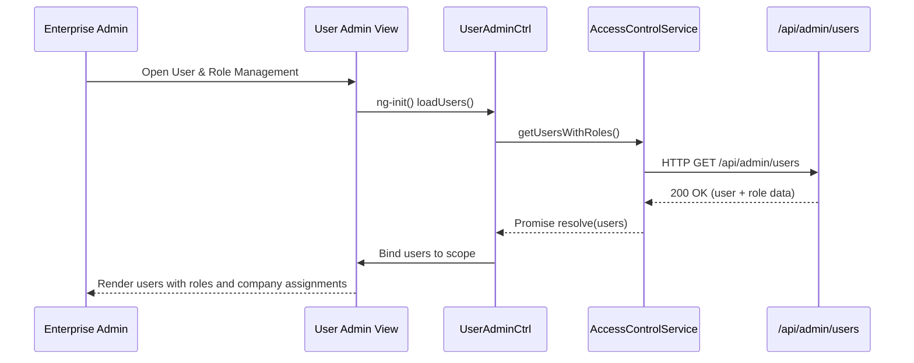

# QE-4920 – Access Control & User Management – LLD

## a. Architecture Mapping (brief)
- Access Control & Authorization Service → AngularJS service `AccessControlService` and HTTP interceptor `AuthInterceptor`.
- User & Role Management Console → AngularJS module `userAdmin`, controller `UserAdminCtrl`, directive `userRoleGrid`.
- SSO / Identity Provider Integration → Service `SsoService` to manage tokens and session state.
- Audit Logging UI → Controller `AuditLogCtrl`, directive `auditLogTable` for viewing key events.
- Lockout Recovery → Directive `userLockoutBanner` and `UserAdminCtrl` actions calling backend recovery APIs.

Recommended folder structure (partial):
- `app/modules/user-admin/`
- `app/modules/user-admin/controllers/`
- `app/modules/user-admin/services/`
- `app/modules/user-admin/directives/`

## b. Component Specifications
| Name                | Artifact Type     | Responsibility (1 line)                                             | Key Dependencies                     |
|---------------------|------------------|----------------------------------------------------------------------|--------------------------------------|
| userAdmin           | AngularJS Module | Group user/role management and audit log components.                | `ui.router`, `AccessControlService` |
| AccessControlService| Service          | Provide helper methods to check user roles and company permissions.  | `$http`, `SsoService`               |
| AuthInterceptor     | Factory          | Attach auth tokens to outbound API calls and handle 401/403.        | `$q`, `$injector`, `SsoService`     |
| SsoService          | Service          | Manage SSO token storage, refresh, and logout redirects.            | `$window`, `$http`, `ApiConfig`     |
| UserAdminCtrl       | Controller       | Manage user list, role assignments, and company access mapping.     | `AccessControlService`, `$state`    |
| userRoleGrid        | Directive        | Render editable grid of users, roles, and assigned companies.       | `UserAdminCtrl`                     |
| AuditLogCtrl        | Controller       | Display audit log entries with filters and pagination.              | `AuditLogService`                   |
| AuditLogService     | Service          | Fetch audit log entries from backend for security reviews.          | `$http`, `ApiConfig`                |
| userLockoutBanner   | Directive        | Show lockout status and provide unlock actions for admins.          | `UserAdminCtrl`                     |

## c. Data Model (brief)
- `User`:
  - `userId: string`
  - `displayName: string`
  - `email: string`
  - `roles: string[]`
  - `companies: string[]`
  - `isLockedOut: boolean`

- `RoleAssignment`:
  - `userId: string`
  - `role: string`
  - `companyId?: string`

- `AuthToken`:
  - `accessToken: string`
  - `expiresAt: string` (ISO datetime)
  - `idpProvider: string`

- `AuditLogEntry`:
  - `id: string`
  - `timestamp: string` (ISO datetime)
  - `userId: string`
  - `action: string`
  - `resource: string`
  - `outcome: 'SUCCESS' | 'FAILURE'`

## d. Data Flow (one paragraph)
User accesses the dashboard or admin console, the AngularJS view triggers SSO login flow via `SsoService` if no valid token exists, then subsequent view/controller initialization (`UserAdminCtrl`, etc.) uses `AccessControlService` to evaluate roles and allowed companies, controllers call backend APIs to fetch users, roles, and audit logs, and the results are bound to directives such as `userRoleGrid` and `auditLogTable`, while `AuthInterceptor` transparently attaches tokens on each API call and reacts to authorization failures.

## e. Primary Sequence Diagram (ONE only)

## f. Implementation Notes (brief)
- Register `AuthInterceptor` with `$httpProvider.interceptors` to standardize auth handling across all modules.
- Keep SSO integration generic in `SsoService` so it can support SAML/OIDC by configuring endpoints and token parsing.
- Use ES6 classes for services where appropriate, instantiated via AngularJS DI wrappers for clarity.
- Implement fine-grained role checks in `AccessControlService` and expose simple helpers like `canViewCompany(companyId)` to controllers.
- Paginate audit log and user lists on the client only after server-side pagination to avoid large payloads.

## g. Error Handling (ONE line)
Use a global `$http` interceptor and route-level guards to catch authentication/authorization errors and show concise modals or redirects.

## h. Security Notes (ONE line)
Standard input validation and secure API calls assumed, with strict RBAC checks on all admin/user endpoints and audit logging enforced backend-side.
