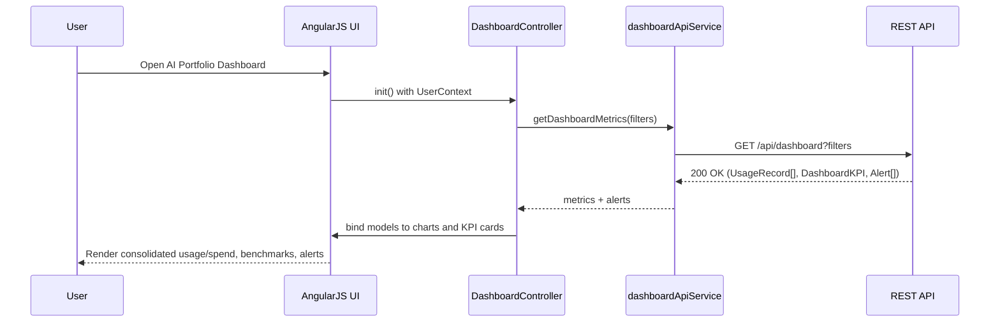

# LLD – EPIC4 AI Usage Aggregation, Benchmarking, and Analytics

## a. Architecture Mapping (brief)
- Ingestion Layer → `aiPortfolioApp` module, `IngestionController`, `providerConnectorService`, `normalizationService`
- Data Platform → `analyticsStoreService`, `metadataService`, `storageFactory`
- Dashboard & Reporting Service → `DashboardController`, `reportService`, `chartDirective`
- Alerting & Notification Service → `AlertController`, `alertService`, `notificationService`
- Benchmarking & Analytics Service → `BenchmarkController`, `benchmarkService`
- AI Cost Optimization & Simulation Engine → `SimulationController`, `simulationService`
- Access & Security Layer (SSO/RBAC) → `securityService`, `authInterceptor`, `sessionService`
- Presentation Layer (Web UI & Executive Views) → `MainController`, `kpiCardDirective`, `filterBarDirective`, views under `/views/dashboard`

**Recommended folder structure**
- `app/`
  - `modules/ai-portfolio-app.js`
  - `controllers/dashboard.controller.js`
  - `controllers/benchmark.controller.js`
  - `controllers/simulation.controller.js`
  - `services/provider-connector.service.js`
  - `services/normalization.service.js`
  - `services/analytics-store.service.js`
  - `services/report.service.js`
  - `services/alert.service.js`
  - `services/notification.service.js`
  - `services/benchmark.service.js`
  - `services/simulation.service.js`
  - `services/security.service.js`
  - `factories/storage.factory.js`
  - `directives/chart.directive.js`
  - `directives/kpi-card.directive.js`
  - `directives/filter-bar.directive.js`
  - `interceptors/auth.interceptor.js`
- `views/`
  - `dashboard.html`
  - `benchmark.html`
  - `simulation.html`
  - `company-drilldown.html`
- `assets/css/dashboard.css`

## b. Component Specifications (table)
| Name | Artifact Type | Responsibility (1 line) | Key Dependencies |
| --- | --- | --- | --- |
| aiPortfolioApp | AngularJS Module | Root module wiring ingestion, analytics, dashboard, and security components. | ngRoute, ui.bootstrap, securityService |
| MainController | Controller | Bootstrap layout, global filters, and top-level navigation between dashboard, benchmarking, and simulation views. | $scope, $location, securityService |
| DashboardController | Controller | Load consolidated usage/spend KPIs, handle time range and entity filters, and bind data to charts and tables. | dashboardApiService, analyticsStoreService, alertService |
| BenchmarkController | Controller | Display cross-company benchmarks, comparison against industry averages, and drill-down charts. | benchmarkService, dashboardApiService |
| SimulationController | Controller | Orchestrate cost optimization what-if scenarios and present projected savings. | simulationService, analyticsStoreService |
| IngestionController | Controller | Admin-only view showing last ingestion run status, data freshness indicators, and connector configuration. | providerConnectorService, normalizationService, alertService |
| providerConnectorService | Service | Call REST APIs for AWS/Azure/GCP ingestion jobs and expose normalized ingestion status to UI. | $http, securityService |
| normalizationService | Service | Transform provider-specific usage/billing payloads into unified JS models used by analyticsStoreService. | lodash/utility helpers |
| analyticsStoreService | Service | Manage client-side cached analytics data (usage, spend, benchmarks) and query helpers for dashboard/benchmark views. | $http, storageFactory |
| metadataService | Service | Fetch and cache portfolio company registry, cost centers, budgets, thresholds, and RBAC mappings. | $http, storageFactory |
| dashboardApiService | Service | Wrap REST endpoints for consolidated dashboard metrics and drill-down analytics. | $http, securityService |
| reportService | Service | Trigger PDF/Excel report generation and handle download links and progress indicators. | $http, $window |
| alertService | Service | Manage alert list (budget, freshness, missing data) and acknowledge/snooze actions. | $http, notificationService |
| notificationService | Service | Show toast/in-page notifications for alerts, errors, and recommendation messages. | $rootScope, $timeout |
| benchmarkService | Service | Request benchmark metrics and trend data and provide comparison helpers for controllers. | $http, analyticsStoreService |
| simulationService | Service | Call optimization/simulation REST APIs and transform responses into scenario summaries. | $http, analyticsStoreService |
| securityService | Service | Handle session info, user roles, and scoped company/project access; integrate with SSO tokens. | $http, authInterceptor, storageFactory |
| sessionService | Service | Store and retrieve current user context (role, company scope, last filters) in local/session storage. | storageFactory |
| storageFactory | Factory | Provide a small abstraction over localStorage/sessionStorage for caching analytics and metadata. | $window |
| chartDirective | Directive | Render reusable charts (line, bar, pie) for usage/spend/benchmark visualizations. | dashboardController scope, third-party chart lib |
| kpiCardDirective | Directive | Present KPI tiles for AI usage, spend, savings potential, and freshness state. | DashboardController scope |
| filterBarDirective | Directive | Encapsulate filter controls (time, company, department, provider) and emit filter change events. | $rootScope, DashboardController |
| authInterceptor | HTTP Interceptor | Attach auth headers to API calls, handle 401/403, and redirect to login on failures. | $q, securityService |

## c. Data Model (brief)
- `UsageRecord` (object):
  - `id: string`
  - `companyId: string`
  - `departmentId: string`
  - `projectId: string`
  - `provider: 'AWS' | 'Azure' | 'GCP' | string`
  - `serviceName: string`
  - `metricType: string` // e.g., computeHours, tokens, apiCalls
  - `metricValue: number`
  - `costAmount: number`
  - `currency: string`
  - `usageStartTime: Date`
  - `usageEndTime: Date`

- `DashboardKPI` (object):
  - `companyId: string`
  - `timeRange: string`
  - `totalSpend: number`
  - `totalUsageUnits: number`
  - `avgCostPerUnit: number`
  - `potentialSavings: number`
  - `dataFreshnessStatus: 'fresh' | 'stale' | 'missing'`

- `BenchmarkMetric` (object):
  - `metricId: string`
  - `metricName: string`
  - `companyId: string`
  - `portfolioAverage: number`
  - `industryAverage: number`
  - `companyValue: number`
  - `score: number` // adoption or efficiency score

- `SimulationScenario` (object):
  - `scenarioId: string`
  - `companyId: string`
  - `description: string`
  - `inputChanges: object` // key-value of knobs changed
  - `projectedSpend: number`
  - `projectedSavings: number`

- `Alert` (object):
  - `alertId: string`
  - `companyId: string`
  - `type: 'budget' | 'freshness' | 'missingData'`
  - `severity: 'info' | 'warning' | 'critical'`
  - `message: string`
  - `createdAt: Date`
  - `acknowledged: boolean`

- `UserContext` (object):
  - `userId: string`
  - `role: 'EnterpriseAdmin' | 'OperatingPartner' | 'DealPartner' | 'GeneralPartner'`
  - `companyScope: string[]`
  - `defaultFilters: object`

## d. Data Flow (one paragraph)
When a user logs in via SSO, the Web UI loads with `MainController` initializing `UserContext`, after which the user selects filters in `filterBarDirective` that trigger `DashboardController` to request consolidated metrics from `dashboardApiService`; the service calls backend REST APIs, which query the analytics store built from normalized `UsageRecord` data, and upon success `DashboardController` updates scoped models (`DashboardKPI`, charts, alerts) causing `chartDirective` and `kpiCardDirective` to re-render and reflect current AI usage, spend, benchmarks, and recommendations in the UI.

## e. Primary Sequence Diagram (Mermaid)

## f. Implementation Notes (brief)
- Use a single AngularJS module (`aiPortfolioApp`) with feature-based folders for controllers, services, directives, and interceptors.
- Apply dependency injection using array-annotated syntax to remain minification-safe (e.g., `['$http', function($http) { ... }]`).
- Centralize REST API base URLs and common headers in `dashboardApiService` and reuse with other API services.
- Prefer ES6 features (const/let, arrow functions, modules via bundler) while exposing AngularJS artifacts via `angular.module(...).service(...)` wrappers.
- Implement client-side caching of analytics using `analyticsStoreService` and `storageFactory` to reduce repeated API calls on filter changes.

## g. Error Handling (ONE line)
Client-side HTTP errors are handled via `authInterceptor` and per-service `.catch` blocks that route messages through `notificationService` for user-friendly alerts.

## h. Security Notes (ONE line)
SSO-issued tokens and RBAC scopes are enforced via `securityService` and `authInterceptor` on every API call, with standard input validation and secure TLS-encrypted API requests.
