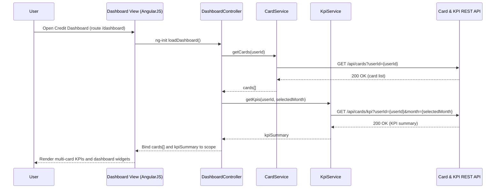

## 1. Architecture Mapping (brief)

- Dashboard UI Layer → AngularJS module `creditDashboardApp`, controller `DashboardController`, directives `cardSummaryPanel`, service `CardService`, service `KpiService`.
- Card & KPI Service API → AngularJS service `KpiApiService` (REST client) and factory `ApiConfigFactory` for base URLs.
- Card & Transaction Data Store → AngularJS service `TransactionService` wrapping HTTP calls and local caching.
- KPI Aggregation Component → AngularJS service `KpiAggregationService` performing in-browser aggregation when needed.

**Recommended folder structure**
- `app/modules/credit-dashboard/`
- `app/modules/credit-dashboard/controllers/`
- `app/modules/credit-dashboard/services/`
- `app/modules/credit-dashboard/directives/`
- `app/modules/credit-dashboard/views/`
- `app/assets/css/`

---

## 2. Component Specifications

| Name | Artifact Type | Responsibility | Key Dependencies |
|------|---------------|----------------|------------------|
| creditDashboardApp | AngularJS Module | Root module for credit card dashboard features and route config | `ngRoute`, `DashboardController`, `CardService`, `KpiService` |
| DashboardController | Controller | Orchestrates loading of cards, KPIs, and transactions; binds view models | `CardService`, `KpiService`, `$q`, `$scope` |
| CardService | Service | Fetches card list, limits, balances per user from REST API | `$http`, `ApiConfigFactory` |
| TransactionService | Service | Retrieves transaction summaries and monthly transactions per card | `$http`, `ApiConfigFactory` |
| KpiService | Service | Provides UI-ready KPI data (monthly spend, total limit, available credit, outstanding amounts) | `KpiApiService`, `KpiAggregationService` |
| KpiApiService | Service | Low-level REST client for KPI endpoints (e.g., `/api/cards/kpi`) | `$http`, `ApiConfigFactory` |
| KpiAggregationService | Service | Aggregates card and transaction data into KPI metrics in the client when needed | `CardService`, `TransactionService` |
| ApiConfigFactory | Factory | Centralizes API base URL, version, and common headers | `$window`, environment config |
| cardSummaryPanel | Directive | Renders per-card KPIs and basic details in Bootstrap panel | `DashboardController` scope, `CardService` |
| kpiOverviewWidget | Directive | Displays consolidated KPIs (monthly spend, limits, available, outstanding) | `DashboardController` scope, `KpiService` |
| dashboard.html | View (HTML5) | Bootstrap-based responsive layout for multi-card dashboard | `DashboardController`, AngularJS templates |
| dashboard.css | CSS | Styles credit dashboard cards, KPI tiles, responsive grid | Bootstrap, base app styles |

---

## 3. Data Model (brief)

```js
// Core models
Card = {
  id: String,
  maskedNumber: String,
  issuer: String,
  creditLimit: Number,
  availableCredit: Number,
  outstandingAmount: Number,
  dueDate: String,           // ISO date string
  status: String             // e.g., "ACTIVE", "BLOCKED"
};

Transaction = {
  id: String,
  cardId: String,
  txnDate: String,           // ISO date string
  amount: Number,
  currency: String,
  category: String,          // Food, Fuel, Shopping, etc.
  merchant: String
};

KpiSummary = {
  month: String,             // e.g., "2025-02"
  totalMonthlySpend: Number,
  totalCreditLimit: Number,
  totalAvailableCredit: Number,
  totalOutstandingAmount: Number,
  cardCount: Number
};

UserDashboardState = {
  userId: String,
  selectedMonth: String,
  cards: Array<Card>,
  transactions: Array<Transaction>,
  kpiSummary: KpiSummary
};
```

---

## 4. Data Flow (one paragraph)

User selects the dashboard route and optionally a month filter in the view, triggering `DashboardController` to call `CardService` and `KpiService`, which in turn invoke `KpiApiService` and `TransactionService` to fetch card and KPI data via REST APIs; responses are aggregated by `KpiAggregationService` where required and then bound back to the AngularJS scope, causing the HTML5/Bootstrap views (via `cardSummaryPanel` and `kpiOverviewWidget` directives) to update with consolidated KPIs and per-card details.

---

## 5. Primary Sequence Diagram (ONE only)



---

## 6. Implementation Notes (brief)

- Use AngularJS 1.x module `creditDashboardApp` with route configuration for `/dashboard` and lazy loading of dashboard components.
- Apply dependency injection for all services (`CardService`, `TransactionService`, `KpiService`, `KpiApiService`) using `$inject` arrays to support minification.
- Implement REST calls with `$http` returning ES6-promises (via `$q`) and handle responses in `DashboardController` with `.then()` chaining.
- Use Bootstrap grid system (`col-xs-*`, `col-md-*`) and media queries in `dashboard.css` for responsive layout across devices.
- Centralize API endpoints and headers (e.g., auth token) in `ApiConfigFactory` and use AngularJS interceptors for common request/response behavior.

---

## 7. Error Handling (ONE line)

Client-side errors are handled via a centralized `$http` interceptor that logs failures and shows user-friendly toast/alert messages on API or aggregation errors.

---

## 8. Security Notes (ONE line)

Standard input validation and secure API calls (HTTPS, token-based auth) assumed, with masking of card numbers and avoidance of sensitive identifiers in the UI.
