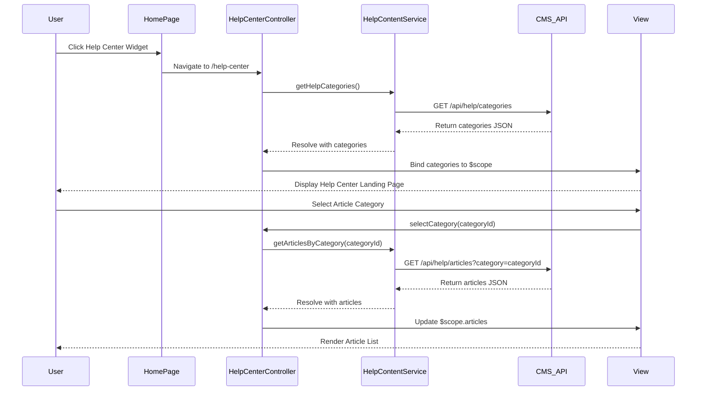

# Low-Level Design: Help Center Integration

## Epic ID: QE-4993

---

## a. Architecture Mapping

- **Home Page Module Enhancement**: Existing HomeModule extended with Help Center entry point component
- **Help Center Module**: New HelpCenterModule containing landing page controller, content display components
- **Help Center Controller**: HelpCenterController manages landing page state and user interactions
- **Content Service**: HelpContentService fetches articles, FAQs, and downloadable materials from CMS via REST API
- **Video Service**: VideoPlayerService integrates with video player service for embedded tutorials
- **Chat Service**: ChatAssistantService connects to chat service platform for interactive help
- **Search Service**: HelpSearchService handles search queries against indexed help content
- **Help Center Directive**: helpCenterWidget directive for Home Page entry point

**Recommended Folder Structure:**
```
app/
├── modules/
│   ├── home/
│   │   ├── home.controller.js
│   │   ├── home.html
│   │   └── directives/help-center-widget.directive.js
│   └── help-center/
│       ├── help-center.module.js
│       ├── help-center.controller.js
│       ├── help-center.html
│       ├── services/
│       │   ├── help-content.service.js
│       │   ├── video-player.service.js
│       │   ├── chat-assistant.service.js
│       │   └── help-search.service.js
│       └── components/
│           ├── article-viewer/
│           ├── video-player/
│           ├── chat-widget/
│           └── search-bar/
```

---

## b. Component Specifications

| Name | Artifact Type | Responsibility | Key Dependencies |
|------|---------------|----------------|------------------|
| HelpCenterModule | Module | Encapsulates all Help Center functionality and routing | angular, ui-router |
| HelpCenterWidgetDirective | Directive | Renders Help Center entry point button/link on Home Page | HomeModule |
| HelpCenterController | Controller | Manages Help Center landing page state, tab navigation, content selection | HelpContentService, VideoPlayerService, ChatAssistantService, HelpSearchService |
| HelpContentService | Service/Factory | Fetches text articles, FAQs, downloadable materials from CMS REST API | $http, $q |
| VideoPlayerService | Service/Factory | Retrieves video metadata and embeds video player for tutorials | $http, $sce |
| ChatAssistantService | Service/Factory | Initializes and manages chat widget connection to chat platform | $http, $window |
| HelpSearchService | Service/Factory | Executes search queries and returns filtered help content results | $http, $q |
| ArticleViewerComponent | Component | Displays text-based help articles and FAQs with formatting | HelpContentService |
| VideoPlayerComponent | Component | Embeds and controls video tutorial playback | VideoPlayerService |
| ChatWidgetComponent | Component | Renders interactive chat interface for user assistance | ChatAssistantService |
| SearchBarComponent | Component | Provides search input and displays search results | HelpSearchService |

---

## c. Data Model

**HelpArticle**
```javascript
{
  id: String,
  title: String,
  category: String,
  content: String,
  tags: Array<String>,
  lastUpdated: Date,
  downloadUrl: String (optional)
}
```

**VideoTutorial**
```javascript
{
  id: String,
  title: String,
  description: String,
  videoUrl: String,
  thumbnailUrl: String,
  duration: Number,
  category: String
}
```

**ChatSession**
```javascript
{
  sessionId: String,
  userId: String,
  messages: Array<{sender: String, text: String, timestamp: Date}>,
  isActive: Boolean
}
```

**SearchResult**
```javascript
{
  results: Array<{type: String, id: String, title: String, snippet: String, relevanceScore: Number}>,
  totalCount: Number,
  query: String
}
```

---

## d. Data Flow

User navigates to Home Page and clicks the Help Center widget (directive) → View triggers route change to Help Center landing page → HelpCenterController initializes and loads default content categories via HelpContentService → User selects a help option (article, video, chat, or search) → Corresponding service (HelpContentService, VideoPlayerService, ChatAssistantService, or HelpSearchService) makes REST API call to backend → Response data is processed and bound to scope → View components (ArticleViewerComponent, VideoPlayerComponent, ChatWidgetComponent, or SearchBarComponent) render the content responsively → User interacts with content, and any further actions repeat the service-to-API-to-view cycle.

---

## e. Primary Sequence Diagram



---

## f. Implementation Notes

- Use AngularJS module pattern with dependency injection for all services and controllers to ensure testability and maintainability
- Implement ES6 classes for services where appropriate, transpiled via Babel; use arrow functions for callbacks to maintain lexical scope
- Leverage $http interceptors for centralized API authentication token injection and error handling across all Help Center services
- Use ui-router for Help Center routing with lazy-loaded states to avoid impacting Home Page load performance
- Apply Bootstrap grid system and responsive utilities for mobile-first Help Center layout; use CSS3 media queries for custom breakpoints

---

## g. Error Handling

HTTP interceptor-based error handling with user-friendly toast notifications for API failures; try/catch blocks in service methods with fallback to cached content where applicable.

---

## h. Security Notes

Requires token-based authentication via existing SSO for user context in chat and personalized help; standard input validation and secure API calls assumed for all services.