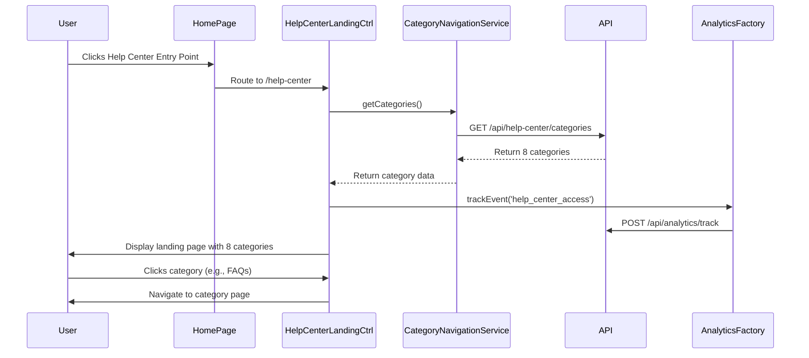

# Low-Level Design: Help Center Integration - Home Page

## Epic ID: QE-5008

---

## a. Architecture Mapping

- **Home Page Module** → AngularJS Module (`app.homepage`) - Entry point integration
- **Help Center Entry Component** → AngularJS Directive (`helpCenterEntry`) - Navigation link rendering
- **Help Center Landing Controller** → AngularJS Controller (`HelpCenterLandingCtrl`) - Landing page orchestration
- **Category Navigation Service** → AngularJS Service (`CategoryNavigationService`) - Category data management
- **Analytics Service** → AngularJS Factory (`AnalyticsFactory`) - Tracking Help Center access patterns
- **Error Handler** → AngularJS Interceptor (`errorInterceptor`) - HTTP error handling

**Recommended Folder Structure:**
```
/app
  /modules
    /help-center
      /controllers
        help-center-landing.controller.js
      /directives
        help-center-entry.directive.js
      /services
        category-navigation.service.js
      /factories
        analytics.factory.js
      /views
        help-center-landing.html
        help-center-entry.html
      help-center.module.js
  /shared
    /interceptors
      error.interceptor.js
```

---

## b. Component Specifications

| Component Name | Artifact Type | Responsibility | Key Dependencies |
|----------------|---------------|----------------|------------------|
| `app.helpCenter` | Module | Root module for Help Center functionality | `ngRoute`, `app.shared` |
| `HelpCenterLandingCtrl` | Controller | Manages landing page state, loads 8 categories, handles user navigation | `CategoryNavigationService`, `AnalyticsFactory`, `$scope` |
| `helpCenterEntry` | Directive | Renders Help Center entry point in Home Page navigation | None |
| `CategoryNavigationService` | Service | Provides category data (Getting Started, FAQs, How-to Guides, Video Tutorials, Help Materials, Troubleshooting, Chat Support, Search Help) | `$http`, `$q` |
| `AnalyticsFactory` | Factory | Tracks Help Center access rates, device info, and user interactions | `$window`, `$http` |
| `errorInterceptor` | Interceptor | Intercepts HTTP errors and displays meaningful messages to users | `$q`, `$injector` |
| `helpCenterLanding` | View Template | Displays 8 category cards with responsive grid layout (Bootstrap) | None |

---

## c. Data Model

```javascript
// Category Model
const Category = {
  id: String,              // e.g., 'getting-started'
  title: String,           // e.g., 'Getting Started'
  description: String,     // Brief category description
  icon: String,            // Icon class or URL
  route: String,           // Navigation route
  order: Number            // Display order (1-8)
};

// Analytics Event Model
const AnalyticsEvent = {
  eventType: String,       // 'help_center_access', 'category_click'
  timestamp: Date,
  userId: String,
  deviceType: String,      // 'desktop', 'tablet', 'mobile'
  categoryId: String       // Optional, for category-specific events
};
```

---

## d. Data Flow

User lands on Home Page → clicks Help Center entry point (directive) → `$location` service routes to `/help-center` → `HelpCenterLandingCtrl` initializes → calls `CategoryNavigationService.getCategories()` → service makes REST API call to fetch 8 categories → controller binds category data to `$scope` → view renders responsive category grid using Bootstrap → `AnalyticsFactory` fires tracking event → user clicks category card → controller navigates to category-specific route → if API fails, `errorInterceptor` catches error and displays user-friendly message.

---

## e. Primary Sequence Diagram



---

## f. Implementation Notes

- Use AngularJS 1.x Dependency Injection for all services, controllers, and factories
- Leverage `$http` service with promise-based API calls; handle responses with `.then()` and `.catch()`
- Implement responsive design using Bootstrap grid system (col-xs, col-sm, col-md, col-lg) for mobile/tablet/desktop
- Use `ng-repeat` with `track by category.id` for rendering category cards to optimize performance
- Apply ARIA attributes (`role`, `aria-label`) and keyboard navigation (`tabindex`, `ng-keypress`) for WCAG 2.1 AA compliance

---

## g. Error Handling

HTTP interceptor-based error handling with user-friendly notifications displayed via Bootstrap alert components.

---

## h. Security Notes

Requires HTTPS for all API calls; standard input validation and secure API calls assumed.