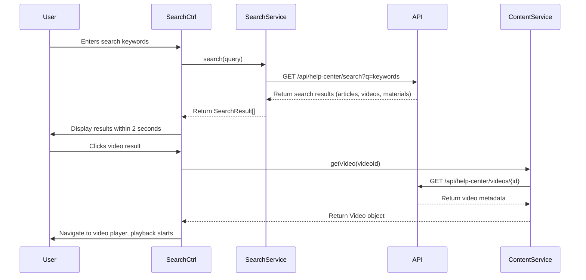

# Low-Level Design: Help Center Content Delivery - Videos, Downloads, and Search

## Epic ID: QE-5009

---

## a. Architecture Mapping

- **Content Delivery Module** → AngularJS Module (`app.helpCenter.content`) - Content rendering and delivery
- **Video Player Controller** → AngularJS Controller (`VideoPlayerCtrl`) - Video playback management
- **Download Manager Service** → AngularJS Service (`DownloadManagerService`) - File download orchestration
- **Search Controller** → AngularJS Controller (`SearchCtrl`) - Search interface and result display
- **Search Service** → AngularJS Service (`SearchService`) - Search API integration
- **Video Embed Directive** → AngularJS Directive (`videoEmbed`) - HTML5 video player embedding
- **Content Service** → AngularJS Service (`ContentService`) - CMS integration for articles and materials

**Recommended Folder Structure:**
```
/app
  /modules
    /help-center
      /content
        /controllers
          video-player.controller.js
          search.controller.js
        /services
          download-manager.service.js
          search.service.js
          content.service.js
        /directives
          video-embed.directive.js
        /views
          video-tutorial.html
          search-results.html
        content.module.js
```

---

## b. Component Specifications

| Component Name | Artifact Type | Responsibility | Key Dependencies |
|----------------|---------------|----------------|------------------|
| `app.helpCenter.content` | Module | Root module for content delivery (videos, downloads, search) | `ngRoute`, `app.helpCenter` |
| `VideoPlayerCtrl` | Controller | Manages video playback state, controls, and error handling | `$scope`, `$sce`, `ContentService` |
| `videoEmbed` | Directive | Embeds HTML5 video player with custom controls and cross-device compatibility | `$sce` |
| `DownloadManagerService` | Service | Handles secure file downloads (PDF, DOCX) via HTTPS | `$http`, `$window` |
| `SearchCtrl` | Controller | Manages search input, displays results, handles filtering | `SearchService`, `$scope`, `$timeout` |
| `SearchService` | Service | Executes keyword-based search across articles, videos, and materials | `$http`, `$q` |
| `ContentService` | Service | Fetches content metadata from CMS | `$http`, `$q` |

---

## c. Data Model

```javascript
// Video Model
const Video = {
  id: String,              // Unique video ID
  title: String,           // Video title
  description: String,     // Video description
  url: String,             // Video streaming URL (HTTPS)
  thumbnailUrl: String,    // Thumbnail image URL
  duration: Number,        // Duration in seconds
  category: String         // Category ID
};

// Downloadable Material Model
const DownloadableMaterial = {
  id: String,              // Unique material ID
  title: String,           // Material title
  fileType: String,        // 'PDF' or 'DOCX'
  fileUrl: String,         // Secure download URL (HTTPS)
  fileSize: Number,        // File size in bytes
  category: String         // Category ID
};

// Search Result Model
const SearchResult = {
  id: String,              // Content ID
  type: String,            // 'article', 'video', 'material'
  title: String,           // Content title
  snippet: String,         // Search result snippet
  url: String,             // Content URL or route
  relevance: Number        // Search relevance score
};
```

---

## d. Data Flow

User navigates to video tutorial page → `VideoPlayerCtrl` initializes → calls `ContentService.getVideo(id)` → service fetches video metadata via REST API → controller uses `$sce.trustAsResourceUrl()` to sanitize video URL → `videoEmbed` directive renders HTML5 player → video streams from hosting platform → playback starts within 2 seconds → for downloads, user clicks download button → `DownloadManagerService.downloadFile(fileUrl)` triggers secure HTTPS download → for search, user enters keywords → `SearchCtrl` calls `SearchService.search(query)` with debounce → service queries REST API → results returned within 2 seconds → controller displays filtered results → user clicks result → navigates to corresponding content.

---

## e. Primary Sequence Diagram



---

## f. Implementation Notes

- Use `$sce.trustAsResourceUrl()` to sanitize video URLs before embedding to prevent XSS attacks
- Implement search debouncing with `$timeout` (300ms delay) to reduce API calls during user typing
- Use HTML5 `<video>` element with fallback error messages for unsupported formats
- Leverage `$http` with `responseType: 'blob'` for secure file downloads; trigger download via `$window.open()` or anchor element
- Apply `ng-if` and loading spinners to manage async content loading states

---

## g. Error Handling

Interceptor-based HTTP error handling with try/catch blocks for video playback failures; user notifications via Bootstrap alerts.

---

## h. Security Notes

All video streaming and file downloads served over HTTPS; GDPR-compliant storage with standard input validation and secure API calls assumed.