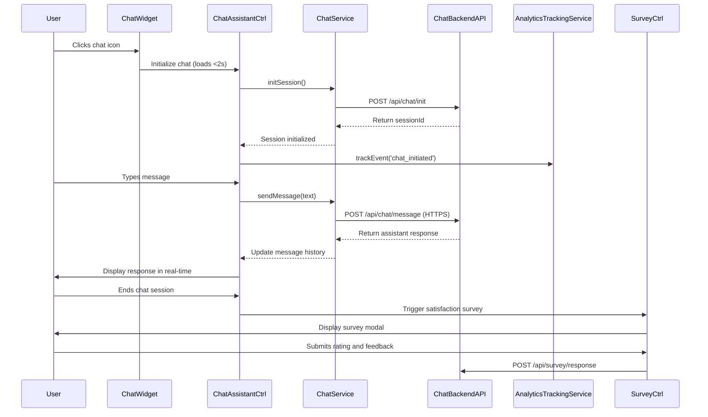

# Low-Level Design: Help Center Chat Assistant and Analytics

## Epic ID: QE-5010

---

## a. Architecture Mapping

- **Chat Assistant Module** → AngularJS Module (`app.helpCenter.chat`) - Real-time chat functionality
- **Chat Controller** → AngularJS Controller (`ChatAssistantCtrl`) - Chat UI state and message management
- **Chat Service** → AngularJS Service (`ChatService`) - WebSocket/REST API integration for chat backend
- **Chat Widget Directive** → AngularJS Directive (`chatWidget`) - Chat UI component rendering
- **Analytics Tracking Service** → AngularJS Service (`AnalyticsTrackingService`) - User interaction and device analytics
- **Survey Controller** → AngularJS Controller (`SurveyCtrl`) - Post-interaction survey management
- **Survey Service** → AngularJS Service (`SurveyService`) - Survey platform integration

**Recommended Folder Structure:**
```
/app
  /modules
    /help-center
      /chat
        /controllers
          chat-assistant.controller.js
          survey.controller.js
        /services
          chat.service.js
          analytics-tracking.service.js
          survey.service.js
        /directives
          chat-widget.directive.js
        /views
          chat-widget.html
          survey-modal.html
        chat.module.js
```

---

## b. Component Specifications

| Component Name | Artifact Type | Responsibility | Key Dependencies |
|----------------|---------------|----------------|------------------|
| `app.helpCenter.chat` | Module | Root module for chat assistant and analytics | `ngRoute`, `app.helpCenter` |
| `ChatAssistantCtrl` | Controller | Manages chat session state, message history, and user input | `ChatService`, `AnalyticsTrackingService`, `$scope` |
| `chatWidget` | Directive | Renders collapsible chat UI component with 2-second load time | `ChatService` |
| `ChatService` | Service | Handles real-time message exchange with chat backend via WebSocket or REST | `$http`, `$q`, `$websocket` (or equivalent) |
| `AnalyticsTrackingService` | Service | Tracks Help Center access, mobile usage, device type, and interaction patterns | `$http`, `$window` |
| `SurveyCtrl` | Controller | Displays post-interaction satisfaction survey and collects responses | `SurveyService`, `$scope`, `$uibModal` |
| `SurveyService` | Service | Submits survey responses to survey platform API | `$http`, `$q` |

---

## c. Data Model

```javascript
// Chat Message Model
const ChatMessage = {
  id: String,              // Unique message ID
  sessionId: String,       // Chat session ID
  sender: String,          // 'user' or 'assistant'
  message: String,         // Message text
  timestamp: Date          // Message timestamp
};

// Chat Session Model
const ChatSession = {
  sessionId: String,       // Unique session ID
  userId: String,          // User ID (if authenticated)
  startTime: Date,         // Session start time
  endTime: Date,           // Session end time
  messages: ChatMessage[]  // Array of messages
};

// Analytics Event Model
const AnalyticsEvent = {
  eventType: String,       // 'page_access', 'chat_initiated', 'device_info'
  timestamp: Date,
  userId: String,
  deviceType: String,      // 'desktop', 'tablet', 'mobile'
  isMobile: Boolean,       // Mobile usage flag
  sessionId: String        // Optional chat session ID
};

// Survey Response Model
const SurveyResponse = {
  sessionId: String,       // Chat session ID
  rating: Number,          // Satisfaction rating (1-5)
  feedback: String,        // Optional text feedback
  timestamp: Date
};
```

---

## d. Data Flow

User accesses Help Center landing page → `AnalyticsTrackingService` captures page access event (device type, mobile flag) → sends analytics data asynchronously to web analytics API → user clicks chat widget → `chatWidget` directive loads within 2 seconds → `ChatAssistantCtrl` initializes chat session → calls `ChatService.initSession()` → service establishes WebSocket connection or REST polling to chat backend → user types message → controller sends message via `ChatService.sendMessage()` → message transmitted over HTTPS → backend processes and returns response in real-time → controller updates message history in `$scope` → after chat ends, `SurveyCtrl` triggers post-interaction survey modal → user submits rating and feedback → `SurveyService.submitResponse()` sends data to survey platform API → all interactions logged for continuous improvement.

---

## e. Primary Sequence Diagram



---

## f. Implementation Notes

- Use AngularJS `$http` for REST-based chat or integrate WebSocket library (e.g., `angular-websocket`) for real-time messaging
- Implement lazy loading for chat widget to ensure 2-second load time; use `ng-if` to defer initialization until user interaction
- Leverage `$window.navigator.userAgent` to detect device type and mobile usage for analytics tracking
- Use `$uibModal` (UI Bootstrap) for post-interaction survey modal display
- Apply GDPR-compliant consent mechanism before initializing chat and analytics tracking

---

## g. Error Handling

Interceptor-based error handling for API failures; WebSocket reconnection logic with exponential backoff; user notifications via inline chat error messages.

---

## h. Security Notes

Requires HTTPS for all chat and analytics API calls; GDPR-compliant data collection with user consent; standard input validation and secure API calls assumed.