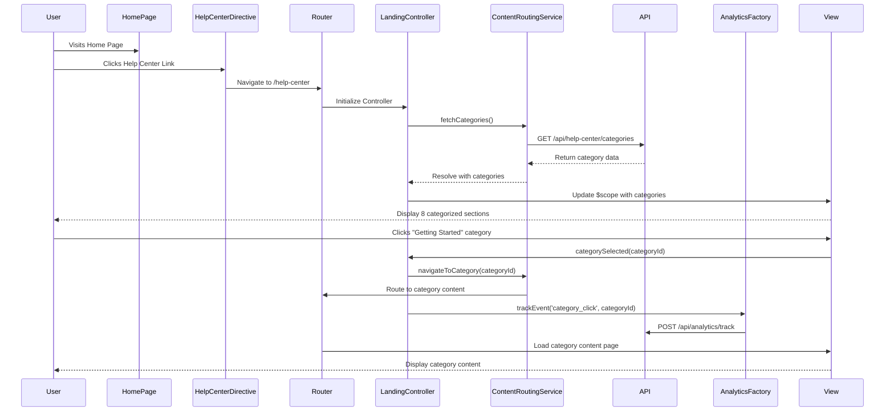

# Low-Level Design: Help Center Integration - Home Page

## Epic ID: QE-5023

---

## a. Architecture Mapping

- **Home Page Navigation Component** → AngularJS Directive (`helpCenterEntryDirective`) embedded in existing home page template
- **Help Center Landing Page** → AngularJS Module (`helpCenterModule`) with dedicated Controller (`HelpCenterLandingController`)
- **Category Navigation** → AngularJS Controller (`CategoryNavigationController`) managing category selection and routing
- **Content Routing Service** → AngularJS Service (`contentRoutingService`) handling category-based navigation logic
- **Analytics Integration** → AngularJS Factory (`analyticsFactory`) for tracking user interactions

**Recommended Folder Structure:**
```
app/
├── modules/
│   └── helpCenter/
│       ├── helpCenter.module.js
│       ├── controllers/
│       │   ├── helpCenterLanding.controller.js
│       │   └── categoryNavigation.controller.js
│       ├── services/
│       │   └── contentRouting.service.js
│       ├── directives/
│       │   └── helpCenterEntry.directive.js
│       ├── factories/
│       │   └── analytics.factory.js
│       └── views/
│           └── helpCenterLanding.html
```

---

## b. Component Specifications

| Name | Artifact Type | Responsibility | Key Dependencies |
|------|---------------|----------------|------------------|
| `helpCenterModule` | Module | Root module for Help Center functionality | `ngRoute`, `ui.bootstrap` |
| `helpCenterEntryDirective` | Directive | Renders Help Center entry point link/button in Home Page header | None |
| `HelpCenterLandingController` | Controller | Manages landing page state, category display, and user interactions | `contentRoutingService`, `analyticsFactory`, `$scope` |
| `CategoryNavigationController` | Controller | Handles category selection and navigation to content sections | `contentRoutingService`, `$location`, `$scope` |
| `contentRoutingService` | Service | Routes users to appropriate content based on category selection | `$http`, `$q` |
| `analyticsFactory` | Factory | Tracks page views, category clicks, and user navigation patterns | `$window` (for analytics SDK) |

---

## c. Data Model

**Category Model:**
```javascript
{
  id: String,              // e.g., "getting-started"
  title: String,           // e.g., "Getting Started"
  description: String,     // Brief category description
  icon: String,            // Icon CSS class or URL
  route: String,           // Target route path
  order: Number            // Display order
}
```

**Help Center State Model:**
```javascript
{
  categories: Array<Category>,  // List of 8 categories
  selectedCategory: String,     // Currently selected category ID
  isLoading: Boolean,           // Loading state
  error: Object                 // Error object {message, code}
}
```

---

## d. Data Flow

User visits Home Page → clicks Help Center entry point (directive) → `$location` navigates to `/help-center` route → `HelpCenterLandingController` initializes and loads category data from `contentRoutingService` → Service fetches category configuration via REST API → Controller updates `$scope` with 8 categories → View renders categorized sections with Bootstrap grid → User clicks category → `CategoryNavigationController` captures event → `contentRoutingService` routes to category-specific content URL → `analyticsFactory` tracks interaction → UI updates with loading indicator during transitions → Error interceptor displays user-friendly message if routing fails.

---

## e. Primary Sequence Diagram



---

## f. Implementation Notes

- Use AngularJS `$routeProvider` for routing between Home Page and Help Center landing page with lazy loading for performance
- Implement dependency injection for all services, factories, and controllers following AngularJS best practices
- Use `$http` interceptor for global error handling and loading state management across all API calls
- Leverage Bootstrap responsive grid system (col-xs/sm/md/lg) for mobile-first responsive layout of 8 categories
- Implement `$q` promises for asynchronous content loading with 2-second timeout threshold and fallback error handling

---

## g. Error Handling

HTTP interceptor-based error handling with user-friendly notifications via Bootstrap alerts; retry logic for transient failures with exponential backoff.

---

## h. Security Notes

Requires token-based authentication via existing SSO; all API calls use HTTPS with CORS validation.