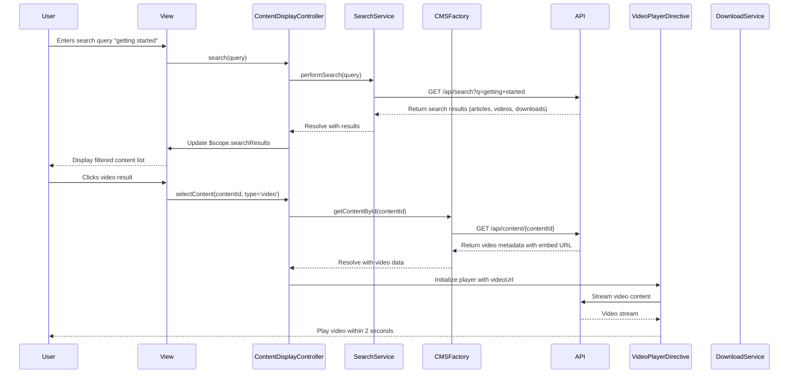

# Low-Level Design: Help Center Content Delivery

## Epic ID: QE-5024

---

## a. Architecture Mapping

- **Content Display Component** → AngularJS Controller (`ContentDisplayController`) managing multi-format content rendering
- **Search Functionality** → AngularJS Service (`searchService`) with keyword-based indexing and filtering
- **Video Player Integration** → AngularJS Directive (`videoPlayerDirective`) for embedded video rendering
- **Downloadable Materials Handler** → AngularJS Service (`downloadService`) managing file retrieval and downloads
- **Content Management Integration** → AngularJS Factory (`cmsFactory`) interfacing with backend CMS API

**Recommended Folder Structure:**
```
app/
├── modules/
│   └── helpContent/
│       ├── helpContent.module.js
│       ├── controllers/
│       │   └── contentDisplay.controller.js
│       ├── services/
│       │   ├── search.service.js
│       │   └── download.service.js
│       ├── directives/
│       │   └── videoPlayer.directive.js
│       ├── factories/
│       │   └── cms.factory.js
│       └── views/
│           ├── contentList.html
│           └── contentDetail.html
```

---

## b. Component Specifications

| Name | Artifact Type | Responsibility | Key Dependencies |
|------|---------------|----------------|------------------|
| `helpContentModule` | Module | Root module for content delivery functionality | `ngRoute`, `ngSanitize`, `helpCenterModule` |
| `ContentDisplayController` | Controller | Manages content rendering, search results, and user interactions | `searchService`, `downloadService`, `cmsFactory`, `$scope` |
| `searchService` | Service | Performs keyword-based search across articles, videos, and downloads | `$http`, `$q`, `$filter` |
| `downloadService` | Service | Handles file download requests and tracks download events | `$http`, `$window` |
| `videoPlayerDirective` | Directive | Embeds and controls video playback with responsive player | `cmsFactory` |
| `cmsFactory` | Factory | Interfaces with CMS API for content retrieval and caching | `$http`, `$cacheFactory` |

---

## c. Data Model

**Content Item Model:**
```javascript
{
  id: String,                  // Unique content identifier
  type: String,                // "article", "video", "download"
  title: String,               // Content title
  description: String,         // Brief description
  body: String,                // Full article text (for articles)
  videoUrl: String,            // Video embed URL (for videos)
  downloadUrl: String,         // File download URL (for downloads)
  fileFormat: String,          // "PDF", "DOCX" (for downloads)
  keywords: Array<String>,     // Search keywords
  categoryId: String,          // Associated category
  createdDate: Date,
  lastModified: Date
}
```

**Search Result Model:**
```javascript
{
  query: String,               // User search query
  results: Array<ContentItem>, // Matching content items
  totalCount: Number,          // Total results found
  executionTime: Number        // Search execution time in ms
}
```

---

## d. Data Flow

User navigates to Help Center content section → enters search query or browses category → `searchService` sends keyword query to backend search API → API queries indexed content across CMS, video platform, and file storage → Results returned within 2 seconds → `ContentDisplayController` receives results and updates `$scope` → View renders filtered list with content type indicators → User selects article/video/download → For articles: `cmsFactory` fetches content via REST API and renders HTML; For videos: `videoPlayerDirective` embeds player with streaming URL; For downloads: `downloadService` initiates secure file download via HTTPS → All interactions cached for performance → Error interceptor displays message if content unavailable.

---

## e. Primary Sequence Diagram



---

## f. Implementation Notes

- Use `$http` with `$cacheFactory` for caching frequently accessed content to reduce API calls and improve load times
- Implement `ngSanitize` for safe HTML rendering of article content to prevent XSS vulnerabilities
- Use debouncing on search input (300ms delay) to minimize API calls during typing using `$timeout` service
- Leverage CDN URLs for video and download content with fallback to origin server if CDN unavailable
- Implement lazy loading for search results using pagination with `$scope.$watch` for infinite scroll behavior

---

## g. Error Handling

HTTP interceptor captures API errors; user-friendly messages displayed via Bootstrap modals with retry options for failed content loads.

---

## h. Security Notes

Standard input validation and secure API calls assumed; video embed URLs validated to prevent injection; download links use signed tokens with expiration.