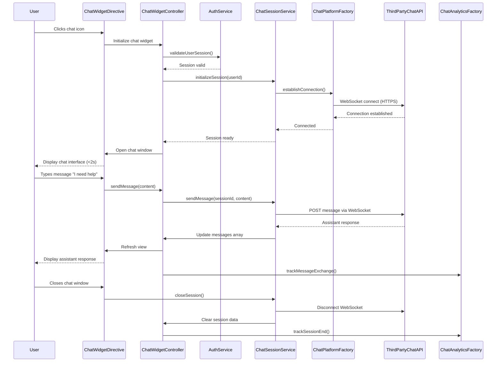

# Low-Level Design: Chat Assistant Integration

## Epic ID: QE-5025

---

## a. Architecture Mapping

- **Chat Widget UI** → AngularJS Directive (`chatWidgetDirective`) embedded in Help Center landing page
- **Chat Session Management** → AngularJS Service (`chatSessionService`) managing real-time messaging and session state
- **Third-Party Chat Integration** → AngularJS Factory (`chatPlatformFactory`) interfacing with external chat API
- **User Authentication** → AngularJS Service (`authService`) validating user sessions for chat access
- **Chat Analytics** → AngularJS Factory (`chatAnalyticsFactory`) tracking chat interactions and performance metrics

**Recommended Folder Structure:**
```
app/
├── modules/
│   └── chatAssistant/
│       ├── chatAssistant.module.js
│       ├── controllers/
│       │   └── chatWidget.controller.js
│       ├── services/
│       │   ├── chatSession.service.js
│       │   └── auth.service.js
│       ├── directives/
│       │   └── chatWidget.directive.js
│       ├── factories/
│       │   ├── chatPlatform.factory.js
│       │   └── chatAnalytics.factory.js
│       └── views/
│           └── chatWidget.html
```

---

## b. Component Specifications

| Name | Artifact Type | Responsibility | Key Dependencies |
|------|---------------|----------------|------------------|
| `chatAssistantModule` | Module | Root module for chat assistant functionality | `ngWebSocket`, `helpCenterModule` |
| `chatWidgetDirective` | Directive | Renders chat widget interface with open/close/minimize controls | `chatSessionService`, `$compile` |
| `ChatWidgetController` | Controller | Manages chat UI state, message display, and user input handling | `chatSessionService`, `authService`, `chatAnalyticsFactory`, `$scope` |
| `chatSessionService` | Service | Handles WebSocket connection, message transmission, and session lifecycle | `chatPlatformFactory`, `$websocket`, `$q` |
| `authService` | Service | Validates user authentication and manages session tokens for chat access | `$http`, `$window` |
| `chatPlatformFactory` | Factory | Interfaces with third-party chat platform API for message routing | `$http` |
| `chatAnalyticsFactory` | Factory | Tracks chat open/close events, message counts, and response times | `$http` |

---

## c. Data Model

**Chat Message Model:**
```javascript
{
  id: String,              // Unique message identifier
  sessionId: String,       // Chat session identifier
  sender: String,          // "user" or "assistant"
  content: String,         // Message text
  timestamp: Date,         // Message timestamp
  status: String           // "sent", "delivered", "read"
}
```

**Chat Session Model:**
```javascript
{
  sessionId: String,       // Unique session identifier
  userId: String,          // Authenticated user ID
  status: String,          // "active", "closed"
  messages: Array<ChatMessage>,
  startTime: Date,
  endTime: Date,
  isConnected: Boolean     // WebSocket connection status
}
```

---

## d. Data Flow

User clicks chat widget icon on Help Center landing page → `chatWidgetDirective` initializes and opens chat window within 2 seconds → `ChatWidgetController` calls `authService` to validate user session → `chatSessionService` establishes WebSocket connection to third-party chat platform via `chatPlatformFactory` → User types message in chat input → Controller captures input and calls `chatSessionService.sendMessage()` → Service transmits message over HTTPS WebSocket to chat platform API → Platform processes message and returns response in real-time → Service receives response and updates `$scope.messages` → View renders new message in chat window → `chatAnalyticsFactory` tracks message exchange → User closes chat → Service terminates WebSocket connection and clears session data (no persistence) → Analytics logs session metrics.

---

## e. Primary Sequence Diagram



---

## f. Implementation Notes

- Use `angular-websocket` library for WebSocket connection management with automatic reconnection on connection drops
- Implement dependency injection for `chatSessionService` and `authService` with singleton pattern to maintain state across components
- Use `$scope.$apply()` within WebSocket callbacks to trigger digest cycle for real-time message updates in view
- Leverage Bootstrap modal component for chat widget UI with CSS transitions for smooth open/close animations
- Implement GDPR-compliant session handling: no message persistence, session data cleared on close, user consent tracked via `authService`

---

## g. Error Handling

WebSocket error events captured with automatic reconnection attempts (max 3 retries); user notified via inline chat message if connection fails persistently.

---

## h. Security Notes

Requires token-based auth via existing SSO; all WebSocket communication over HTTPS/WSS; GDPR compliance enforced with no message persistence and session-only data storage.