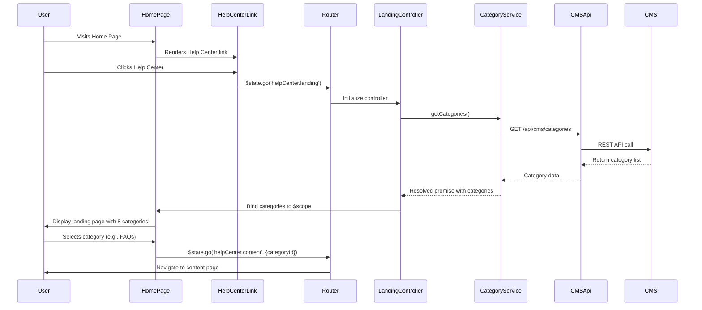

# Low-Level Design: Help Center Integration - Home Page Entry Point and Landing Page

**Epic ID:** QE-5038

**Technology Stack:** AngularJS 1.x, JavaScript ES6, HTML5, CSS3, Bootstrap, REST APIs, MVC Architecture

---

## a. Architecture Mapping

- **Home Page Component** → AngularJS Module: `app.homePage`, Controller: `HomePageController`
- **Help Center Entry Point** → Directive: `helpCenterLink` (navigation link component)
- **Help Center Landing Page** → Module: `app.helpCenter`, Controller: `HelpCenterLandingController`, View: `help-center-landing.html`
- **Category Navigation** → Component: `categoryNavigation`, Service: `CategoryService` (fetches categories from CMS)
- **Content Pages** → Controller: `ContentPageController`, Service: `ContentService` (retrieves content via REST API)
- **CMS Integration** → Factory: `CMSApiFactory` (handles all CMS REST API calls)

**Recommended Folder Structure:**
```
/app
  /modules
    /home-page
      home-page.controller.js
      home-page.html
    /help-center
      help-center-landing.controller.js
      help-center-landing.html
      category-navigation.component.js
      content-page.controller.js
  /services
    category.service.js
    content.service.js
  /factories
    cms-api.factory.js
  /directives
    help-center-link.directive.js
  /assets
    /css
    /images
```

---

## b. Component Specifications

| Component Name | Artifact Type | Responsibility | Key Dependencies |
|----------------|---------------|----------------|------------------|
| `app.homePage` | Module | Home page module definition and routing | `ui.router`, `app.helpCenter` |
| `HomePageController` | Controller | Manages home page state and navigation | `$scope`, `$state` |
| `helpCenterLink` | Directive | Renders Help Center entry point link in header | `$state` |
| `app.helpCenter` | Module | Help Center module with routing configuration | `ui.router`, `ngResource` |
| `HelpCenterLandingController` | Controller | Loads and displays landing page with categories | `$scope`, `CategoryService`, `$state` |
| `categoryNavigation` | Component | Displays eight categorized navigation menu | `CategoryService` |
| `ContentPageController` | Controller | Renders category-specific content pages | `$scope`, `ContentService`, `$stateParams` |
| `CategoryService` | Service | Fetches category list from CMS via REST API | `CMSApiFactory`, `$q` |
| `ContentService` | Service | Retrieves content for selected category | `CMSApiFactory`, `$q` |
| `CMSApiFactory` | Factory | Handles all CMS REST API interactions | `$resource`, `$http` |

---

## c. Data Model

**Category Model:**
```javascript
{
  id: String,
  name: String,  // e.g., "Getting Started", "FAQs", "How-to Guides"
  slug: String,
  icon: String,
  order: Number
}
```

**Content Model:**
```javascript
{
  id: String,
  categoryId: String,
  title: String,
  body: String,  // HTML content
  type: String,  // "article", "faq", "guide"
  lastUpdated: Date
}
```

**Navigation Link Model:**
```javascript
{
  label: String,
  route: String,
  visible: Boolean
}
```

---

## d. Data Flow

User visits Home Page → `HomePageController` renders view with `helpCenterLink` directive in header → User clicks Help Center link → `$state.go('helpCenter.landing')` triggers route transition → `HelpCenterLandingController` initializes and calls `CategoryService.getCategories()` → Service invokes `CMSApiFactory` REST API (`GET /api/cms/categories`) → CMS returns category list → Controller binds categories to `$scope` → View renders `categoryNavigation` component with eight categories → User selects category (e.g., FAQs) → `$state.go('helpCenter.content', {categoryId})` navigates to content page → `ContentPageController` calls `ContentService.getContent(categoryId)` → REST API (`GET /api/cms/content?categoryId=X`) retrieves content → View displays content with error handling via interceptor if API fails.

---

## e. Primary Sequence Diagram



---

## f. Implementation Notes

- Use AngularJS `ui-router` for state-based navigation with lazy-loaded templates for performance (<2s page load).
- Implement dependency injection pattern: inject services into controllers, factories into services.
- Use `$resource` or `$http` in `CMSApiFactory` for RESTful CMS API integration with promise-based responses.
- Apply Bootstrap responsive grid system and CSS3 media queries for mobile/tablet/desktop compatibility.
- Ensure WCAG 2.1 AA compliance: add ARIA labels to navigation, keyboard navigation support (`tabindex`), alt text for icons.

---

## g. Error Handling

HTTP interceptor captures API errors (4xx/5xx), displays user-friendly notifications via Bootstrap alerts, and logs errors to console.

---

## h. Security Notes

All API calls use HTTPS; standard input validation and secure API calls assumed per existing application security baseline.