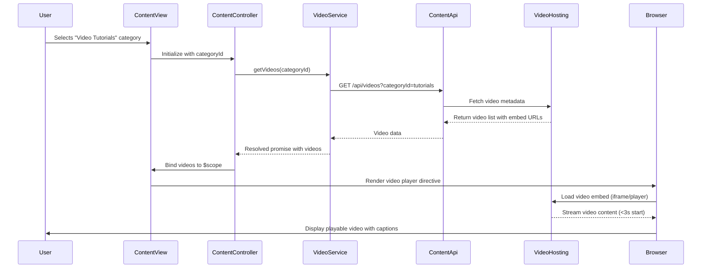

# Low-Level Design: Help Center Multi-Format Content Delivery

**Epic ID:** QE-5039

**Technology Stack:** AngularJS 1.x, JavaScript ES6, HTML5, CSS3, Bootstrap, REST APIs, MVC Architecture

---

## a. Architecture Mapping

- **Content Display Component** → Module: `app.helpCenter.content`, Controller: `ContentViewController`
- **Text Articles/FAQs** → Service: `ArticleService` (fetches via CMS REST API), View: `article-view.html`
- **Video Tutorials** → Directive: `videoPlayer` (embeds video from hosting platform), Service: `VideoService`
- **Downloadable Materials** → Service: `DownloadService` (retrieves secure file links), Component: `downloadLink`
- **Search Functionality** → Controller: `SearchController`, Service: `SearchService` (queries CMS)
- **Content Management** → Factory: `ContentApiFactory` (handles all content-related REST APIs)

**Recommended Folder Structure:**
```
/app
  /modules
    /help-center
      /content
        content-view.controller.js
        content-view.html
        article-view.html
        search.controller.js
  /services
    article.service.js
    video.service.js
    download.service.js
    search.service.js
  /factories
    content-api.factory.js
  /directives
    video-player.directive.js
  /components
    download-link.component.js
```

---

## b. Component Specifications

| Component Name | Artifact Type | Responsibility | Key Dependencies |
|----------------|---------------|----------------|------------------|
| `app.helpCenter.content` | Module | Content display module with routing | `ui.router`, `ngSanitize` |
| `ContentViewController` | Controller | Manages content rendering based on type (text/video/download) | `$scope`, `ArticleService`, `VideoService`, `DownloadService`, `$stateParams` |
| `SearchController` | Controller | Handles search queries and displays results | `$scope`, `SearchService` |
| `ArticleService` | Service | Fetches text articles and FAQs from CMS | `ContentApiFactory`, `$q` |
| `VideoService` | Service | Retrieves video metadata and embed URLs | `ContentApiFactory`, `$q` |
| `DownloadService` | Service | Gets secure download links for materials | `ContentApiFactory`, `$q` |
| `SearchService` | Service | Performs search across all content types | `ContentApiFactory`, `$q` |
| `ContentApiFactory` | Factory | REST API wrapper for CMS and file storage | `$resource`, `$http` |
| `videoPlayer` | Directive | Embeds video player with accessibility controls | `VideoService` |
| `downloadLink` | Component | Renders secure download button with file info | `DownloadService` |

---

## c. Data Model

**Article Model:**
```javascript
{
  id: String,
  title: String,
  body: String,  // HTML content
  categoryId: String,
  type: String,  // "article" or "faq"
  tags: Array<String>,
  lastUpdated: Date
}
```

**Video Model:**
```javascript
{
  id: String,
  title: String,
  description: String,
  embedUrl: String,  // CDN-backed video hosting URL
  thumbnailUrl: String,
  duration: Number,  // seconds
  captionsAvailable: Boolean
}
```

**Download Model:**
```javascript
{
  id: String,
  title: String,
  description: String,
  fileUrl: String,  // Secure CDN link
  fileType: String,  // "pdf", "docx", etc.
  fileSize: Number,  // bytes
  lastUpdated: Date
}
```

**Search Result Model:**
```javascript
{
  id: String,
  title: String,
  snippet: String,
  contentType: String,  // "article", "video", "download"
  relevanceScore: Number
}
```

---

## d. Data Flow

User navigates to Help Center and selects content category → `ContentViewController` initializes with `$stateParams.categoryId` → Controller determines content type from route → For text: calls `ArticleService.getArticles(categoryId)` → Service invokes `ContentApiFactory` (`GET /api/cms/articles?categoryId=X`) → CMS returns articles → View renders HTML with `ng-bind-html` (sanitized). For videos: calls `VideoService.getVideos(categoryId)` → REST API (`GET /api/videos?categoryId=X`) returns video metadata → `videoPlayer` directive embeds player from hosting platform URL. For downloads: calls `DownloadService.getDownloads(categoryId)` → REST API (`GET /api/downloads?categoryId=X`) returns secure file storage links → `downloadLink` component renders download buttons. Search: User enters query → `SearchController` calls `SearchService.search(query)` → REST API (`GET /api/cms/search?q=query`) returns results across all types → View displays unified search results.

---

## e. Primary Sequence Diagram



---

## f. Implementation Notes

- Use `ngSanitize` module with `ng-bind-html` for safe rendering of HTML article content from CMS.
- Implement `videoPlayer` directive using iframe embed or HTML5 video element with CDN-backed source URLs.
- Use `$resource` in `ContentApiFactory` for RESTful API calls with caching to improve <2s page load performance.
- Apply lazy loading for video thumbnails and defer embed initialization until user interaction to optimize performance.
- Ensure WCAG 2.1 AA: video captions via hosting platform, alt text for thumbnails, keyboard-accessible download buttons.

---

## g. Error Handling

HTTP interceptor catches API failures, displays Bootstrap alert notifications, and provides fallback content or retry options.

---

## h. Security Notes

All content delivery via HTTPS; secure file download links with time-limited tokens from file storage service; standard input validation applied.