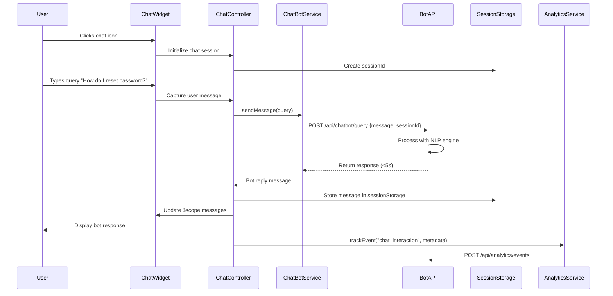

# Low-Level Design: Help Center Chat Assistant and Analytics

**Epic ID:** QE-5040

**Technology Stack:** AngularJS 1.x, JavaScript ES6, HTML5, CSS3, Bootstrap, REST APIs, MVC Architecture

---

## a. Architecture Mapping

- **Chat Assistant Interface** → Module: `app.helpCenter.chat`, Controller: `ChatController`, Directive: `chatWidget`
- **Chat Bot Engine Integration** → Service: `ChatBotService` (communicates with third-party bot API)
- **Session Storage** → Service: `SessionStorageService` (manages temporary chat data in browser)
- **Analytics Tracking** → Service: `AnalyticsService` (captures user interactions), Factory: `AnalyticsApiFactory`
- **Analytics Dashboard** → Module: `app.analytics`, Controller: `AnalyticsDashboardController` (for support staff)
- **Feedback Collection** → Component: `feedbackForm`, Service: `FeedbackService`

**Recommended Folder Structure:**
```
/app
  /modules
    /help-center
      /chat
        chat.controller.js
        chat-widget.directive.js
    /analytics
      analytics-dashboard.controller.js
      analytics-dashboard.html
  /services
    chatbot.service.js
    session-storage.service.js
    analytics.service.js
    feedback.service.js
  /factories
    analytics-api.factory.js
  /components
    feedback-form.component.js
```

---

## b. Component Specifications

| Component Name | Artifact Type | Responsibility | Key Dependencies |
|----------------|---------------|----------------|------------------|
| `app.helpCenter.chat` | Module | Chat assistant module definition | `ui.router` |
| `ChatController` | Controller | Manages chat state, messages, and user interactions | `$scope`, `ChatBotService`, `SessionStorageService` |
| `chatWidget` | Directive | Renders floating chat interface on Help Center pages | `ChatController` |
| `ChatBotService` | Service | Sends queries to bot engine API and receives responses (<5s) | `$http`, `$q` |
| `SessionStorageService` | Service | Stores chat history in browser sessionStorage with privacy controls | `$window` |
| `AnalyticsService` | Service | Tracks page views, searches, downloads, chat interactions | `AnalyticsApiFactory`, `$q` |
| `AnalyticsApiFactory` | Factory | REST API wrapper for analytics data submission | `$resource`, `$http` |
| `app.analytics` | Module | Analytics dashboard module for support staff | `ui.router`, `chart.js` |
| `AnalyticsDashboardController` | Controller | Displays engagement metrics and trends | `$scope`, `AnalyticsService` |
| `feedbackForm` | Component | Optional user feedback form with opt-in consent | `FeedbackService` |
| `FeedbackService` | Service | Submits user feedback to backend | `AnalyticsApiFactory`, `$q` |

---

## c. Data Model

**Chat Message Model:**
```javascript
{
  id: String,
  sessionId: String,
  sender: String,  // "user" or "bot"
  message: String,
  timestamp: Date,
  responseTime: Number  // milliseconds
}
```

**Chat Session Model:**
```javascript
{
  sessionId: String,
  userId: String,  // anonymous or authenticated
  messages: Array<ChatMessage>,
  startTime: Date,
  consentGiven: Boolean
}
```

**Analytics Event Model:**
```javascript
{
  eventId: String,
  eventType: String,  // "page_view", "search", "download", "chat_interaction"
  userId: String,
  sessionId: String,
  metadata: Object,  // topic, query, fileId, etc.
  timestamp: Date
}
```

**Feedback Model:**
```javascript
{
  feedbackId: String,
  sessionId: String,
  rating: Number,  // 1-5
  comment: String,
  consentGiven: Boolean,
  timestamp: Date
}
```

---

## d. Data Flow

User initiates chat from Help Center landing page → `chatWidget` directive displays chat interface → User types query → `ChatController` captures input and calls `ChatBotService.sendMessage(query)` → Service sends POST request to bot engine API (`POST /api/chatbot/query`) → Bot engine processes with NLP and returns response within 5 seconds → `ChatController` receives response and updates `$scope.messages` → View renders bot reply. Simultaneously, `SessionStorageService` stores chat history in browser sessionStorage unless user opts in for persistent storage. For analytics: `AnalyticsService` tracks all user interactions (page views via `$stateChangeSuccess`, searches, downloads, chat queries) → Events sent to `AnalyticsApiFactory` (`POST /api/analytics/events`) → Data aggregated in backend → Support staff access `AnalyticsDashboardController` to view metrics and trends. Optional feedback: User completes `feedbackForm` → `FeedbackService` submits data (`POST /api/feedback`) with consent flag.

---

## e. Primary Sequence Diagram



---

## f. Implementation Notes

- Use WebSocket or HTTP polling in `ChatBotService` for real-time chat; fallback to REST API for <5s response guarantee.
- Implement `chatWidget` as a floating directive with CSS3 animations and Bootstrap styling for responsive design.
- Use browser `sessionStorage` API in `SessionStorageService` for temporary data; clear on tab close unless consent given.
- Track analytics events using AngularJS `$rootScope.$on('$stateChangeSuccess')` for page views and custom event emitters for searches/downloads.
- Integrate third-party bot platform SDK (e.g., Dialogflow, IBM Watson) via `ChatBotService` with API key authentication.

---

## g. Error Handling

HTTP interceptor handles bot API timeouts/failures, displays fallback message in chat ("Sorry, I'm having trouble. Please try again."), and logs errors for monitoring.

---

## h. Security Notes

All chat and analytics API calls use HTTPS; session data stored client-side with no PII unless explicit consent; token-based auth for analytics dashboard access.