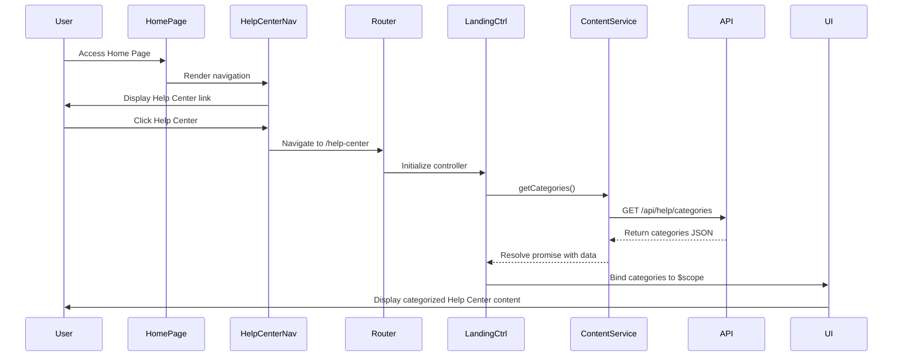

# Low-Level Design: Help Center Entry Point on Home Page

**Epic ID:** QE-5047

## a. Architecture Mapping

- **Home Page Navigation Component** → AngularJS Directive (`helpCenterNavDirective`)
- **Help Center Landing Page** → AngularJS Module (`helpCenterModule`) with Controller (`helpCenterLandingCtrl`)
- **Help Content Service** → AngularJS Service (`helpContentService`)
- **Video Player Integration** → AngularJS Directive (`videoPlayerDirective`) + Service (`videoPlayerService`)
- **Chat Integration** → AngularJS Service (`chatService`) + Directive (`chatWidgetDirective`)
- **Document Download** → AngularJS Service (`documentService`)
- **Search Functionality** → AngularJS Service (`searchService`) + Controller (`searchCtrl`)

**Recommended Folder Structure:**
```
app/
├── modules/
│   └── help-center/
│       ├── controllers/
│       ├── services/
│       ├── directives/
│       ├── views/
│       └── help-center.module.js
├── shared/
│   └── directives/
│       └── navigation/
└── assets/
    └── styles/
        └── help-center.css
```

## b. Component Specifications

| Name | Artifact Type | Responsibility | Key Dependencies |
|------|---------------|----------------|------------------|
| helpCenterNavDirective | Directive | Renders Help Center entry point in Home Page navigation | $location |
| helpCenterModule | Module | Root module for Help Center functionality | ngRoute, ui.bootstrap |
| helpCenterLandingCtrl | Controller | Manages landing page state and content categories | helpContentService, $scope |
| helpContentService | Service | Fetches categorized help content from REST API | $http, $q |
| videoPlayerDirective | Directive | Embeds and controls video playback | videoPlayerService |
| videoPlayerService | Service | Interfaces with video hosting platform API | $http |
| chatWidgetDirective | Directive | Renders interactive chat interface | chatService |
| chatService | Service | Manages chat session and communication with chatbot API | $http, $window |
| documentService | Service | Handles document downloads from CDN | $http |
| searchService | Service | Executes search queries against Search Service API | $http, $q |
| searchCtrl | Controller | Manages search UI and result display | searchService, $scope |

## c. Data Model

```javascript
// HelpContent
{
  id: String,
  title: String,
  category: String,
  type: String, // 'article', 'faq', 'video', 'document'
  content: String,
  videoUrl: String,
  documentUrl: String,
  tags: Array<String>,
  createdDate: Date,
  updatedDate: Date
}

// Category
{
  id: String,
  name: String,
  description: String,
  icon: String,
  contentCount: Number
}

// ChatMessage
{
  id: String,
  sessionId: String,
  message: String,
  sender: String, // 'user' or 'bot'
  timestamp: Date
}

// SearchResult
{
  id: String,
  title: String,
  excerpt: String,
  type: String,
  relevanceScore: Number,
  url: String
}
```

## d. Data Flow

User navigates to Home Page → `helpCenterNavDirective` renders Help Center link in navigation → User clicks link → Angular router loads Help Center Landing Page view with `helpCenterLandingCtrl` → Controller calls `helpContentService.getCategories()` → Service makes REST API call to Help Content Service → Response data bound to view displaying categorized content → User selects content type (article/video/document/chat/search) → Corresponding directive/controller invokes appropriate service (`videoPlayerService`, `chatService`, `documentService`, or `searchService`) → Service calls respective backend API → Response rendered in UI maintaining responsive Bootstrap grid layout.

## e. Primary Sequence Diagram



## f. Implementation Notes

- Use AngularJS component-based architecture with ES6 classes for controllers and services
- Implement dependency injection via `$inject` annotation for minification safety
- Use `$http` interceptors for API error handling and loading states
- Leverage Bootstrap responsive grid (col-xs/sm/md/lg) for cross-device layout
- Implement lazy loading for video content to maintain Home Page performance

## g. Error Handling

HTTP interceptor-based approach with user-friendly toast notifications for API failures and try/catch blocks in service methods.

## h. Security Notes

Standard input validation and secure API calls assumed; Help Center content served over HTTPS with existing application authentication context.