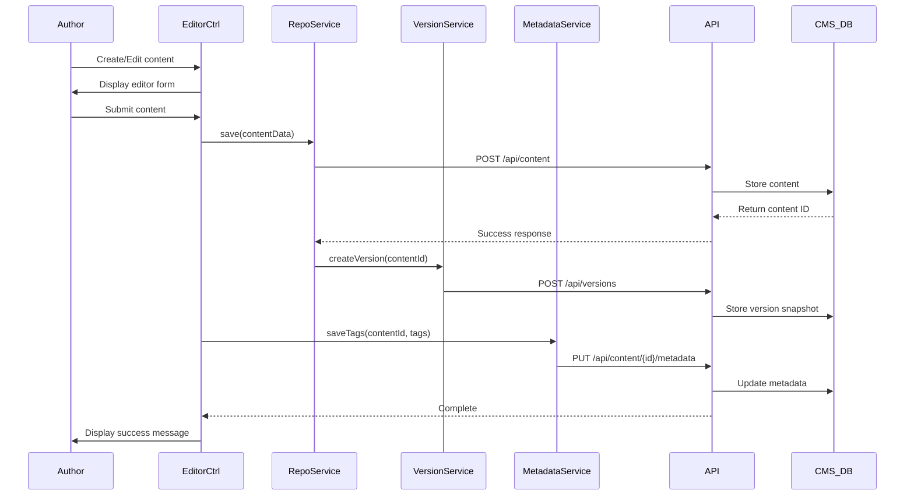

# Low-Level Design: Content Management System for Help Resources

**Epic ID:** QE-5048

## a. Architecture Mapping

- **Content Management Interface** → AngularJS Module (`cmsModule`) with Controller (`contentEditorCtrl`)
- **Content Repository Access** → AngularJS Service (`contentRepositoryService`)
- **Video Management** → AngularJS Service (`videoManagementService`) + Controller (`videoEditorCtrl`)
- **Document Management** → AngularJS Service (`documentManagementService`) + Controller (`documentEditorCtrl`)
- **Content Versioning** → AngularJS Service (`versionControlService`)
- **Metadata & Tagging** → AngularJS Directive (`metadataEditorDirective`) + Service (`metadataService`)
- **Analytics Dashboard** → AngularJS Controller (`analyticsCtrl`) + Service (`analyticsService`)

**Recommended Folder Structure:**
```
app/
├── modules/
│   └── cms/
│       ├── controllers/
│       ├── services/
│       ├── directives/
│       ├── views/
│       └── cms.module.js
├── shared/
│   └── components/
│       └── rich-text-editor/
└── assets/
    └── styles/
        └── cms.css
```

## b. Component Specifications

| Name | Artifact Type | Responsibility | Key Dependencies |
|------|---------------|----------------|------------------|
| cmsModule | Module | Root module for CMS functionality | ngRoute, ui.bootstrap, ngFileUpload |
| contentEditorCtrl | Controller | Manages content authoring UI and workflow | contentRepositoryService, versionControlService, $scope |
| contentRepositoryService | Service | CRUD operations for text content via REST API | $http, $q |
| videoEditorCtrl | Controller | Manages video upload and metadata editing | videoManagementService, $scope |
| videoManagementService | Service | Handles video uploads to hosting platform API | $http, Upload |
| documentEditorCtrl | Controller | Manages document uploads and categorization | documentManagementService, $scope |
| documentManagementService | Service | Handles document uploads to storage/CDN | $http, Upload |
| versionControlService | Service | Manages content versioning and rollback operations | $http |
| metadataEditorDirective | Directive | Provides tag and metadata input interface | metadataService |
| metadataService | Service | Manages metadata schema and tag operations | $http |
| analyticsCtrl | Controller | Displays content usage metrics and insights | analyticsService, $scope |
| analyticsService | Service | Fetches analytics data from analytics platform API | $http |

## c. Data Model

```javascript
// ContentItem
{
  id: String,
  title: String,
  category: String,
  type: String, // 'getting-started', 'faq', 'how-to', 'troubleshooting'
  body: String,
  authorId: String,
  status: String, // 'draft', 'published', 'archived'
  version: Number,
  metadata: Object,
  tags: Array<String>,
  createdAt: Date,
  updatedAt: Date,
  publishedAt: Date
}

// VideoContent
{
  id: String,
  title: String,
  description: String,
  videoUrl: String,
  thumbnailUrl: String,
  duration: Number,
  category: String,
  uploadedBy: String,
  status: String,
  tags: Array<String>,
  uploadedAt: Date
}

// DocumentContent
{
  id: String,
  title: String,
  description: String,
  fileUrl: String,
  fileType: String,
  fileSize: Number,
  category: String,
  uploadedBy: String,
  tags: Array<String>,
  uploadedAt: Date
}

// ContentVersion
{
  id: String,
  contentId: String,
  version: Number,
  snapshot: Object,
  changedBy: String,
  changeDescription: String,
  createdAt: Date
}

// AnalyticsData
{
  contentId: String,
  views: Number,
  uniqueVisitors: Number,
  avgTimeSpent: Number,
  searchAppearances: Number,
  helpfulVotes: Number,
  period: String
}
```

## d. Data Flow

Content Author logs into CMS interface → `contentEditorCtrl` loads existing content or blank form → Author creates/edits content using rich text editor → Controller calls `contentRepositoryService.save()` with content data → Service makes REST API call to Content Repository → Version snapshot created via `versionControlService` → Author adds metadata/tags using `metadataEditorDirective` → `metadataService` saves tags to backend → Content published by changing status → Published content flows to Help Center Frontend → User interactions tracked by Analytics Platform → `analyticsService` retrieves metrics → `analyticsCtrl` displays usage insights for content optimization.

## e. Primary Sequence Diagram



## f. Implementation Notes

- Use ng-file-upload library for handling video and document uploads with progress tracking
- Implement role-based access control using AngularJS route resolvers and authentication service
- Use rich text editor directive (e.g., textAngular or ng-quill) for WYSIWYG content authoring
- Implement optimistic UI updates with rollback on API failure for better UX
- Use $q.all() for parallel API calls when loading content with metadata and version history

## g. Error Handling

HTTP interceptor captures API errors; user-friendly notifications via toast service; validation errors displayed inline with form fields.

## h. Security Notes

Requires token-based auth via existing SSO; role-based authorization enforced on API endpoints; file upload validation for type and size.