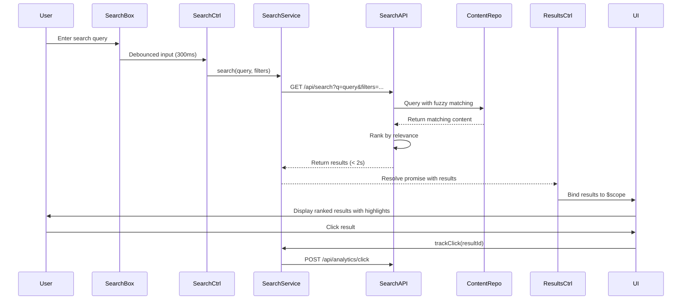

# Low-Level Design: Search and Chat Assistant for Help Center

**Epic ID:** QE-5049

## a. Architecture Mapping

- **Search Interface** → AngularJS Controller (`searchCtrl`) + Directive (`searchBoxDirective`)
- **Search Service** → AngularJS Service (`searchService`)
- **Search Results Display** → AngularJS Controller (`searchResultsCtrl`) + Directive (`searchResultsDirective`)
- **Chat Interface** → AngularJS Directive (`chatAssistantDirective`)
- **Chat Service** → AngularJS Service (`chatAssistantService`)
- **Search Analytics** → AngularJS Service (`searchAnalyticsService`)
- **Search Filters** → AngularJS Directive (`searchFiltersDirective`) + Controller (`filtersCtrl`)

**Recommended Folder Structure:**
```
app/
├── modules/
│   └── help-center/
│       ├── search/
│       │   ├── controllers/
│       │   ├── services/
│       │   ├── directives/
│       │   └── views/
│       └── chat/
│           ├── directives/
│           ├── services/
│           └── views/
└── assets/
    └── styles/
        ├── search.css
        └── chat.css
```

## b. Component Specifications

| Name | Artifact Type | Responsibility | Key Dependencies |
|------|---------------|----------------|------------------|
| searchBoxDirective | Directive | Renders search input with autocomplete | searchService, $timeout |
| searchCtrl | Controller | Manages search query state and submission | searchService, $scope, $location |
| searchService | Service | Executes search queries against Search Engine API | $http, $q |
| searchResultsCtrl | Controller | Manages search results display and pagination | searchService, searchAnalyticsService, $scope |
| searchResultsDirective | Directive | Renders ranked search results with highlighting | None |
| searchFiltersDirective | Directive | Provides filter UI for content type, category, date | filtersCtrl |
| filtersCtrl | Controller | Manages filter state and applies to search | searchService, $scope |
| chatAssistantDirective | Directive | Renders chat widget with conversation UI | chatAssistantService |
| chatAssistantService | Service | Manages chat session and API communication | $http, $q, $window |
| searchAnalyticsService | Service | Tracks search queries and result interactions | $http |

## c. Data Model

```javascript
// SearchQuery
{
  query: String,
  filters: {
    contentType: Array<String>,
    category: String,
    dateRange: Object
  },
  page: Number,
  pageSize: Number
}

// SearchResult
{
  id: String,
  title: String,
  excerpt: String,
  contentType: String,
  category: String,
  url: String,
  relevanceScore: Number,
  highlights: Array<String>,
  lastUpdated: Date
}

// SearchResponse
{
  results: Array<SearchResult>,
  totalResults: Number,
  page: Number,
  pageSize: Number,
  queryTime: Number
}

// ChatSession
{
  sessionId: String,
  userId: String,
  messages: Array<ChatMessage>,
  context: Object,
  startedAt: Date,
  lastActivity: Date
}

// ChatMessage
{
  id: String,
  sessionId: String,
  message: String,
  sender: String, // 'user' or 'assistant'
  timestamp: Date,
  suggestions: Array<String>,
  relatedContent: Array<Object>
}

// ChatRequest
{
  sessionId: String,
  message: String,
  context: Object
}
```

## d. Data Flow

User enters search query in `searchBoxDirective` → `searchCtrl` captures input with debouncing → Controller calls `searchService.search(query, filters)` → Service makes REST API call to Search Engine with query parameters → Search Engine queries Help Center Content Repository with fuzzy matching and synonym expansion → Ranked results returned within 2 seconds → `searchResultsCtrl` receives results and binds to view → `searchResultsDirective` renders results with highlighting → User clicks result tracked via `searchAnalyticsService`. For chat: User opens chat widget → `chatAssistantDirective` initializes session → User sends message → `chatAssistantService.sendMessage()` calls Chatbot Platform API with session context → Platform processes message using NLP and retrieves relevant content → Response with suggestions returned → Directive updates conversation UI maintaining message history.

## e. Primary Sequence Diagram



## f. Implementation Notes

- Implement search query debouncing using $timeout (300ms) to reduce API calls during typing
- Use $http timeout configuration to enforce 2-second search response NFR with fallback error handling
- Implement chat session management with localStorage for persistence across page refreshes
- Use WebSocket or polling for real-time chat updates if chatbot platform supports it
- Leverage AngularJS filters for client-side result highlighting based on search terms

## g. Error Handling

HTTP interceptor for API timeouts and failures; user-friendly error messages for search unavailability; chat fallback message when assistant cannot respond.

## h. Security Notes

Standard input validation and secure API calls assumed; search queries sanitized to prevent injection; chat session tokens validated on backend.