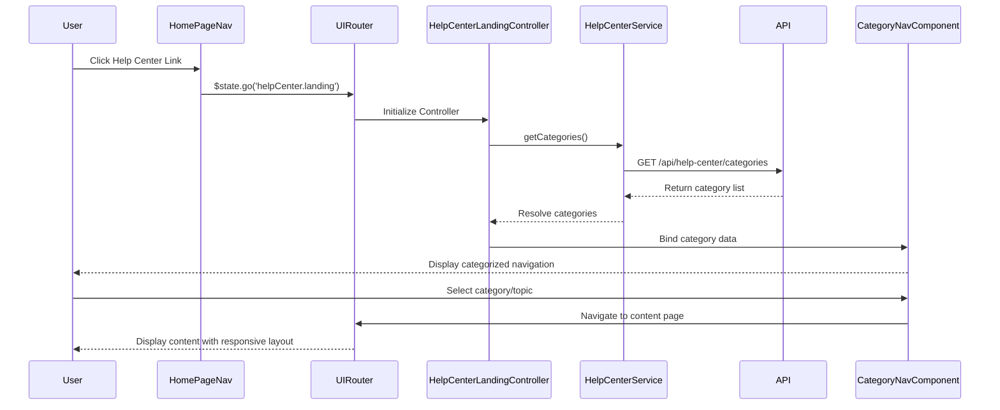

# Low-Level Design: Help Center Integration - Home Page

**Epic ID:** QE-5062

## a. Architecture Mapping

- **Home Page Module** → AngularJS Module (`app.homePage`) - Main application module with routing configuration
- **Help Center Navigation Entry** → AngularJS Directive (`helpCenterLink`) - Navigation component in Home Page header
- **Help Center Landing Page** → AngularJS Module (`app.helpCenter`) with Controller (`HelpCenterLandingController`) and Template
- **Category Navigation** → AngularJS Component (`categoryNav`) - Reusable category navigation widget
- **Content Pages** → AngularJS Route configurations with Controllers (`ContentPageController`) and Templates
- **Responsive Layout Engine** → CSS3 Media Queries + Bootstrap Grid System integrated across all views

**Recommended Folder Structure:**
```
/app
  /modules
    /home-page
    /help-center
      /controllers
      /services
      /directives
      /views
  /shared
    /directives
    /services
  /assets
    /css
    /js
```

## b. Component Specifications

| Component Name | Artifact Type | Responsibility | Key Dependencies |
|---|---|---|---|
| HomePageModule | AngularJS Module | Main module with routing and navigation | ui.router, helpCenterModule |
| helpCenterLink | Directive | Renders Help Center entry point in navigation | $state |
| HelpCenterModule | AngularJS Module | Help Center feature module with routes | ui.router, categoryNav |
| HelpCenterLandingController | Controller | Manages landing page state and category data | HelpCenterService, $scope |
| HelpCenterService | Factory | Fetches category and content metadata via REST API | $http, $q |
| categoryNav | Component | Displays categorized navigation (Getting Started, FAQs, How-to, Videos, Materials, Troubleshooting, Chat, Search) | HelpCenterService |
| ContentPageController | Controller | Manages individual content page rendering | ContentService, $stateParams |
| ContentService | Factory | Retrieves specific content page data | $http |
| responsiveLayout | CSS Module | Bootstrap-based responsive grid and media queries | Bootstrap 3.x |
| errorHandler | Service | Displays user-friendly error messages when resources unavailable | $rootScope |

## c. Data Model

**Category Object:**
```javascript
{
  id: String,
  name: String, // e.g., "Getting Started", "FAQs"
  icon: String,
  route: String,
  order: Number
}
```

**ContentPage Object:**
```javascript
{
  id: String,
  categoryId: String,
  title: String,
  body: String, // HTML content
  lastUpdated: Date,
  isAvailable: Boolean
}
```

**NavigationState Object:**
```javascript
{
  currentCategory: String,
  breadcrumbs: Array<String>
}
```

## d. Data Flow

User clicks the Help Center link in the Home Page navigation, triggering a state transition via ui-router to the Help Center Landing Page. The HelpCenterLandingController initializes, calling HelpCenterService to fetch category metadata via REST API. The categoryNav component renders the eight categories (Getting Started, FAQs, How-to Guides, Video Tutorials, Help Materials, Troubleshooting, Chat Support, Search Help) with responsive layout applied via Bootstrap grid. When a user selects a category or topic, ui-router navigates to the ContentPageController, which uses ContentService to fetch and display the specific content. All API calls use $http with error interceptors that invoke errorHandler service to display user-friendly messages. The responsive layout engine (CSS3 + Bootstrap) ensures optimal rendering across desktop, tablet, and mobile throughout all interactions.

## e. Primary Sequence Diagram



## f. Implementation Notes

- Use AngularJS ui-router for state-based routing with lazy-loaded templates to maintain 2-second page load target
- Implement Dependency Injection pattern for all services and controllers using explicit array notation for minification safety
- Apply Bootstrap 3.x grid system with custom CSS3 media queries for responsive breakpoints (mobile: <768px, tablet: 768-1024px, desktop: >1024px)
- Use $http interceptors for centralized error handling and HTTPS enforcement across all API calls
- Leverage AngularJS $q promises for asynchronous service calls with proper error propagation

## g. Error Handling

HTTP interceptor-based approach with try/catch blocks in services; user-friendly notifications displayed via errorHandler service using Bootstrap alerts.

## h. Security Notes

HTTPS enforced for all API communication; WCAG 2.1 AA compliance via ARIA attributes and keyboard navigation support; standard input validation and secure API calls assumed.