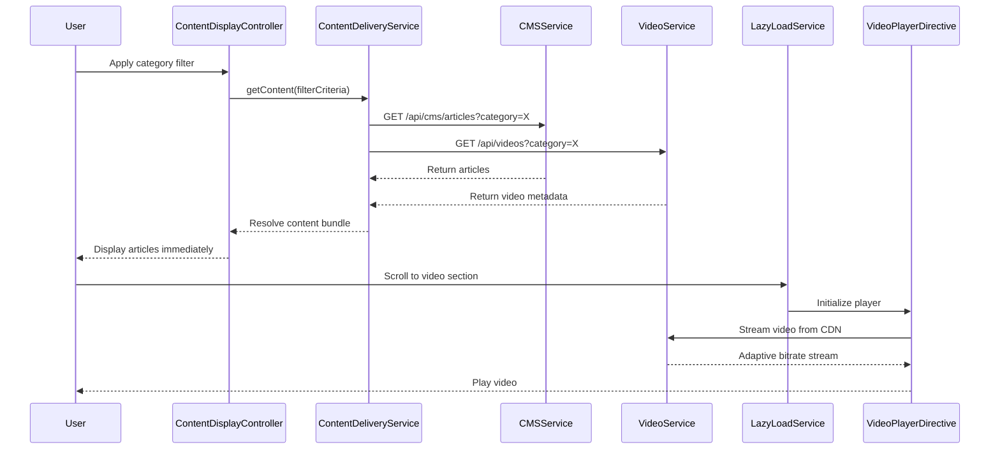

# Low-Level Design: Help Center Content Delivery

**Epic ID:** QE-5063

## a. Architecture Mapping

- **Content Delivery Service** → AngularJS Factory (`ContentDeliveryService`) - Orchestrates content retrieval from multiple sources
- **Content Management System Integration** → AngularJS Factory (`CMSService`) - Fetches articles and FAQs via REST API
- **Video Player Component** → AngularJS Directive (`videoPlayer`) - Embeds and manages video playback with lazy-loading
- **File Download Component** → AngularJS Directive (`fileDownload`) - Handles downloadable materials (PDF, DOCX)
- **Content Filter UI** → AngularJS Component (`contentFilter`) - Category and popularity filtering interface
- **Content Display Controller** → AngularJS Controller (`ContentDisplayController`) - Manages content rendering and user interactions

**Recommended Folder Structure:**
```
/app
  /modules
    /help-center
      /content
        /controllers
        /services
        /directives
        /components
        /views
  /shared
    /filters
```

## b. Component Specifications

| Component Name | Artifact Type | Responsibility | Key Dependencies |
|---|---|---|---|
| ContentDeliveryService | Factory | Orchestrates content retrieval from CMS, video platform, and file storage | CMSService, VideoService, FileStorageService, $q |
| CMSService | Factory | Fetches text articles and FAQs from CMS REST API | $http |
| VideoService | Factory | Manages video metadata and streaming URLs from video hosting platform | $http |
| FileStorageService | Factory | Provides download links for PDF/DOCX materials from cloud storage | $http |
| videoPlayer | Directive | Embeds video player with lazy-loading and cross-device compatibility | VideoService, $timeout |
| fileDownload | Directive | Renders download buttons with HTTPS links and format indicators | FileStorageService |
| contentFilter | Component | Provides category and popularity filter controls | $scope |
| ContentDisplayController | Controller | Manages filtered content display and error states | ContentDeliveryService, $scope, $filter |
| lazyLoadService | Factory | Implements lazy-loading strategy for videos and images | $window, $timeout |
| errorNotification | Service | Displays error messages for unavailable resources | $rootScope |

## c. Data Model

**Article Object:**
```javascript
{
  id: String,
  title: String,
  body: String, // HTML content
  category: String,
  popularity: Number,
  lastUpdated: Date
}
```

**Video Object:**
```javascript
{
  id: String,
  title: String,
  description: String,
  streamUrl: String,
  thumbnailUrl: String,
  duration: Number, // seconds
  category: String,
  popularity: Number
}
```

**DownloadableFile Object:**
```javascript
{
  id: String,
  title: String,
  format: String, // "PDF" or "DOCX"
  downloadUrl: String, // HTTPS URL
  fileSize: Number, // bytes
  category: String
}
```

**FilterCriteria Object:**
```javascript
{
  category: String,
  sortBy: String // "popularity" or "recent"
}
```

## d. Data Flow

User navigates to content pages and applies filters via the contentFilter component, which updates FilterCriteria in ContentDisplayController. The controller invokes ContentDeliveryService with filter parameters. ContentDeliveryService makes parallel calls to CMSService for articles/FAQs, VideoService for video metadata, and FileStorageService for downloadable materials. Text content renders immediately. The videoPlayer directive uses lazyLoadService to defer video player initialization until scrolled into viewport, maintaining 2-second page load target. Videos stream from CDN-backed hosting platform with adaptive bitrate. The fileDownload directive renders HTTPS download links for PDF/DOCX files. All API calls use $http with HTTPS enforcement. When resources are unavailable, errorNotification service displays user-friendly messages via Bootstrap alerts.

## e. Primary Sequence Diagram



## f. Implementation Notes

- Use Intersection Observer API (wrapped in lazyLoadService) for video lazy-loading to defer player initialization until viewport entry
- Implement $q.all() in ContentDeliveryService for parallel API calls to CMS, video platform, and file storage
- Embed video players using iframe with sandbox attributes; configure CDN for adaptive bitrate streaming (HLS/DASH)
- Apply AngularJS $filter for client-side sorting by popularity; use ng-repeat with track by for efficient rendering
- Enforce HTTPS via $http interceptor; validate download URLs before rendering fileDownload directive

## g. Error Handling

HTTP interceptor captures failed API calls; errorNotification service displays Bootstrap alert modals with retry options; video player shows fallback message on stream failure.

## h. Security Notes

HTTPS enforced for all downloads and video streams; GDPR compliance via minimal data collection; standard input validation and secure API calls assumed.