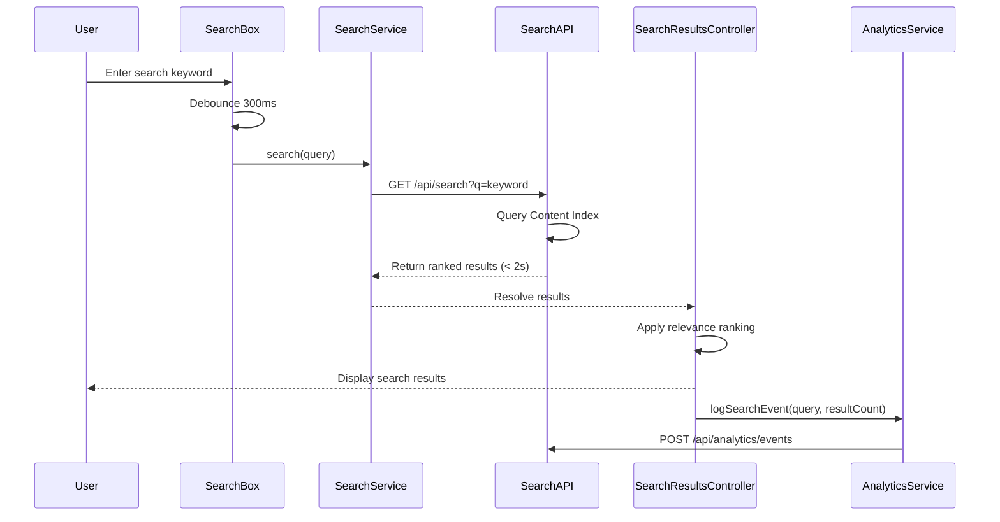

# Low-Level Design: Self-Service Search and Chat Assistant

**Epic ID:** QE-5064

## a. Architecture Mapping

- **Search Service** → AngularJS Factory (`SearchService`) - Handles search queries and result ranking via REST API
- **Content Index Integration** → Backend REST API (`/api/search`) - Queries indexed content from CMS
- **Search UI Component** → AngularJS Component (`searchBox`) - Search input with autocomplete and results display
- **Chat Widget** → AngularJS Directive (`chatWidget`) - Interactive chat interface with lazy-loading
- **Chat Assistant API Integration** → AngularJS Factory (`ChatAssistantService`) - Communicates with third-party chat API via HTTPS
- **Analytics Service** → AngularJS Factory (`AnalyticsService`) - Tracks search queries and chat interactions
- **Search Results Controller** → AngularJS Controller (`SearchResultsController`) - Manages search result display and pagination

**Recommended Folder Structure:**
```
/app
  /modules
    /help-center
      /search
        /controllers
        /services
        /components
        /views
      /chat
        /directives
        /services
  /shared
    /analytics
```

## b. Component Specifications

| Component Name | Artifact Type | Responsibility | Key Dependencies |
|---|---|---|---|
| SearchService | Factory | Executes keyword search queries against content index via REST API | $http, $q |
| searchBox | Component | Renders search input with autocomplete and triggers search | SearchService, $timeout |
| SearchResultsController | Controller | Manages search results display, ranking, and pagination | SearchService, AnalyticsService, $scope |
| chatWidget | Directive | Renders chat interface with lazy-loading (3-second target) | ChatAssistantService, $timeout |
| ChatAssistantService | Factory | Sends/receives messages to third-party chat API via HTTPS (REST or WebSocket) | $http, $websocket |
| AnalyticsService | Factory | Logs search queries and chat interactions for support staff monitoring | $http |
| searchResultRanker | Filter | Client-side relevance ranking for search results | None |
| chatMessageHandler | Service | Processes chat messages and handles fallback responses | $rootScope |
| errorHandler | Service | Displays error messages for failed searches or chat unavailability | $rootScope |

## c. Data Model

**SearchQuery Object:**
```javascript
{
  query: String,
  timestamp: Date,
  userId: String // GDPR-compliant anonymized ID
}
```

**SearchResult Object:**
```javascript
{
  id: String,
  title: String,
  snippet: String,
  contentType: String, // "article", "faq", "video"
  relevanceScore: Number,
  url: String
}
```

**ChatMessage Object:**
```javascript
{
  id: String,
  sender: String, // "user" or "assistant"
  message: String,
  timestamp: Date,
  suggestedTopics: Array<String> // optional
}
```

**AnalyticsEvent Object:**
```javascript
{
  eventType: String, // "search" or "chat"
  query: String,
  resultCount: Number,
  timestamp: Date,
  sessionId: String
}
```

## d. Data Flow

User enters search keywords in the searchBox component, which debounces input and calls SearchService after 300ms. SearchService sends GET request to `/api/search?q=keyword` which queries the Content Index (populated asynchronously from CMS). API returns ranked results within 2 seconds. SearchResultsController applies searchResultRanker filter for client-side relevance sorting and displays results. AnalyticsService logs the search event. For chat, user clicks chat icon triggering lazy-load of chatWidget directive (3-second target). ChatAssistantService establishes HTTPS connection (REST or WebSocket) to third-party chat API. User sends message via chatWidget, ChatAssistantService transmits to API, receives response with suggested topics, and chatMessageHandler processes and displays in UI. All interactions logged to AnalyticsService for support staff monitoring dashboard. Error states handled via errorHandler service with fallback messaging.

## e. Primary Sequence Diagram



## f. Implementation Notes

- Use $timeout for 300ms debouncing in searchBox component to reduce API calls during typing
- Implement SearchService with $http for REST API calls; use $websocket (angular-websocket library) for chat if WebSocket-based
- Apply lazy-loading for chatWidget using $timeout with 3-second delay or on-demand click initialization
- Use AngularJS $filter (searchResultRanker) for client-side relevance sorting based on relevanceScore from API
- Enforce HTTPS via $http interceptor; implement GDPR-compliant anonymized user IDs in AnalyticsService

## g. Error Handling

HTTP interceptor captures API failures; errorHandler service displays Bootstrap alerts with retry options; chat fallback message shown when assistant unavailable.

## h. Security Notes

HTTPS enforced for all search and chat API calls; GDPR compliance via anonymized analytics data; token-based authentication for third-party chat API integration.