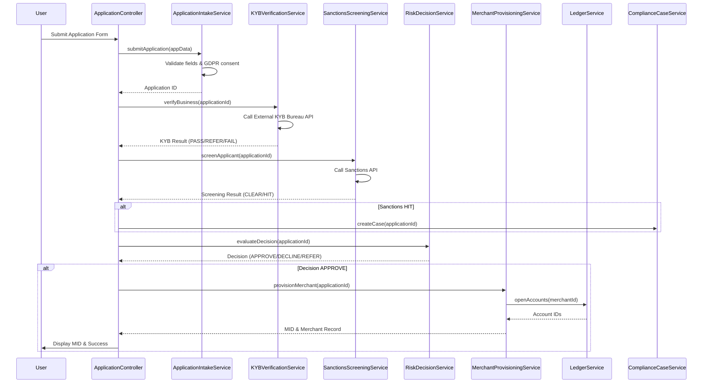

# Low-Level Design: Merchant Onboarding with KYB and Risk Decisioning

**Epic ID:** QE-5078

## a. Architecture Mapping

- **Merchant Application Portal** → AngularJS Module (`merchantOnboarding`) with Controller (`ApplicationController`)
- **Application Intake Service** → AngularJS Service (`ApplicationIntakeService`) for API communication
- **KYB Verification Service** → AngularJS Service (`KYBVerificationService`) for external bureau integration
- **Sanctions and PEP Screening Service** → AngularJS Service (`SanctionsScreeningService`) for screening API calls
- **Risk Decisioning Engine** → AngularJS Service (`RiskDecisionService`) for decision logic
- **Compliance Case Management** → AngularJS Controller (`ComplianceCaseController`) with Service (`ComplianceCaseService`)
- **Merchant Provisioning Service** → AngularJS Service (`MerchantProvisioningService`) for merchant creation
- **Ledger Service** → AngularJS Service (`LedgerService`) for account provisioning
- **Enterprise IdP** → AngularJS Interceptor (`AuthInterceptor`) for OIDC/JWT handling

**Recommended Folder Structure:**
```
app/
├── modules/
│   └── merchantOnboarding/
│       ├── controllers/
│       ├── services/
│       ├── directives/
│       └── views/
├── shared/
│   ├── interceptors/
│   └── services/
└── assets/
```

## b. Component Specifications

| Component Name | Artifact Type | Responsibility | Key Dependencies |
|---|---|---|---|
| merchantOnboarding | Module | Root module for merchant onboarding workflow | angular, ui.router, ngMessages |
| ApplicationController | Controller | Manage application form state and submission | ApplicationIntakeService, $scope, $state |
| ApplicationIntakeService | Service | POST application data to intake API, validate fields | $http, $q, AuthInterceptor |
| KYBVerificationService | Service | Invoke external KYB bureau API and map responses | $http, $q, $timeout (retry logic) |
| SanctionsScreeningService | Service | Screen applicant/beneficial owners against sanctions lists | $http, $q |
| RiskDecisionService | Service | Evaluate KYB/sanctions results and produce decision | $http, ComplianceCaseService |
| ComplianceCaseController | Controller | Display and manage compliance cases for sanctions hits | ComplianceCaseService, $scope |
| ComplianceCaseService | Service | CRUD operations for compliance cases | $http, $q |
| MerchantProvisioningService | Service | Create merchant record, issue MID, rollback on failure | $http, $q, LedgerService |
| LedgerService | Service | Open ledger accounts via REST API | $http, $q |
| AuthInterceptor | Interceptor | Inject JWT from IdP, handle 401/403 responses | $window, $location |
| applicationForm | Directive | Reusable form component with validation | ApplicationIntakeService, ngMessages |
| dualApprovalWidget | Directive | UI for dual-control approval workflow | RiskDecisionService |

## c. Data Model

**MerchantApplication (JS Object)**
```javascript
{
  applicationId: String,
  businessName: String,
  businessRegistrationNumber: String,
  businessAddress: Object, // {line1, line2, city, postalCode, country}
  ownershipStructure: String,
  beneficialOwners: Array, // [{name, dob, nationality, ownershipPercent}]
  settlementBankDetails: Object, // {accountNumber, sortCode, bankName}
  gdprConsent: Boolean,
  legalBasis: String,
  status: String, // 'DRAFT', 'SUBMITTED', 'KYB_PENDING', 'SCREENING_PENDING', 'APPROVED', 'DECLINED', 'REFERRED'
  submittedAt: Date,
  kybResult: Object, // {status: 'PASS'|'REFER'|'FAIL', bureauResponse: Object}
  sanctionsResult: Object, // {status: 'CLEAR'|'HIT', hits: Array}
  riskDecision: Object, // {decision: 'APPROVE'|'DECLINE'|'REFER', approver1, approver2, timestamp}
  merchantId: String,
  mid: String,
  auditTrail: Array // [{event, timestamp, userId}]
}
```

**ComplianceCase (JS Object)**
```javascript
{
  caseId: String,
  applicationId: String,
  caseType: String, // 'SANCTIONS_HIT', 'PEP_HIT'
  status: String, // 'OPEN', 'UNDER_REVIEW', 'RESOLVED'
  assignedTo: String,
  createdAt: Date,
  resolvedAt: Date,
  notes: Array
}
```

## d. Data Flow

User accesses the Merchant Application Portal (ApplicationController) authenticated via Enterprise IdP (AuthInterceptor injects JWT). User fills the application form (applicationForm directive) capturing business identity, ownership, beneficial owners, and bank details with GDPR consent. On submission, ApplicationController invokes ApplicationIntakeService, which POSTs to the intake API. Backend triggers KYBVerificationService to call the external KYB bureau; the service maps bureau responses to pass/refer/fail and updates application status. SanctionsScreeningService screens applicant and beneficial owners; hits auto-hold the application and invoke ComplianceCaseService to create a case. RiskDecisionService evaluates passed KYB and clear sanctions to produce approve/decline/refer; refer cases display dualApprovalWidget for dual-control approval. On approval, MerchantProvisioningService atomically creates merchant record, issues MID, and calls LedgerService to open accounts; failures trigger rollback. UI updates application status and displays MID to user.

## e. Primary Sequence Diagram



## f. Implementation Notes

- Use AngularJS 1.x module pattern with dependency injection for all services and controllers.
- Implement AuthInterceptor to attach JWT from sessionStorage to all $http requests and redirect on 401.
- Use $http service with promise-based error handling; implement retry logic in KYBVerificationService using $timeout.
- Apply Bootstrap form validation classes and ngMessages for client-side validation feedback.
- Use ui.router for state management (draft → submitted → kyb_pending → screening_pending → decision → provisioned).

## g. Error Handling

HTTP interceptor-based error handling with user notification via Bootstrap modals; API errors displayed with specific error codes and retry options.

## h. Security Notes

Requires token-based auth via existing Enterprise IdP (OIDC/JWT); PII encrypted at rest (AES-256) and in transit (TLS 1.3); GDPR consent captured and documented.