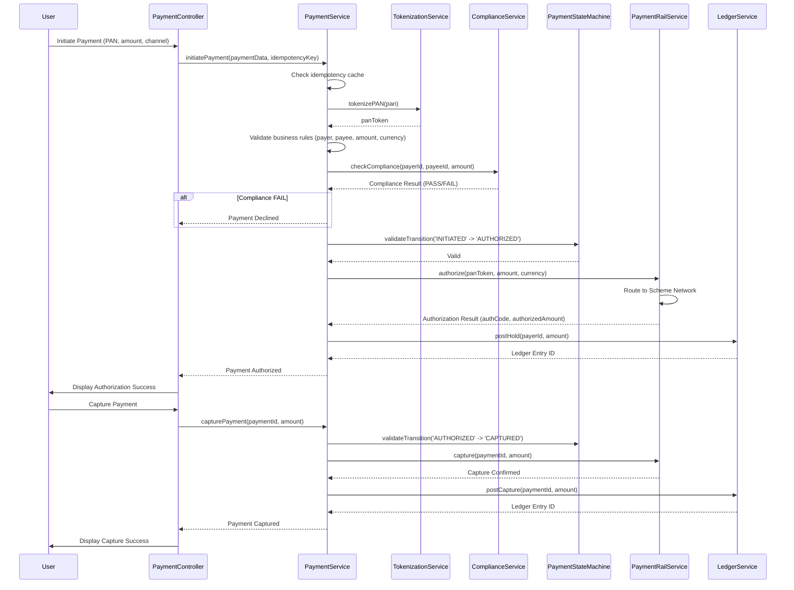

# Low-Level Design: Unified Payment Acceptance API

**Epic ID:** QE-5079

## a. Architecture Mapping

- **Client Application** → AngularJS Module (`paymentAcceptance`) with Controller (`PaymentController`)
- **API Gateway** → AngularJS Interceptor (`ApiGatewayInterceptor`) for routing and auth
- **Payment Service** → AngularJS Service (`PaymentService`) for payment initiation and lifecycle
- **Compliance Service** → AngularJS Service (`ComplianceService`) for KYC/AML/risk checks
- **Tokenization Service** → AngularJS Service (`TokenizationService`) for PAN tokenization
- **Payment Rail Adapter** → AngularJS Service (`PaymentRailService`) for authorization/capture/void/refund
- **Ledger Service** → AngularJS Service (`LedgerService`) for double-entry postings
- **State Machine** → AngularJS Factory (`PaymentStateMachine`) for state transition logic
- **Scheme Networks** → External API integration via PaymentRailService

**Recommended Folder Structure:**
```
app/
├── modules/
│   └── paymentAcceptance/
│       ├── controllers/
│       ├── services/
│       ├── factories/
│       └── views/
├── shared/
│   ├── interceptors/
│   └── services/
└── assets/
```

## b. Component Specifications

| Component Name | Artifact Type | Responsibility | Key Dependencies |
|---|---|---|---|
| paymentAcceptance | Module | Root module for payment acceptance workflows | angular, ui.router, ngMessages |
| PaymentController | Controller | Manage payment initiation UI and transaction lifecycle | PaymentService, $scope, $state |
| PaymentService | Service | Orchestrate payment initiation, idempotency, business-rule validation | $http, $q, TokenizationService, ComplianceService, PaymentStateMachine |
| ComplianceService | Service | Invoke KYC/AML/risk decision API | $http, $q |
| TokenizationService | Service | Tokenize PAN at edge before downstream processing | $http, $q |
| PaymentRailService | Service | Route authorization/capture/void/refund to scheme networks | $http, $q, $timeout (retry logic) |
| LedgerService | Service | Post double-entry transactions (holds, captures, voids, refunds) | $http, $q |
| PaymentStateMachine | Factory | Enforce deterministic state transitions (INITIATED → AUTHORIZED → CAPTURED/VOIDED/REFUNDED) | None |
| ApiGatewayInterceptor | Interceptor | Inject idempotency key header, handle 409 (duplicate), attach JWT | $window, $location |
| paymentForm | Directive | Reusable payment form with PAN masking and validation | PaymentService, TokenizationService, ngMessages |
| scaChallenge | Directive | PSD2 SCA challenge UI with exemption display | PaymentService |
| transactionStatus | Directive | Display transaction state and lifecycle actions | PaymentService, PaymentStateMachine |

## c. Data Model

**Payment (JS Object)**
```javascript
{
  paymentId: String,
  idempotencyKey: String,
  channel: String, // 'ONLINE', 'PAYMENT_LINK', 'TERMINAL', 'INVOICE'
  payerId: String,
  payeeId: String,
  amount: Number,
  currency: String,
  panToken: String, // Tokenized PAN
  state: String, // 'INITIATED', 'COMPLIANCE_PENDING', 'SCA_REQUIRED', 'AUTHORIZED', 'CAPTURED', 'VOIDED', 'REFUNDED', 'DECLINED'
  authorizationType: String, // 'FULL', 'PARTIAL'
  authorizedAmount: Number,
  capturedAmount: Number,
  refundedAmount: Number,
  complianceResult: Object, // {status: 'PASS'|'FAIL', reason: String}
  scaExemption: String, // 'LOW_VALUE', 'TRUSTED_BENEFICIARY', 'RECURRING', null
  railResponse: Object, // {authCode, rrn, timestamp}
  ledgerEntries: Array, // [{entryId, type: 'HOLD'|'CAPTURE'|'VOID'|'REFUND', amount, timestamp}]
  createdAt: Date,
  updatedAt: Date,
  auditTrail: Array // [{event, state, timestamp, userId}]
}
```

**LedgerEntry (JS Object)**
```javascript
{
  entryId: String,
  paymentId: String,
  type: String, // 'HOLD', 'CAPTURE', 'VOID', 'REFUND'
  debitAccount: String,
  creditAccount: String,
  amount: Number,
  currency: String,
  timestamp: Date,
  immutable: Boolean // Always true
}
```

## d. Data Flow

User initiates payment via PaymentController, entering PAN, amount, and channel. PaymentController invokes PaymentService.initiatePayment() with a client-generated idempotency key (ApiGatewayInterceptor attaches it as header). PaymentService validates schema and checks idempotency cache; duplicates return cached result (409). TokenizationService tokenizes PAN at edge; token replaces PAN in downstream calls. Business-rule validation (payer/payee presence, amount > 0, currency/rail support) is performed. ComplianceService is invoked for KYC/AML/risk; failures block authorization. For EEA/UK customer-initiated payments, PSD2 SCA is enforced (scaChallenge directive displays challenge); exemption logic applied. PaymentStateMachine validates state transition to AUTHORIZED. PaymentRailService routes authorization request to scheme networks; full or partial authorization result received. LedgerService posts hold entry (debit payer, credit suspense). UI updates to AUTHORIZED state. User triggers capture via transactionStatus directive; PaymentService invokes PaymentRailService.capture(); LedgerService posts capture entry (debit suspense, credit payee). Similar flows for void (compensating entry reversing hold) and refund (debit payee, credit payer). All state transitions append to immutable auditTrail.

## e. Primary Sequence Diagram



## f. Implementation Notes

- Use AngularJS 1.x with strict DI annotation; inject all services via array syntax for minification safety.
- Implement ApiGatewayInterceptor to generate/attach idempotency key (UUID v4) and handle 409 responses with cached result.
- PaymentStateMachine factory uses state transition map (object literal) to enforce legal transitions; throws error on invalid transition.
- Use $http with promise chaining; implement retry logic in PaymentRailService using $timeout with exponential backoff.
- Bootstrap form validation with ngMessages for client-side feedback; PAN masking via custom directive filter.

## g. Error Handling

HTTP interceptor-based with try/catch in service layer; user notification via Bootstrap toasts; 409 returns cached idempotent result; rail failures display retry option.

## h. Security Notes

Token-based auth via existing Enterprise IdP (OIDC/JWT); PAN tokenized at edge and never persisted; TLS 1.3 in transit, AES-256 at rest; CVV/PIN never stored per PCI DSS.