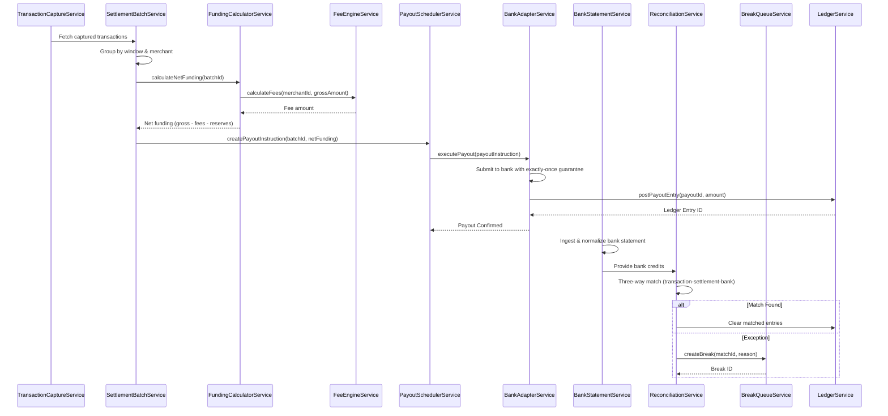

# Low-Level Design: Settlement, Reconciliation, and Financial Operations

**Epic ID:** QE-5080

## a. Architecture Mapping

- **Transaction Capture** → AngularJS Service (`TransactionCaptureService`) for captured transaction ingestion
- **Settlement Batch Builder** → AngularJS Service (`SettlementBatchService`) for batch creation
- **Funding Calculator** → AngularJS Service (`FundingCalculatorService`) for net funding computation
- **Fee Engine** → AngularJS Service (`FeeEngineService`) for fee calculation
- **Payout Scheduler** → AngularJS Service (`PayoutSchedulerService`) for payout instruction creation
- **Bank Adapter** → AngularJS Service (`BankAdapterService`) for payout execution and statement ingestion
- **Bank Statement Ingestion** → AngularJS Service (`BankStatementService`) for statement normalization
- **Three-Way Match Engine** → AngularJS Service (`ReconciliationService`) for transaction-settlement-bank matching
- **Exception Break Queue** → AngularJS Controller (`BreakQueueController`) with Service (`BreakQueueService`)
- **Dispute Management** → AngularJS Controller (`DisputeController`) with Service (`DisputeService`)
- **Ledger Service** → AngularJS Service (`LedgerService`) for all financial postings
- **Reporting Service** → AngularJS Controller (`ReportingController`) with Service (`ReportingService`)

**Recommended Folder Structure:**
```
app/
├── modules/
│   ├── settlement/
│   │   ├── controllers/
│   │   ├── services/
│   │   └── views/
│   ├── reconciliation/
│   │   ├── controllers/
│   │   ├── services/
│   │   └── views/
│   ├── disputes/
│   │   ├── controllers/
│   │   ├── services/
│   │   └── views/
│   └── reporting/
│       ├── controllers/
│       ├── services/
│       └── views/
├── shared/
│   ├── interceptors/
│   └── services/
└── assets/
```

## b. Component Specifications

| Component Name | Artifact Type | Responsibility | Key Dependencies |
|---|---|---|---|
| settlement | Module | Root module for settlement workflows | angular, ui.router |
| reconciliation | Module | Root module for reconciliation workflows | angular, ui.router |
| disputes | Module | Root module for dispute management | angular, ui.router |
| reporting | Module | Root module for reporting | angular, ui.router, angular-chart.js |
| TransactionCaptureService | Service | Fetch eligible captured transactions for settlement | $http, $q |
| SettlementBatchService | Service | Group transactions by window and merchant into batches | $http, $q, FundingCalculatorService |
| FundingCalculatorService | Service | Compute net merchant funding (gross - fees - reserves) | FeeEngineService |
| FeeEngineService | Service | Calculate fees per merchant rate schedule | $http, $q |
| PayoutSchedulerService | Service | Create payout instructions per merchant terms | $http, $q, BankAdapterService |
| BankAdapterService | Service | Execute bank payouts with exactly-once guarantee | $http, $q, $timeout (retry logic) |
| BankStatementService | Service | Ingest and normalize bank statements | $http, $q |
| ReconciliationService | Service | Perform three-way match (transaction-settlement-bank) | $http, $q, BreakQueueService |
| BreakQueueService | Service | CRUD operations for reconciliation exceptions | $http, $q |
| BreakQueueController | Controller | Display and manage reconciliation breaks | BreakQueueService, $scope |
| DisputeService | Service | CRUD operations for chargeback/dispute cases | $http, $q, LedgerService |
| DisputeController | Controller | Display and manage dispute cases with deadline tracking | DisputeService, $scope |
| LedgerService | Service | Post all financial movements as double-entry | $http, $q |
| ReportingService | Service | Generate settlement, fee, and transaction reports | $http, $q |
| ReportingController | Controller | Display reports with filters and export | ReportingService, $scope |
| settlementBatchView | Directive | Display batch details with merchant funding breakdown | SettlementBatchService |
| payoutStatusWidget | Directive | Display payout status and bank confirmation | PayoutSchedulerService, BankAdapterService |
| threeWayMatchWidget | Directive | Display match results with exception highlighting | ReconciliationService |
| disputeTimeline | Directive | Display dispute case timeline with deadline alerts | DisputeService |

## c. Data Model

**SettlementBatch (JS Object)**
```javascript
{
  batchId: String,
  merchantId: String,
  settlementWindow: Object, // {startDate, endDate}
  transactions: Array, // [{transactionId, amount, currency, capturedAt}]
  grossAmount: Number,
  fees: Number,
  reserves: Number,
  netFunding: Number,
  currency: String,
  status: String, // 'PENDING', 'SCHEDULED', 'PAID', 'FAILED'
  payoutInstructionId: String,
  createdAt: Date,
  paidAt: Date
}
```

**PayoutInstruction (JS Object)**
```javascript
{
  payoutId: String,
  batchId: String,
  merchantId: String,
  bankAccountNumber: String,
  sortCode: String,
  amount: Number,
  currency: String,
  scheduledDate: Date,
  status: String, // 'SCHEDULED', 'SUBMITTED', 'CONFIRMED', 'FAILED'
  bankReference: String,
  executedAt: Date,
  ledgerEntryId: String
}
```

**ReconciliationMatch (JS Object)**
```javascript
{
  matchId: String,
  transactionId: String,
  batchId: String,
  bankCreditId: String,
  matchStatus: String, // 'MATCHED', 'EXCEPTION'
  exceptionReason: String, // 'AMOUNT_MISMATCH', 'MISSING_BANK_CREDIT', 'DUPLICATE', null
  transactionAmount: Number,
  settlementAmount: Number,
  bankCreditAmount: Number,
  tolerance: Number,
  matchedAt: Date
}
```

**DisputeCase (JS Object)**
```javascript
{
  disputeId: String,
  transactionId: String,
  merchantId: String,
  caseType: String, // 'CHARGEBACK', 'RETRIEVAL_REQUEST'
  reasonCode: String,
  amount: Number,
  currency: String,
  status: String, // 'OPEN', 'EVIDENCE_PENDING', 'SUBMITTED', 'WON', 'LOST'
  deadline: Date,
  evidence: Array, // [{documentId, uploadedAt}]
  schemeReference: String,
  resolution: Object, // {decision: 'WON'|'LOST', resolvedAt, ledgerAdjustmentId}
  createdAt: Date,
  updatedAt: Date
}
```

**Report (JS Object)**
```javascript
{
  reportId: String,
  reportType: String, // 'SETTLEMENT', 'FEE', 'TRANSACTION'
  merchantId: String,
  filters: Object, // {startDate, endDate, status, currency}
  data: Array, // Report-specific data rows
  generatedAt: Date,
  exportFormat: String // 'CSV', 'PDF', 'EXCEL'
}
```

## d. Data Flow

TransactionCaptureService fetches eligible captured transactions. SettlementBatchService groups them by window and merchant, invoking FundingCalculatorService to compute net funding (FundingCalculatorService calls FeeEngineService for fee calculation). PayoutSchedulerService creates payout instructions per merchant terms and invokes BankAdapterService to execute bank payouts with exactly-once guarantee; BankAdapterService posts to LedgerService. Concurrently, BankStatementService ingests and normalizes bank statements. ReconciliationService performs three-way match correlating transactions, settlement batches, and bank credits; matched sets are cleared, exceptions route to BreakQueueService. BreakQueueController displays exceptions for manual investigation; resolved breaks update match status. DisputeService creates cases from scheme chargeback notifications; DisputeController displays cases with deadline tracking and evidence upload. On resolution, DisputeService posts ledger adjustments via LedgerService. ReportingService generates settlement, fee, and transaction reports; ReportingController displays reports with filters and export options (CSV/PDF/Excel).

## e. Primary Sequence Diagram



## f. Implementation Notes

- Use AngularJS 1.x with modular architecture (settlement, reconciliation, disputes, reporting as separate modules).
- Implement BankAdapterService with idempotency key per payout instruction to ensure exactly-once execution; use $timeout for retry logic with exponential backoff.
- ReconciliationService uses configurable tolerance thresholds (stored in app config) for amount matching; mismatches within tolerance are auto-matched.
- DisputeController uses angular-chart.js for deadline visualization; Bootstrap alerts for escalation warnings.
- ReportingService uses $http with streaming response for large datasets; export via Blob API and FileSaver.js.

## g. Error Handling

HTTP interceptor-based with service-layer try/catch; payout failures trigger retry with exponential backoff; reconciliation exceptions route to BreakQueueService; user notifications via Bootstrap toasts.

## h. Security Notes

Token-based auth via existing Enterprise IdP (OIDC/JWT); transaction search scoped to merchant's own MID with cross-tenant access blocked; dual-control validation for funding calculations per SOX 404; immutable audit trail for all break resolutions and dispute decisions; data residency per contract requirements.