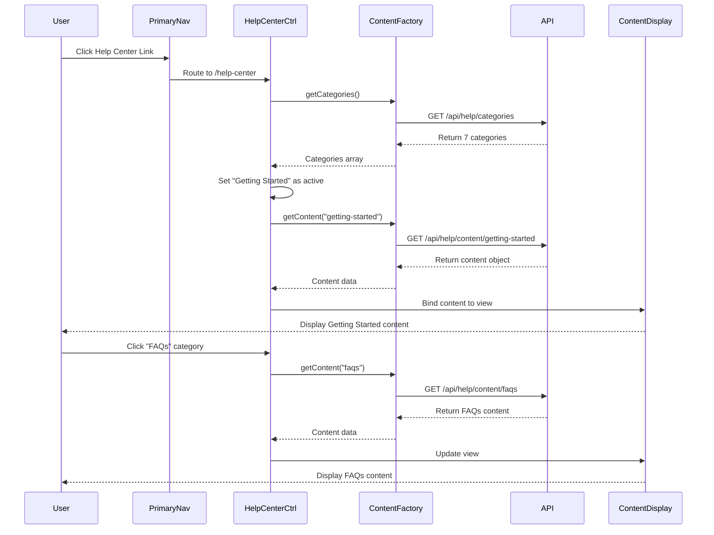

# Low-Level Design: Help Center Integration - Equity Master

## Epic ID: QE-5087

---

## a. Architecture Mapping

- **Primary Navigation Component** → AngularJS Directive (`primaryNavDirective`) - adds Help Center link to existing nav
- **Help Center Container** → AngularJS Module (`helpCenterModule`) with Controller (`HelpCenterController`)
- **Category Navigation** → AngularJS Directive (`categoryNavDirective`) - renders seven category tabs
- **Content Display Area** → AngularJS Component (`contentDisplayComponent`) - dynamically renders selected category content
- **Content Repository Service** → AngularJS Factory (`ContentRepositoryFactory`) - fetches help content via REST API

**Recommended Folder Structure:**
```
/app
  /modules
    /help-center
      help-center.module.js
      help-center.controller.js
      help-center.service.js
      /directives
        category-nav.directive.js
        content-display.component.js
      /views
        help-center.html
        category-nav.html
      /styles
        help-center.css
```

---

## b. Component Specifications

| Component Name | Artifact Type | Responsibility | Key Dependencies |
|---|---|---|---|
| `helpCenterModule` | Module | Registers all Help Center components and routes | `ngRoute`, `ui.bootstrap` |
| `HelpCenterController` | Controller | Manages category selection state and content loading | `ContentRepositoryFactory`, `$scope` |
| `ContentRepositoryFactory` | Factory | Fetches help content from REST API endpoints | `$http`, `$q` |
| `categoryNavDirective` | Directive | Renders seven category tabs with active state management | `HelpCenterController` |
| `contentDisplayComponent` | Component | Displays selected category content dynamically | `HelpCenterController`, `$sce` |
| `primaryNavDirective` | Directive | Adds Help Center link to existing primary navigation | Existing navigation controller |

---

## c. Data Model

**HelpCategory Object:**
```javascript
{
  id: String,              // e.g., "getting-started"
  name: String,            // e.g., "Getting Started"
  displayOrder: Number,    // 1-7
  isDefault: Boolean       // true for Getting Started
}
```

**HelpContent Object:**
```javascript
{
  categoryId: String,      // Foreign key to HelpCategory
  title: String,
  body: String,            // HTML content
  lastUpdated: Date,
  mediaUrls: Array         // URLs for videos/downloads
}
```

---

## d. Data Flow

User clicks Help Center link in Primary Navigation → `primaryNavDirective` triggers route change to `/help-center` → `HelpCenterController` initializes and calls `ContentRepositoryFactory.getCategories()` → Factory makes GET request to `/api/help/categories` → Controller receives seven categories and sets "Getting Started" as active → `categoryNavDirective` renders tabs → `ContentRepositoryFactory.getContent('getting-started')` fetches default content via GET `/api/help/content/{categoryId}` → `contentDisplayComponent` receives and renders content using `$sce.trustAsHtml()` → User clicks different category tab → Controller updates active category → Content Display Area re-renders with new content within 2 seconds.

---

## e. Primary Sequence Diagram



---

## f. Implementation Notes

- Use AngularJS `$routeProvider` to register `/help-center` route with lazy-loaded template and controller
- Implement category selection using `ng-click` with `$scope.activeCategory` binding and `ng-class` for active state styling
- Use `$http` service with promise chaining for REST API calls; cache category list in Factory using closure variable
- Apply `$sce.trustAsHtml()` for rendering rich HTML content safely in Content Display Component
- Leverage Bootstrap grid (`col-md-3` for category nav, `col-md-9` for content) and responsive utilities for mobile layout

---

## g. Error Handling

HTTP interceptor captures API failures; display user-friendly error message in Content Display Area using `ng-show` with error flag; retry logic via Factory method.

---

## h. Security Notes

Standard input validation and secure API calls assumed; content sanitization via `$sce` prevents XSS attacks.

---