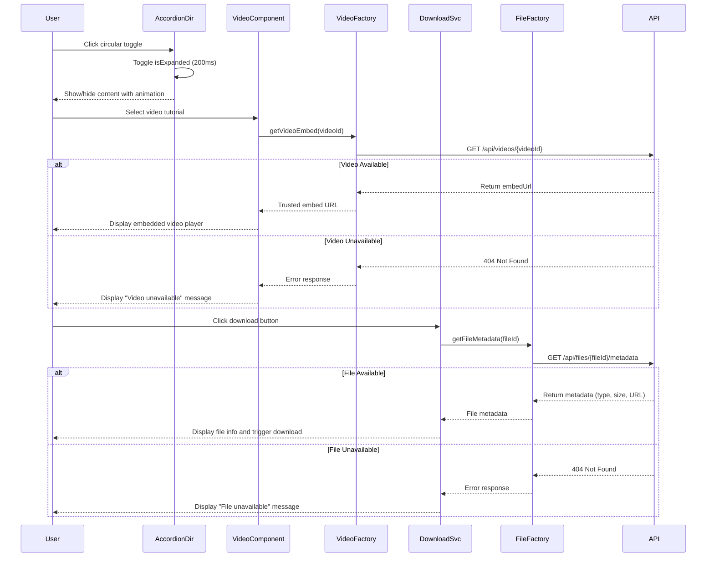

# Low-Level Design: Interactive Help Content Features

## Epic ID: QE-5088

---

## a. Architecture Mapping

- **Accordion Controller** → AngularJS Directive (`accordionDirective`) - manages expand/collapse state for FAQs, How-to, Troubleshooting
- **Video Player Component** → AngularJS Component (`videoPlayerComponent`) - embeds and controls video playback
- **Download Manager** → AngularJS Service (`DownloadService`) - handles file metadata retrieval and download initiation
- **Video Hosting Integration** → AngularJS Factory (`VideoHostingFactory`) - interfaces with external video service API
- **File Storage Integration** → AngularJS Factory (`FileStorageFactory`) - retrieves file metadata and download URLs

**Recommended Folder Structure:**
```
/app
  /modules
    /help-center
      /directives
        accordion.directive.js
      /components
        video-player.component.js
      /services
        download.service.js
        video-hosting.factory.js
        file-storage.factory.js
      /views
        accordion-item.html
        video-player.html
      /styles
        interactive-content.css
```

---

## b. Component Specifications

| Component Name | Artifact Type | Responsibility | Key Dependencies |
|---|---|---|---|
| `accordionDirective` | Directive | Renders expandable/collapsible sections with circular toggle controls | `$timeout`, `$animate` |
| `videoPlayerComponent` | Component | Embeds video player with controls and handles playback events | `VideoHostingFactory`, `$sce` |
| `DownloadService` | Service | Manages file download requests and displays metadata (type, size) | `FileStorageFactory`, `$window` |
| `VideoHostingFactory` | Factory | Fetches video embed URLs and validates availability | `$http`, `$q` |
| `FileStorageFactory` | Factory | Retrieves file metadata and secure download URLs from storage API | `$http`, `$q` |
| `errorHandlerService` | Service | Displays user-friendly messages for unavailable resources | `$rootScope` |

---

## c. Data Model

**AccordionItem Object:**
```javascript
{
  id: String,              // Unique identifier
  title: String,           // Display title
  content: String,         // HTML content
  isExpanded: Boolean,     // Current state
  categoryType: String     // "faq", "howto", "troubleshooting"
}
```

**VideoResource Object:**
```javascript
{
  videoId: String,
  title: String,
  embedUrl: String,        // Trusted embed URL
  thumbnailUrl: String,
  duration: Number,        // Seconds
  isAvailable: Boolean
}
```

**DownloadableFile Object:**
```javascript
{
  fileId: String,
  fileName: String,
  fileType: String,        // e.g., "PDF", "DOCX"
  fileSize: Number,        // Bytes
  downloadUrl: String,
  isAvailable: Boolean
}
```

---

## d. Data Flow

User clicks accordion circular toggle → `accordionDirective` captures click event → Directive updates `isExpanded` property on AccordionItem model within 200ms using `$timeout` → `ng-class` applies CSS transition for smooth expand/collapse → Content rendered or hidden. For videos: User selects video tutorial → `videoPlayerComponent` calls `VideoHostingFactory.getVideoEmbed(videoId)` → Factory makes GET request to `/api/videos/{videoId}` → Returns embed URL → Component uses `$sce.trustAsResourceUrl()` → Video iframe rendered and plays within Help Center. For downloads: User clicks download button → `DownloadService.initiateDownload(fileId)` → Service calls `FileStorageFactory.getFileMetadata(fileId)` → Factory retrieves metadata via GET `/api/files/{fileId}/metadata` → Service displays file type and size → `$window.open(downloadUrl)` triggers download.

---

## e. Primary Sequence Diagram



---

## f. Implementation Notes

- Use `ng-repeat` with `track by item.id` for accordion items; bind `ng-click="toggleAccordion(item)"` to circular control with CSS transition for 200ms animation
- Implement video embedding using `<iframe>` with `ng-src` bound to `$sce.trustAsResourceUrl(embedUrl)` for security; add responsive wrapper with Bootstrap `embed-responsive` class
- Handle downloads via `DownloadService` method that calls `$window.open(secureUrl, '_blank')` after displaying metadata using `ng-bind` for file type and size
- Add ARIA attributes: `aria-expanded`, `aria-controls` for accordions; `aria-label` for video players; keyboard support via `tabindex` and `keydown` event handlers
- Use `$q.reject()` in Factories for unavailable resources; catch in Controllers and display error messages via `errorHandlerService.showError(message)`

---

## g. Error Handling

HTTP interceptor with try/catch blocks in Factory methods; unavailable resources trigger user notifications via toast or inline error messages using `ng-show` with error state flags.

---

## h. Security Notes

Downloadable materials must not expose sensitive data; use secure signed URLs with expiration; video embeds validated via `$sce.trustAsResourceUrl()` to prevent XSS.

---