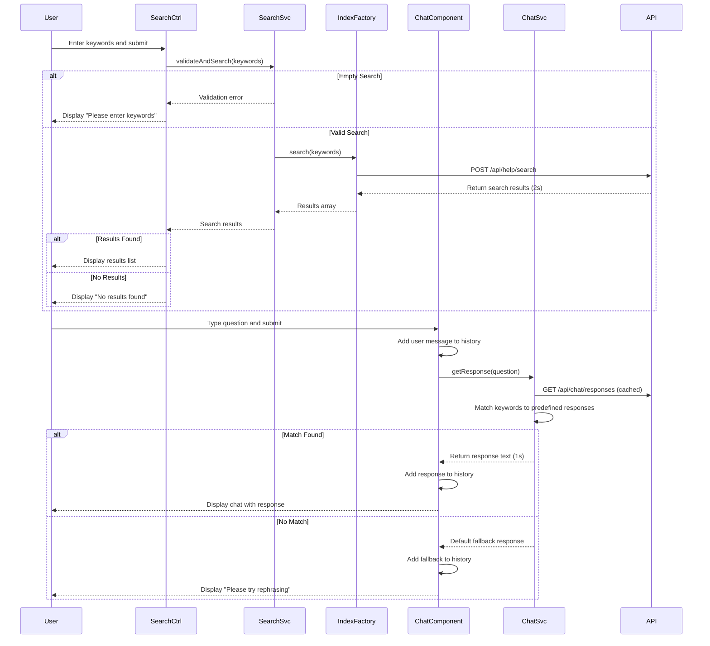

# Low-Level Design: Search and Chat Support Features

## Epic ID: QE-5089

---

## a. Architecture Mapping

- **Search Service** → AngularJS Service (`SearchService`) - handles keyword search logic and validation
- **Content Index** → AngularJS Factory (`ContentIndexFactory`) - interfaces with search API and manages indexed content
- **Chat Interface** → AngularJS Component (`chatSupportComponent`) - renders chat UI with message history
- **Response Engine** → AngularJS Service (`ChatResponseService`) - matches user questions to predefined responses
- **Search UI Controller** → AngularJS Controller (`SearchController`) - manages search input and results display

**Recommended Folder Structure:**
```
/app
  /modules
    /help-center
      /services
        search.service.js
        chat-response.service.js
        content-index.factory.js
      /components
        chat-support.component.js
      /controllers
        search.controller.js
      /views
        search-results.html
        chat-support.html
      /styles
        search-chat.css
```

---

## b. Component Specifications

| Component Name | Artifact Type | Responsibility | Key Dependencies |
|---|---|---|---|
| `SearchService` | Service | Validates search input and coordinates search execution | `ContentIndexFactory`, `$q` |
| `ContentIndexFactory` | Factory | Queries indexed Help Center content via REST API | `$http`, `$q` |
| `SearchController` | Controller | Manages search form state, triggers search, displays results | `SearchService`, `$scope` |
| `chatSupportComponent` | Component | Renders chat interface with input field and message history | `ChatResponseService`, `$scope` |
| `ChatResponseService` | Service | Matches user questions to predefined responses using keyword matching | `$http`, `$timeout` |
| `chatHistoryService` | Service | Maintains session-based chat message history | `$window.sessionStorage` |

---

## c. Data Model

**SearchQuery Object:**
```javascript
{
  keywords: String,        // User input
  timestamp: Date,
  filters: Object          // Optional category filters
}
```

**SearchResult Object:**
```javascript
{
  contentId: String,
  title: String,
  snippet: String,         // Highlighted excerpt
  categoryId: String,
  relevanceScore: Number,
  url: String              // Deep link to content
}
```

**ChatMessage Object:**
```javascript
{
  id: String,
  sender: String,          // "user" or "system"
  text: String,
  timestamp: Date,
  isResponse: Boolean
}
```

**PredefinedResponse Object:**
```javascript
{
  id: String,
  keywords: Array,         // Trigger keywords
  responseText: String,
  priority: Number         // For matching precedence
}
```

---

## d. Data Flow

User enters search keywords in search input → `SearchController` captures input via `ng-model` → User submits → Controller calls `SearchService.validateAndSearch(keywords)` → Service checks for empty input and returns validation error if empty → If valid, Service calls `ContentIndexFactory.search(keywords)` → Factory makes POST request to `/api/help/search` with keywords → API queries indexed content across all categories → Returns array of SearchResult objects within 2 seconds → Controller receives results and binds to view using `ng-repeat` → If no results, display "No results found" message. For chat: User types question in chat input → `chatSupportComponent` captures input → User submits → Component calls `ChatResponseService.getResponse(question)` → Service performs keyword matching against predefined responses loaded from `/api/chat/responses` → Returns matched response within 1 second → Component appends user message and system response to chat history via `chatHistoryService.addMessage()` → History displayed using `ng-repeat` with auto-scroll to latest message.

---

## e. Primary Sequence Diagram



---

## f. Implementation Notes

- Use `ng-submit` on search form with `SearchController.performSearch()` method; validate using `ng-required` and custom validation directive for empty string check
- Implement search results display with `ng-repeat="result in searchResults"` and highlight matching keywords using custom filter or `$sce.trustAsHtml()` with server-side snippet highlighting
- Chat interface uses `ng-repeat="message in chatHistory track by message.id"` with `ng-class` to style user vs system messages differently; auto-scroll implemented via `$timeout` and `scrollIntoView()`
- Load predefined chat responses on module initialization using `ChatResponseService.loadResponses()` and cache in service closure; match using simple keyword array intersection with priority-based selection
- Use `$window.sessionStorage` to persist chat history during session; clear on Help Center exit or page refresh

---

## g. Error Handling

HTTP interceptor captures API failures; search errors display inline message via `ng-show` with error flag; chat errors show default fallback response "Unable to process request".

---

## h. Security Notes

Standard input validation and secure API calls assumed; search input sanitized server-side to prevent injection attacks; chat responses are predefined (no user-generated content risk).

---