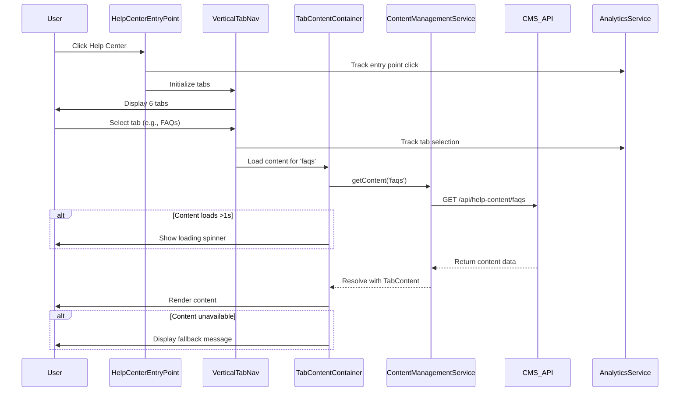

# Low-Level Design: Help Center Entry Point Enhancement

## Epic ID: QE-5102

---

## a. Architecture Mapping

- **Home Page Module** → AngularJS Module (`app.homePage`)
- **Help Center Entry Point** → AngularJS Component (`helpCenterEntryPoint`)
- **Vertical Tab Navigation** → AngularJS Component (`verticalTabNav`)
- **Tab Content Container** → AngularJS Component (`tabContentContainer`)
- **Content Management Service** → AngularJS Service (`contentManagementService`)
- **Analytics Integration** → AngularJS Service (`analyticsService`)
- **Loading Indicator** → AngularJS Directive (`loadingSpinner`)

**Recommended Folder Structure:**
```
/app
  /modules
    /home-page
      /components
        help-center-entry-point.component.js
        vertical-tab-nav.component.js
        tab-content-container.component.js
      /services
        content-management.service.js
        analytics.service.js
      /directives
        loading-spinner.directive.js
      home-page.module.js
```

---

## b. Component Specifications

| Name | Artifact Type | Responsibility | Key Dependencies |
|------|---------------|----------------|------------------|
| `helpCenterEntryPoint` | Component | Renders prominent Help Center entry button/link on Home Page | `analyticsService` |
| `verticalTabNav` | Component | Displays six vertical tabs (FAQs, How-to Guides, Video Tutorials, Help Materials, Troubleshooting, Chat Support) and handles tab selection | `$scope`, `analyticsService` |
| `tabContentContainer` | Component | Loads and displays content for selected tab with loading indicator | `contentManagementService`, `loadingSpinner` |
| `contentManagementService` | Service | Fetches tab content from backend CMS via REST API | `$http`, `$q` |
| `analyticsService` | Service | Tracks user interactions (entry point clicks, tab switches) | `$http` |
| `loadingSpinner` | Directive | Shows/hides loading indicator based on content fetch status | None |

---

## c. Data Model

**TabConfig Object:**
```javascript
{
  id: String,              // e.g., 'faqs', 'how-to-guides'
  label: String,           // Display name
  active: Boolean,         // Currently selected tab
  contentUrl: String       // API endpoint for content
}
```

**TabContent Object:**
```javascript
{
  tabId: String,
  title: String,
  body: String,            // HTML content
  lastUpdated: Date,
  isLoading: Boolean,
  error: String            // Error message if content unavailable
}
```

---

## d. Data Flow

User lands on Home Page → `helpCenterEntryPoint` component renders prominently → User clicks entry point → `verticalTabNav` component initializes with six tabs → User selects a tab → `tabContentContainer` invokes `contentManagementService.getContent(tabId)` → Service makes REST API call to CMS → If response time >1 second, `loadingSpinner` directive activates → Content received and rendered in responsive layout → Tab context retained in `$scope` when switching tabs → `analyticsService` logs all interactions → If content unavailable, fallback message displayed in `tabContentContainer`.

---

## e. Primary Sequence Diagram



---

## f. Implementation Notes

- Use AngularJS component-based architecture with one-way data binding for tab state management
- Implement Dependency Injection for `contentManagementService` and `analyticsService` in all components
- Use `$http` service with promise-based API calls; cache responses using `$cacheFactory` for performance
- Apply Bootstrap grid system and CSS3 media queries for responsive design across desktop/mobile
- Implement keyboard navigation (Tab, Enter, Arrow keys) and ARIA attributes for WCAG 2.1 AA compliance

---

## g. Error Handling

Use `$http` interceptor for global error handling; display user-friendly messages in `tabContentContainer` on API failures with retry option.

---

## h. Security Notes

Standard input validation and secure API calls assumed; content served via HTTPS with CSP headers.