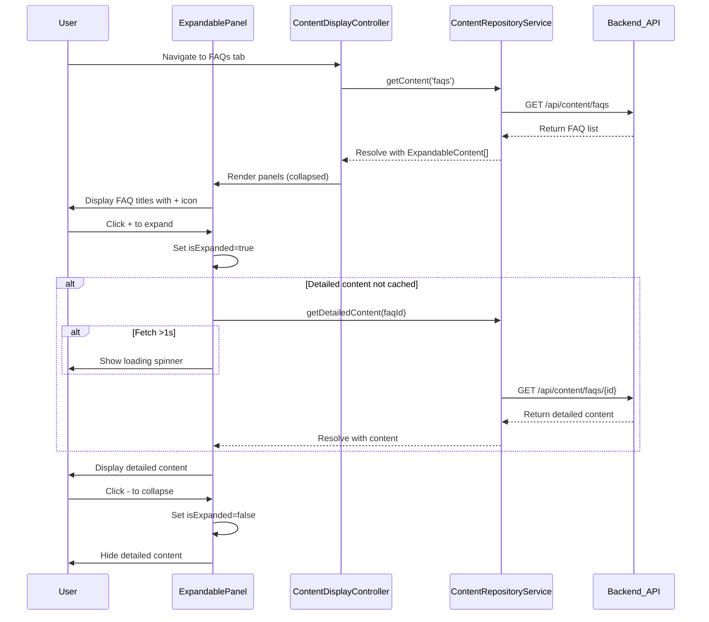

# Low-Level Design: Interactive Help Content Delivery

## Epic ID: QE-5103

---

## a. Architecture Mapping

- **Content Display Manager** → AngularJS Controller (`contentDisplayController`)
- **Expandable Panel Controller** → AngularJS Component (`expandablePanel`)
- **Video Embedding Service** → AngularJS Service (`videoEmbedService`)
- **Download Manager** → AngularJS Service (`downloadService`)
- **Content Repository** → REST API Integration via AngularJS Service (`contentRepositoryService`)
- **Malware Scanner** → Backend API Integration via `downloadService`

**Recommended Folder Structure:**
```
/app
  /modules
    /help-content
      /components
        expandable-panel.component.js
        video-player.component.js
        download-tile.component.js
      /controllers
        content-display.controller.js
      /services
        video-embed.service.js
        download.service.js
        content-repository.service.js
      help-content.module.js
```

---

## b. Component Specifications

| Name | Artifact Type | Responsibility | Key Dependencies |
|------|---------------|----------------|------------------|
| `contentDisplayController` | Controller | Orchestrates content rendering for FAQs, How-to, Troubleshooting tabs | `contentRepositoryService`, `$scope` |
| `expandablePanel` | Component | Renders expandable/collapsible panels with +/- controls and handles expand/collapse logic | `contentRepositoryService`, `loadingSpinner` |
| `videoPlayer` | Component | Embeds video with thumbnail, validates links, displays error for broken links | `videoEmbedService` |
| `downloadTile` | Component | Displays downloadable resource tile with icon and triggers download | `downloadService` |
| `videoEmbedService` | Service | Validates video URLs and generates embed code for approved platforms | `$http` |
| `downloadService` | Service | Initiates download after malware scan via backend API | `$http`, `$window` |
| `contentRepositoryService` | Service | Fetches structured content (FAQs, guides, troubleshooting) from backend | `$http`, `$q` |

---

## c. Data Model

**ExpandableContent Object:**
```javascript
{
  id: String,
  title: String,
  summary: String,
  detailedContent: String,  // HTML
  isExpanded: Boolean,
  isLoading: Boolean
}
```

**VideoContent Object:**
```javascript
{
  id: String,
  title: String,
  videoUrl: String,
  thumbnailUrl: String,
  embedCode: String,
  isValid: Boolean,
  errorMessage: String
}
```

**DownloadableResource Object:**
```javascript
{
  id: String,
  title: String,
  fileType: String,        // e.g., 'PDF', 'DOCX'
  fileSize: String,
  downloadUrl: String,
  isScanComplete: Boolean,
  scanStatus: String       // 'safe', 'malware', 'pending'
}
```

---

## d. Data Flow

User navigates to FAQ/How-to/Troubleshooting tab → `contentDisplayController` invokes `contentRepositoryService.getContent(tabType)` → Service fetches structured content from REST API → `expandablePanel` components render with +/- controls → User clicks to expand → `expandablePanel` sets `isExpanded=true` and fetches detailed content if not cached → If fetch >1 second, `loadingSpinner` activates → Content displayed → For Video Tutorials tab, `videoPlayer` component calls `videoEmbedService.validateAndEmbed(videoUrl)` → Valid videos show thumbnail/embed; broken links show error message → For Help Materials tab, user clicks download tile → `downloadService.initiateDownload(resourceId)` triggers backend malware scan → On scan success, file download starts via `$window.open()`; on failure, error displayed.

---

## e. Primary Sequence Diagram



---

## f. Implementation Notes

- Use AngularJS component lifecycle hooks (`$onInit`) to fetch initial content for each tab
- Implement `ng-repeat` with `track by` for efficient rendering of expandable panels
- Use `$sce.trustAsHtml()` for rendering HTML content in panels with XSS protection
- Validate video URLs against whitelist of approved platforms (YouTube, Vimeo) in `videoEmbedService`
- Trigger malware scan via backend API before serving downloads; use `$window.location.href` for file download

---

## g. Error Handling

Use try/catch blocks in service methods with user-friendly error notifications via `$rootScope.$broadcast('showError', message)`; display inline error messages for broken video links and failed downloads.

---

## h. Security Notes

Downloadable materials scanned for malware via backend service; video embed URLs validated against approved platform whitelist; HTML content sanitized using `$sce`.