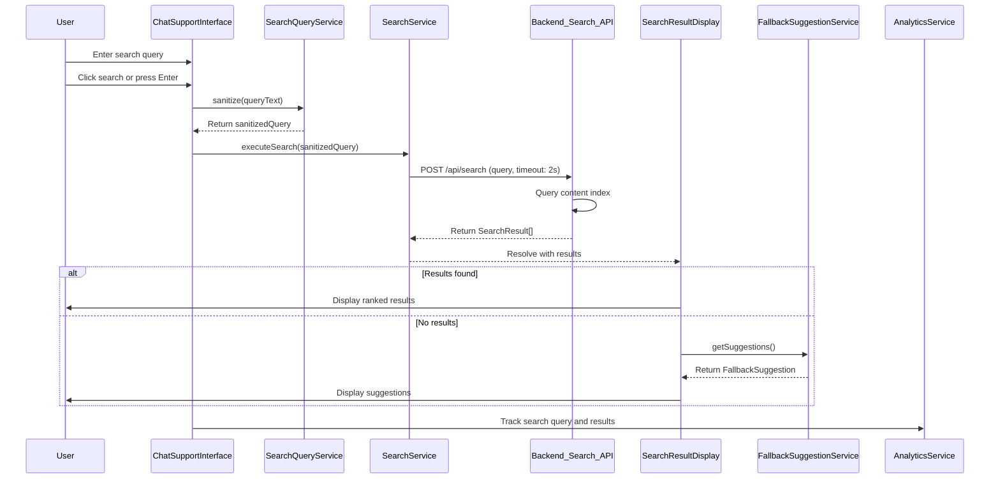

# Low-Level Design: Intelligent Chat Support Integration

## Epic ID: QE-5104

---

## a. Architecture Mapping

- **User Chat Interface** → AngularJS Component (`chatSupportInterface`)
- **Search Query Processor** → AngularJS Service (`searchQueryService`)
- **Search Algorithm Service** → Backend REST API Integration via AngularJS Service (`searchService`)
- **Website Content Index** → Backend Search Index (accessed via `searchService`)
- **Result Display Component** → AngularJS Component (`searchResultDisplay`)
- **Fallback Suggestion Engine** → AngularJS Service (`fallbackSuggestionService`)

**Recommended Folder Structure:**
```
/app
  /modules
    /chat-support
      /components
        chat-support-interface.component.js
        search-result-display.component.js
      /services
        search-query.service.js
        search.service.js
        fallback-suggestion.service.js
      chat-support.module.js
```

---

## b. Component Specifications

| Name | Artifact Type | Responsibility | Key Dependencies |
|------|---------------|----------------|------------------|
| `chatSupportInterface` | Component | Renders chat input field and manages user query submission | `searchQueryService`, `$scope` |
| `searchResultDisplay` | Component | Displays search results or fallback suggestions in conversational format | `searchService`, `fallbackSuggestionService` |
| `searchQueryService` | Service | Processes and sanitizes user search queries before submission | None |
| `searchService` | Service | Executes search against website content index via REST API with 2-second timeout | `$http`, `$q`, `$timeout` |
| `fallbackSuggestionService` | Service | Generates helpful alternative suggestions when no results found | None |
| `analyticsService` | Service | Tracks chat interactions and search queries | `$http` |

---

## c. Data Model

**SearchQuery Object:**
```javascript
{
  queryText: String,
  timestamp: Date,
  sanitizedQuery: String
}
```

**SearchResult Object:**
```javascript
{
  id: String,
  title: String,
  snippet: String,          // Excerpt with highlighted keywords
  relevanceScore: Number,
  sourceUrl: String,
  contentType: String       // e.g., 'FAQ', 'Guide', 'Article'
}
```

**FallbackSuggestion Object:**
```javascript
{
  suggestions: Array<String>,  // List of alternative queries or topics
  helpfulLinks: Array<{title: String, url: String}>
}
```

---

## d. Data Flow

User enters search query in `chatSupportInterface` → Query submitted on Enter key or button click → `searchQueryService.sanitize(queryText)` cleans input → `searchService.executeSearch(sanitizedQuery)` makes REST API call to backend with 2-second timeout → Backend queries Website Content Index using keyword/semantic matching → Results ranked by relevance and returned → `searchResultDisplay` renders results in conversational format within 2 seconds → If no results found, `fallbackSuggestionService.getSuggestions()` generates alternative topics/links → Suggestions displayed to user → All interactions logged via `analyticsService` → No personal user data exposed in search operations.

---

## e. Primary Sequence Diagram



---

## f. Implementation Notes

- Use AngularJS `ng-submit` on form with input validation to trigger search on Enter key
- Implement `$http` with 2-second timeout using `timeout` config option; handle timeout errors gracefully
- Use `$filter('highlight')` custom filter to highlight search keywords in result snippets
- Store recent queries in `$sessionStorage` for potential autocomplete (future enhancement)
- Ensure search API endpoint does not accept or log any user personal identifiable information

---

## g. Error Handling

Use `$http` interceptor for API errors; display "Search temporarily unavailable" message on timeout/failure with fallback suggestions automatically shown.

---

## h. Security Notes

No exposure of user personal data; search queries sanitized to prevent injection attacks; all API calls over HTTPS with CORS validation.