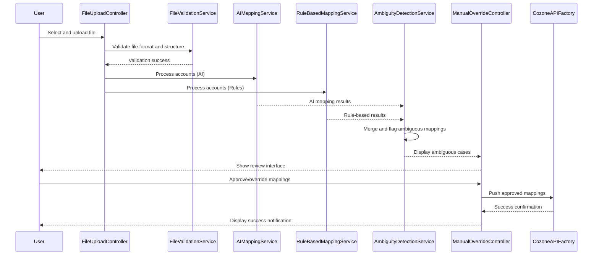

# Low-Level Design: Automated Ledger Mapping Tool

## Epic ID: QE-5129

---

## a. Architecture Mapping

- **File Upload Interface** → AngularJS Module (`fileUploadModule`) + Controller (`FileUploadController`) + Directive (`fileUploader`)
- **File Validation Service** → AngularJS Service (`FileValidationService`)
- **AI Mapping Engine** → AngularJS Service (`AIMappingService`) calling REST API
- **Rule-Based Mapping Engine** → AngularJS Service (`RuleBasedMappingService`) calling REST API
- **Ambiguity Detection Service** → AngularJS Service (`AmbiguityDetectionService`)
- **Manual Override Interface** → AngularJS Controller (`ManualOverrideController`) + View
- **Historical Data Repository** → Backend REST API (accessed via AngularJS Factory `HistoricalDataFactory`)
- **Cozone API** → Backend REST API (accessed via AngularJS Factory `CozoneAPIFactory`)

**Recommended Folder Structure:**
```
/app
  /modules
    /ledger-mapping
      /controllers
      /services
      /directives
      /factories
      /views
      /models
```

---

## b. Component Specifications

| Name | Artifact Type | Responsibility | Key Dependencies |
|------|---------------|----------------|------------------|
| fileUploadModule | Module | Root module for ledger mapping feature | angular, ngFileUpload, ui.bootstrap |
| FileUploadController | Controller | Handles file selection, upload initiation, progress tracking | FileValidationService, $scope, $http |
| fileUploader | Directive | Custom file input with drag-drop support and format validation | FileValidationService |
| FileValidationService | Service | Validates file format (CSV/XLSX/XML), size, structure before processing | $q, $http |
| AIMappingService | Service | Calls AI mapping API, processes results, returns confidence scores | $http, $q, HistoricalDataFactory |
| RuleBasedMappingService | Service | Executes rule-based mapping logic via API, merges with AI results | $http, $q |
| AmbiguityDetectionService | Service | Analyzes mapping results, flags low-confidence matches for review | $q |
| ManualOverrideController | Controller | Displays ambiguous mappings, handles user approval/override actions | AmbiguityDetectionService, CozoneAPIFactory, NotificationService, $scope |
| HistoricalDataFactory | Factory | Provides historical mapping data for AI context | $http |
| CozoneAPIFactory | Factory | Pushes final approved mappings to Cozone master ledger | $http, AuthService |
| NotificationService | Service | Displays success/error notifications to users | toastr or custom notification |
| AuthService | Service | Manages user authentication tokens for API calls | $http, $window |

---

## c. Data Model

**LegacyAccount** (JavaScript object)
```javascript
{
  accountCode: String,
  accountDescription: String,
  accountType: String,
  balance: Number,
  currency: String
}
```

**MappingSuggestion** (JavaScript object)
```javascript
{
  legacyAccountCode: String,
  suggestedMasterCode: String,
  confidenceScore: Number,
  mappingSource: String, // 'AI' or 'Rule-Based'
  isAmbiguous: Boolean,
  userOverride: String // null or user-selected code
}
```

**UploadSession** (JavaScript object)
```javascript
{
  sessionId: String,
  firmName: String,
  fileName: String,
  fileFormat: String,
  uploadTimestamp: Date,
  totalAccounts: Number,
  mappedAccounts: Number,
  ambiguousAccounts: Number,
  status: String // 'uploading', 'processing', 'review', 'completed'
}
```

---

## d. Data Flow

User selects legacy account file via File Upload Interface → FileUploadController validates file using FileValidationService → Valid file is uploaded to backend → AIMappingService and RuleBasedMappingService process accounts in parallel via REST APIs → AmbiguityDetectionService merges results and flags low-confidence mappings → High-confidence mappings are auto-applied; ambiguous cases are displayed in ManualOverrideController view → User reviews and approves/overrides suggestions → ManualOverrideController calls CozoneAPIFactory to push final mappings to Cozone master ledger → NotificationService displays success/error message → UI updates session status.

---

## e. Primary Sequence Diagram



---

## f. Implementation Notes

- Use AngularJS 1.x dependency injection for all services, controllers, and factories
- Implement file upload with ng-file-upload library for multi-format support and progress tracking
- Use $q promises for asynchronous API calls; chain AI and rule-based services with Promise.all for parallel execution
- Apply ES6 arrow functions and const/let for cleaner service implementations
- Integrate Bootstrap modals for manual override interface with sortable/filterable tables for ambiguous mappings

---

## g. Error Handling

HTTP interceptor captures API errors; try/catch blocks in services handle exceptions; NotificationService displays user-friendly error messages with retry options.

---

## h. Security Notes

Requires token-based authentication via existing SSO; all API calls include auth headers managed by AuthService; file uploads validated for size/type to prevent malicious content.