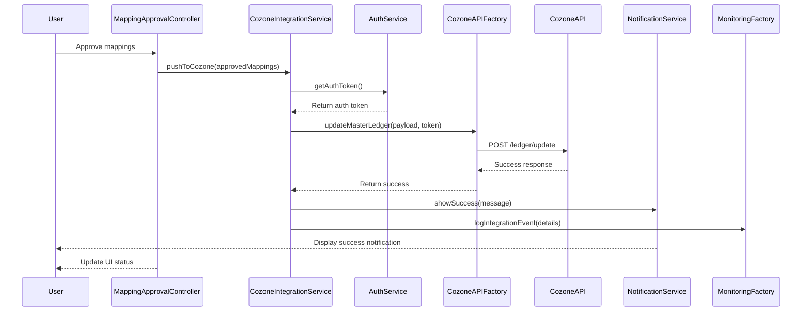

# Low-Level Design: Cozone Platform Integration

## Epic ID: QE-5130

---

## a. Architecture Mapping

- **Mapping Approval Workflow** → AngularJS Controller (`MappingApprovalController`) + View
- **Integration Service** → AngularJS Service (`CozoneIntegrationService`) calling REST API
- **Cozone API** → Backend REST API (accessed via AngularJS Factory `CozoneAPIFactory`)
- **Notification Service** → AngularJS Service (`NotificationService`)
- **Monitoring and Logging** → Backend service (accessed via AngularJS Factory `MonitoringFactory` for client-side events)
- **Failover Service** → Backend service with client-side status polling via AngularJS Service (`FailoverStatusService`)

**Recommended Folder Structure:**
```
/app
  /modules
    /cozone-integration
      /controllers
      /services
      /factories
      /views
      /models
```

---

## b. Component Specifications

| Name | Artifact Type | Responsibility | Key Dependencies |
|------|---------------|----------------|------------------|
| cozoneIntegrationModule | Module | Root module for Cozone integration feature | angular, ui.bootstrap |
| MappingApprovalController | Controller | Manages approval workflow UI, triggers integration on user approval | CozoneIntegrationService, NotificationService, $scope |
| CozoneIntegrationService | Service | Orchestrates ledger update process, handles API calls and responses | CozoneAPIFactory, $q, $http, FailoverStatusService |
| CozoneAPIFactory | Factory | Wraps Cozone API endpoints for ledger updates with authentication | $http, AuthService, API_CONFIG |
| NotificationService | Service | Displays real-time success/failure notifications to users | toastr or custom notification |
| MonitoringFactory | Factory | Logs integration events and errors for monitoring dashboard | $http |
| FailoverStatusService | Service | Polls backend for failover status, queues requests during outages | $http, $interval, $q |
| AuthService | Service | Manages Cozone API authentication tokens and session | $http, $window |
| APIVersionService | Service | Handles API versioning logic, routes requests to correct endpoint version | $http |

---

## c. Data Model

**ApprovedMapping** (JavaScript object)
```javascript
{
  sessionId: String,
  mappings: Array, // Array of {legacyAccountCode, masterAccountCode, userId, timestamp}
  firmId: String,
  approvalTimestamp: Date,
  approvedBy: String
}
```

**CozoneUpdateRequest** (JavaScript object)
```javascript
{
  requestId: String,
  firmId: String,
  accounts: Array, // Array of {masterAccountCode, accountDescription, accountType}
  requestTimestamp: Date,
  apiVersion: String
}
```

**IntegrationStatus** (JavaScript object)
```javascript
{
  requestId: String,
  status: String, // 'pending', 'success', 'failed', 'queued'
  responseTime: Number,
  errorMessage: String,
  retryCount: Number
}
```

---

## d. Data Flow

User approves mapped accounts in MappingApprovalController → Controller calls CozoneIntegrationService.pushToCozone() → Service prepares payload and authenticates via AuthService → CozoneAPIFactory sends POST request to Cozone API with approved mappings → Cozone API returns success/failure response within 2 minutes → CozoneIntegrationService processes response and triggers NotificationService to display outcome → MonitoringFactory logs transaction details → If API is unavailable, FailoverStatusService queues request for automatic retry → UI updates approval status in real-time.

---

## e. Primary Sequence Diagram



---

## f. Implementation Notes

- Use AngularJS $http service with interceptors for authentication token injection and API versioning headers
- Implement promise-based error handling with $q for retry logic in FailoverStatusService
- Use $interval for periodic polling of failover queue status (every 30 seconds)
- Apply ES6 template literals for dynamic API endpoint construction based on version
- Bootstrap progress indicators and status badges for real-time integration feedback

---

## g. Error Handling

HTTP interceptor captures API errors (4xx, 5xx); CozoneIntegrationService wraps calls in try/catch; failed requests are queued by FailoverStatusService; NotificationService displays user-friendly error messages with retry options.

---

## h. Security Notes

Requires token-based auth via existing SSO; all Cozone API calls use TLS 1.2+ encryption; AuthService manages token refresh and expiration.