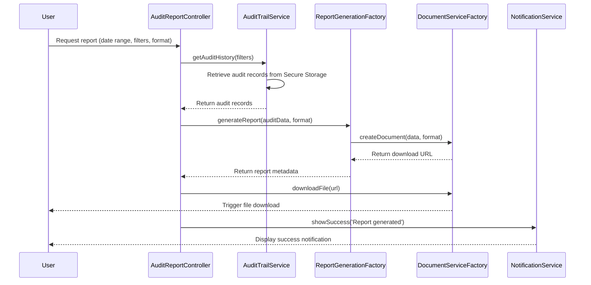

# Low-Level Design: Audit-Ready Reporting

## Epic ID: QE-5131

---

## a. Architecture Mapping

- **User Interface** → AngularJS Module (`auditReportModule`) + Controller (`AuditReportController`) + View
- **Audit Trail Service** → AngularJS Service (`AuditTrailService`) calling REST API
- **Report Generation Engine** → Backend REST API (accessed via AngularJS Factory `ReportGenerationFactory`)
- **Secure Storage System** → Backend service (accessed via REST API through `AuditTrailService`)
- **Document Service** → Backend REST API (accessed via AngularJS Factory `DocumentServiceFactory`)
- **Authentication Service** → AngularJS Service (`AuthService`)

**Recommended Folder Structure:**
```
/app
  /modules
    /audit-reporting
      /controllers
      /services
      /factories
      /views
      /models
```

---

## b. Component Specifications

| Name | Artifact Type | Responsibility | Key Dependencies |
|------|---------------|----------------|------------------|
| auditReportModule | Module | Root module for audit reporting feature | angular, ui.bootstrap, ngFileSaver |
| AuditReportController | Controller | Manages report request UI, filters, download actions | AuditTrailService, ReportGenerationFactory, NotificationService, $scope |
| AuditTrailService | Service | Retrieves mapping history, metadata, and audit logs from backend | $http, $q, AuthService |
| ReportGenerationFactory | Factory | Calls report generation API, returns PDF/CSV download links | $http, $q |
| DocumentServiceFactory | Factory | Handles document creation and secure download | $http, FileSaver |
| NotificationService | Service | Displays report generation status and error messages | toastr or custom notification |
| AuthService | Service | Manages user authentication and RBAC permissions | $http, $window |
| AuditFilterService | Service | Applies date range, user, and action type filters to audit data | $filter |

---

## c. Data Model

**AuditRecord** (JavaScript object)
```javascript
{
  recordId: String,
  userId: String,
  userName: String,
  sessionId: String,
  actionType: String, // 'upload', 'mapping', 'override', 'approval'
  timestamp: Date,
  beforeValue: String,
  afterValue: String,
  firmId: String
}
```

**ReportRequest** (JavaScript object)
```javascript
{
  requestId: String,
  reportType: String, // 'PDF' or 'CSV'
  dateRange: Object, // {startDate: Date, endDate: Date}
  filters: Object, // {userId, firmId, actionType}
  requestedBy: String,
  requestTimestamp: Date
}
```

**ReportMetadata** (JavaScript object)
```javascript
{
  reportId: String,
  fileName: String,
  fileSize: Number,
  generatedAt: Date,
  downloadUrl: String,
  expiresAt: Date
}
```

---

## d. Data Flow

User initiates report request via AuditReportController by selecting date range, filters, and format (PDF/CSV) → Controller calls AuditTrailService.getAuditHistory() to retrieve mapping history and metadata from Secure Storage → AuditTrailService returns filtered audit records → Controller calls ReportGenerationFactory.generateReport() with audit data and format → Backend Report Generation Engine formats data and calls Document Service to create PDF/CSV → DocumentServiceFactory receives download URL → Controller triggers file download via FileSaver → NotificationService displays success message → All actions are logged with user identity, timestamp, and context for compliance traceability.

---

## e. Primary Sequence Diagram



---

## f. Implementation Notes

- Use AngularJS $http service for REST API calls with promise-based error handling via $q
- Implement FileSaver.js (ngFileSaver) for client-side file download with proper MIME types
- Apply Bootstrap date-pickers and multi-select dropdowns for filter UI with two-way data binding
- Use ES6 object destructuring for cleaner filter parameter handling in services
- Implement RBAC checks in AuthService before allowing report generation; restrict access based on user roles

---

## g. Error Handling

HTTP interceptor captures API errors; AuditTrailService and ReportGenerationFactory wrap calls in try/catch; NotificationService displays user-friendly error messages; failed report requests are logged for retry.

---

## h. Security Notes

Requires token-based auth via existing SSO; RBAC enforced for report access; all audit data encrypted with AES-256 in transit and at rest; download URLs expire after 1 hour.