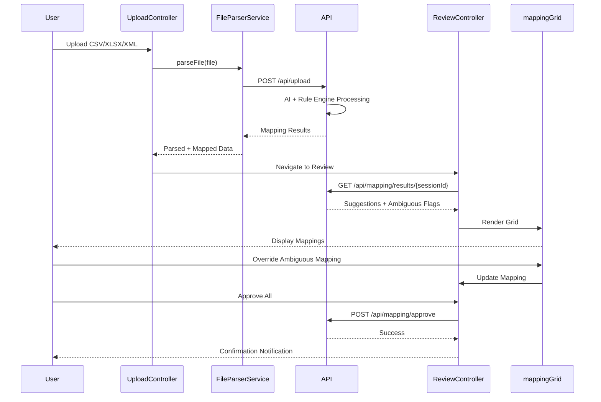

# Low-Level Design: QE-5138 - Automated Ledger Mapping Tool

## a. Architecture Mapping

- **Upload Interface** → AngularJS Module (`app.upload`) + Controller (`UploadController`)
- **File Parser** → Service (`FileParserService`) using FileReader API
- **AI Mapping Engine** → Factory (`AIMappingFactory`) consuming REST endpoint `/api/mapping/ai`
- **Rule Engine** → Service (`RuleEngineService`) consuming REST endpoint `/api/mapping/rules`
- **Master Ledger Repository** → Service (`MasterLedgerService`) consuming REST endpoint `/api/ledger/master`
- **Review and Override UI** → Module (`app.review`) + Controller (`ReviewController`) + Directive (`mappingGrid`)

**Folder Structure:**
```
/app
  /modules
    /upload
    /review
  /services
  /factories
  /directives
  /models
```

## b. Component Specifications

| Name | Artifact Type | Responsibility | Key Dependencies |
|------|---------------|----------------|------------------|
| UploadController | Controller | Handles file upload UI interactions and triggers parsing | FileParserService, $scope, $http |
| FileParserService | Service | Parses CSV/XLSX/XML files and extracts account structures | $q, $http |
| AIMappingFactory | Factory | Invokes AI mapping API and returns confidence-scored suggestions | $http, $q |
| RuleEngineService | Service | Applies rule-based mapping logic against master ledger | $http, MasterLedgerService |
| MasterLedgerService | Service | Fetches and caches master ledger reference data | $http, $cacheFactory |
| ReviewController | Controller | Manages review UI, handles manual overrides, and approves mappings | AIMappingFactory, RuleEngineService, $scope |
| mappingGrid | Directive | Renders editable grid for mapping review with inline editing | ReviewController |

## c. Data Model

```javascript
// LegacyAccount
{
  accountCode: String,
  accountName: String,
  accountType: String,
  firmId: String,
  uploadSessionId: String
}

// MappingSuggestion
{
  legacyAccountCode: String,
  suggestedMasterCode: String,
  confidence: Number, // 0-100
  mappingSource: String, // 'AI' or 'RULE'
  isAmbiguous: Boolean,
  alternativeSuggestions: Array<String>
}

// MappingResult
{
  legacyAccountCode: String,
  masterAccountCode: String,
  status: String, // 'AUTO', 'MANUAL', 'PENDING'
  overriddenBy: String,
  timestamp: Date
}
```

## d. Data Flow

User uploads legacy account file via UploadController → FileParserService extracts accounts and posts to `/api/upload` → Backend triggers AI Mapping Engine and Rule Engine → AIMappingFactory and RuleEngineService fetch results from `/api/mapping/results` → High-confidence mappings auto-assigned, ambiguous flagged → ReviewController displays results in mappingGrid directive → User reviews/overrides ambiguous mappings → Approved mappings submitted via `/api/mapping/approve` → UI updates with success notification.

## e. Primary Sequence Diagram



## f. Implementation Notes

- Use AngularJS 1.x Dependency Injection for all services, factories, and controllers
- FileParserService leverages HTML5 FileReader API with $q promises for async parsing
- Implement $http interceptor for global error handling and authentication token injection
- Use $cacheFactory in MasterLedgerService to cache master ledger data (TTL: 1 hour)
- mappingGrid directive uses ng-repeat with track-by for performance on 10K+ rows

## g. Error Handling

HTTP interceptor captures API errors (4xx/5xx), displays user-friendly notifications via toastr, and logs to console; file parsing errors caught via try/catch with inline validation feedback.

## h. Security Notes

Requires token-based auth via existing SSO; all API calls over TLS 1.2+; file uploads validated for type/size on client and server.