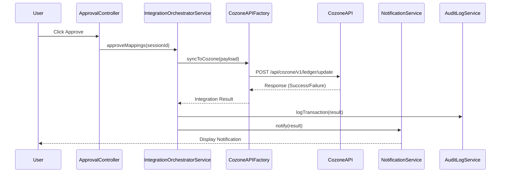

# Low-Level Design: QE-5139 - Cozone Platform Integration

## a. Architecture Mapping

- **Mapping Approval UI** → Controller (`ApprovalController`) within existing review module
- **Integration Orchestrator** → Service (`IntegrationOrchestratorService`) managing workflow
- **Cozone API Client** → Factory (`CozoneAPIFactory`) wrapping REST calls to Cozone
- **Notification Service** → Service (`NotificationService`) for user alerts
- **Audit Log** → Service (`AuditLogService`) recording all transactions

**Folder Structure:**
```
/app
  /modules
    /approval
  /services
  /factories
  /models
```

## b. Component Specifications

| Name | Artifact Type | Responsibility | Key Dependencies |
|------|---------------|----------------|------------------|
| ApprovalController | Controller | Handles final mapping approval and triggers Cozone sync | IntegrationOrchestratorService, $scope |
| IntegrationOrchestratorService | Service | Orchestrates approval workflow and Cozone API calls | CozoneAPIFactory, NotificationService, AuditLogService |
| CozoneAPIFactory | Factory | Executes REST API calls to Cozone with retry logic | $http, $q, $timeout |
| NotificationService | Service | Displays success/failure notifications to users | toastr or custom notification directive |
| AuditLogService | Service | Logs all integration events with timestamps | $http |

## c. Data Model

```javascript
// ApprovalPayload
{
  sessionId: String,
  mappings: Array<MappingResult>,
  approvedBy: String,
  approvalTimestamp: Date
}

// CozoneUpdateRequest
{
  accountCode: String,
  masterAccountCode: String,
  firmId: String,
  effectiveDate: Date
}

// IntegrationResponse
{
  status: String, // 'SUCCESS', 'FAILURE', 'PARTIAL'
  successCount: Number,
  failureCount: Number,
  errors: Array<{accountCode: String, errorMessage: String}>
}
```

## d. Data Flow

User clicks "Approve" in ApprovalController → IntegrationOrchestratorService receives approval event → CozoneAPIFactory formats payload per Cozone schema → POST to `/api/cozone/v1/ledger/update` via TLS 1.2+ → Cozone returns success/failure response → NotificationService alerts user with result summary → AuditLogService records transaction details → Retry logic activates on API failure (3 retries with exponential backoff).

## e. Primary Sequence Diagram



## f. Implementation Notes

- CozoneAPIFactory uses $http with custom headers for API versioning (X-API-Version: v1)
- Retry logic implemented via $timeout with exponential backoff (1s, 2s, 4s)
- IntegrationOrchestratorService uses $q.all for batch updates with partial failure handling
- NotificationService integrates with angular-toastr for consistent UI notifications
- AuditLogService posts asynchronously to `/api/audit/log` without blocking user flow

## g. Error Handling

HTTP interceptor captures Cozone API errors; CozoneAPIFactory implements 3-retry logic with exponential backoff; NotificationService displays detailed error messages with retry option.

## h. Security Notes

Requires token-based auth via existing SSO; Cozone API calls authenticated via OAuth 2.0 bearer tokens; all traffic over TLS 1.2+.