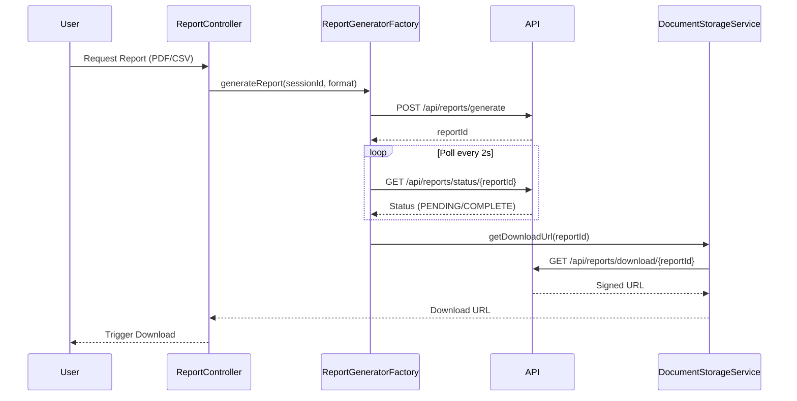

# Low-Level Design: QE-5140 - Audit-Ready Reporting

## a. Architecture Mapping

- **User Interface** → Controller (`ReportController`) + View (`report.html`)
- **Audit Logging Service** → Service (`AuditLoggingService`) capturing all events
- **Report Generation Engine** → Factory (`ReportGeneratorFactory`) consuming `/api/reports/generate`
- **Secure Document Storage** → Service (`DocumentStorageService`) managing report retrieval
- **Authentication Service** → Existing SSO integration via `AuthService`

**Folder Structure:**
```
/app
  /modules
    /reports
  /services
  /factories
  /models
```

## b. Component Specifications

| Name | Artifact Type | Responsibility | Key Dependencies |
|------|---------------|----------------|------------------|
| ReportController | Controller | Manages report request UI and download actions | ReportGeneratorFactory, DocumentStorageService, $scope |
| AuditLoggingService | Service | Captures and stores audit events immutably | $http |
| ReportGeneratorFactory | Factory | Requests report generation and polls for completion | $http, $q, $interval |
| DocumentStorageService | Service | Retrieves generated reports and previous report history | $http |
| AuthService | Service | Validates user permissions for report access | $http, $window |

## c. Data Model

```javascript
// AuditEvent
{
  eventId: String,
  eventType: String, // 'MAPPING_DECISION', 'OVERRIDE', 'APPROVAL'
  userId: String,
  sessionId: String,
  timestamp: Date,
  metadata: Object // {accountCode, oldValue, newValue, etc.}
}

// ReportRequest
{
  sessionId: String,
  reportFormat: String, // 'PDF' or 'CSV'
  dateRange: {start: Date, end: Date},
  requestedBy: String
}

// ReportMetadata
{
  reportId: String,
  reportFormat: String,
  generatedAt: Date,
  downloadUrl: String,
  expiresAt: Date
}
```

## d. Data Flow

User actions trigger AuditLoggingService to POST events to `/api/audit/events` → Events stored immutably → User requests report via ReportController → ReportGeneratorFactory POSTs to `/api/reports/generate` with format (PDF/CSV) → Backend generates report asynchronously → ReportGeneratorFactory polls `/api/reports/status/{reportId}` every 2s → Upon completion, DocumentStorageService retrieves download URL → User downloads report via secure link → Report expires after 7 days per retention policy.

## e. Primary Sequence Diagram



## f. Implementation Notes

- AuditLoggingService uses $http POST with fire-and-forget pattern (no blocking)
- ReportGeneratorFactory implements polling via $interval with 2-second intervals and 30-second timeout
- DocumentStorageService uses signed URLs with 1-hour expiration for secure downloads
- ReportController uses HTML5 download attribute for client-side file download
- All report metadata cached in $cacheFactory for "Previous Reports" view

## g. Error Handling

HTTP interceptor handles API failures; ReportGeneratorFactory retries on polling timeout; user notified via NotificationService if report generation fails.

## h. Security Notes

Requires token-based auth via existing SSO; report downloads use time-limited signed URLs; all API calls over TLS 1.2+; AES-256 encryption at rest.