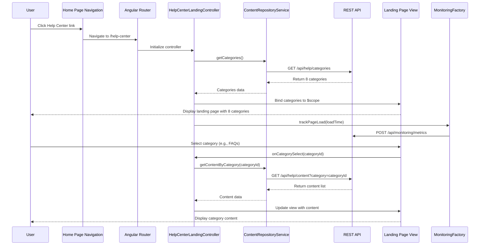

# Low-Level Design: Help Center Integration - Home Page

**Epic ID:** QE-5153

## a. Architecture Mapping

- **Help Center Module** → AngularJS Module (`helpCenterModule`)
- **Navigation Component** → AngularJS Directive (`helpCenterNav`)
- **Landing Page Controller** → AngularJS Controller (`HelpCenterLandingController`)
- **Content Repository Service** → AngularJS Service (`ContentRepositoryService`)
- **Monitoring Service** → AngularJS Factory (`MonitoringFactory`)
- **Responsive Framework** → Bootstrap CSS3 + AngularJS responsive directives

**Recommended Folder Structure:**
```
/app
  /modules
    /help-center
      /controllers
        - help-center-landing.controller.js
      /services
        - content-repository.service.js
        - monitoring.factory.js
      /directives
        - help-center-nav.directive.js
      /views
        - help-center-landing.html
      - help-center.module.js
  /assets
    /css
      - help-center.css
```

## b. Component Specifications

| Name | Artifact Type | Responsibility | Key Dependencies |
|------|---------------|----------------|------------------|
| helpCenterModule | Module | Root module for Help Center functionality | ngRoute, ui.bootstrap |
| HelpCenterLandingController | Controller | Manages landing page state, category navigation, and content loading | ContentRepositoryService, MonitoringFactory, $scope |
| ContentRepositoryService | Service | Fetches help content from REST API, caches category data | $http, $q |
| helpCenterNav | Directive | Renders category navigation with 8 categories (Getting Started, FAQs, How-to Guides, Video Tutorials, Help Materials, Troubleshooting, Chat Support, Search Help) | ContentRepositoryService |
| MonitoringFactory | Factory | Tracks page load times, uptime metrics, concurrent users | $window, $http |
| HelpCenterRouteConfig | Config | Defines routes for landing page and category views | $routeProvider |

## c. Data Model

**HelpCategory (JS Object):**
```javascript
{
  id: String,
  name: String,
  icon: String,
  description: String,
  contentCount: Number,
  url: String
}
```

**HelpContent (JS Object):**
```javascript
{
  id: String,
  categoryId: String,
  title: String,
  type: String, // 'article', 'faq', 'video', 'download'
  url: String,
  lastUpdated: Date
}
```

**PerformanceMetrics (JS Object):**
```javascript
{
  pageLoadTime: Number,
  timestamp: Date,
  concurrentUsers: Number,
  uptime: Number
}
```

## d. Data Flow

User clicks Help Center link in Home Page navigation → AngularJS routes to Help Center landing view → HelpCenterLandingController initializes and calls ContentRepositoryService.getCategories() → Service makes REST API call to fetch 8 category definitions → Controller binds category data to $scope → helpCenterNav directive renders category tiles with Bootstrap responsive grid → User selects category → Controller updates view with category-specific content list from ContentRepositoryService → MonitoringFactory tracks page load time and sends metrics to monitoring endpoint → UI updates within 2-second target.

## e. Primary Sequence Diagram



## f. Implementation Notes

- Use AngularJS 1.x module pattern with dependency injection for all controllers, services, and directives
- Implement ContentRepositoryService with $http promise-based API calls and in-memory caching using ES6 Map for category data
- Use Bootstrap responsive grid (col-xs/sm/md/lg) for mobile-first layout ensuring WCAG 2.1 AA compliance with aria-labels and keyboard navigation
- Apply $routeProvider for SPA routing with resolve guards to preload category data before view rendering
- Implement MonitoringFactory using $window.performance API to capture page load metrics and $http to POST to monitoring endpoint

## g. Error Handling

HTTP interceptor catches API failures, displays user-friendly error messages via Bootstrap modal, and logs errors to MonitoringFactory.

## h. Security Notes

All API calls use HTTPS-only endpoints with existing SSO token-based authentication passed via $http interceptor headers.