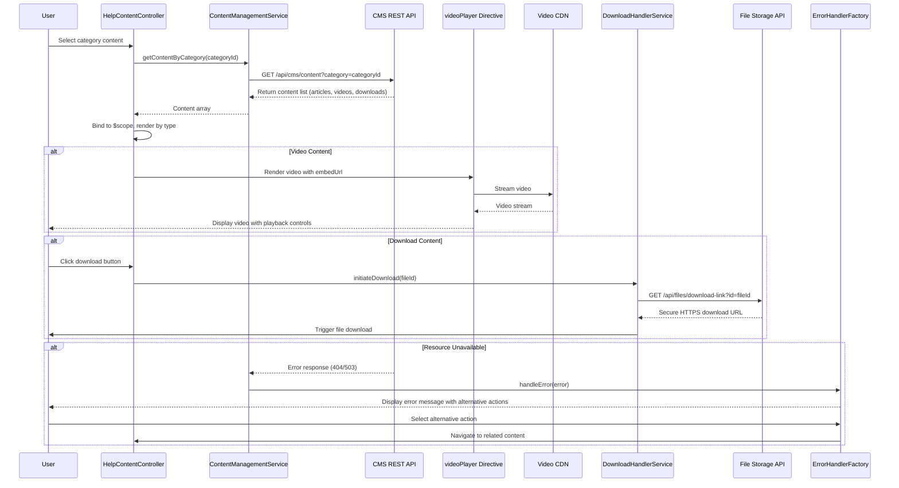

# Low-Level Design: Help Center Content Delivery

**Epic ID:** QE-5154

## a. Architecture Mapping

- **Content Display Module** → AngularJS Module (`helpContentModule`)
- **Content Controller** → AngularJS Controller (`HelpContentController`)
- **Content Management Service** → AngularJS Service (`ContentManagementService`)
- **Video Player Directive** → AngularJS Directive (`videoPlayer`)
- **Download Handler Service** → AngularJS Service (`DownloadHandlerService`)
- **Error Handler** → AngularJS Factory (`ErrorHandlerFactory`)

**Recommended Folder Structure:**
```
/app
  /modules
    /help-content
      /controllers
        - help-content.controller.js
      /services
        - content-management.service.js
        - download-handler.service.js
        - error-handler.factory.js
      /directives
        - video-player.directive.js
      /views
        - content-view.html
        - error-fallback.html
      - help-content.module.js
```

## b. Component Specifications

| Name | Artifact Type | Responsibility | Key Dependencies |
|------|---------------|----------------|------------------|
| helpContentModule | Module | Root module for content delivery functionality | ngRoute, ngSanitize |
| HelpContentController | Controller | Manages content display, category filtering, video playback, and download actions | ContentManagementService, DownloadHandlerService, ErrorHandlerFactory, $scope, $routeParams |
| ContentManagementService | Service | Fetches articles, FAQs, video metadata, and downloadable materials from CMS REST API | $http, $q, $cacheFactory |
| videoPlayer | Directive | Embeds video player with playback controls, handles streaming from CDN | ContentManagementService |
| DownloadHandlerService | Service | Generates secure download links, initiates file downloads over HTTPS | $http, $window |
| ErrorHandlerFactory | Factory | Displays meaningful error messages with alternative actions, performs automated link checking | $http |

## c. Data Model

**Article (JS Object):**
```javascript
{
  id: String,
  categoryId: String,
  title: String,
  content: String, // HTML content
  type: String, // 'article' or 'faq'
  lastUpdated: Date
}
```

**VideoContent (JS Object):**
```javascript
{
  id: String,
  categoryId: String,
  title: String,
  embedUrl: String,
  thumbnailUrl: String,
  duration: Number,
  type: String // 'video'
}
```

**DownloadableMaterial (JS Object):**
```javascript
{
  id: String,
  categoryId: String,
  title: String,
  fileName: String,
  fileSize: Number,
  fileType: String, // 'pdf', 'doc', etc.
  downloadUrl: String,
  type: String // 'download'
}
```

**ErrorResponse (JS Object):**
```javascript
{
  message: String,
  alternativeActions: Array, // [{text: String, url: String}]
  errorCode: String
}
```

## d. Data Flow

User browses categories and selects content → HelpContentController receives categoryId via $routeParams → Controller calls ContentManagementService.getContentByCategory(categoryId) → Service makes REST API call to CMS → CMS returns mixed content (articles, FAQs, videos, downloads) → Controller binds content to $scope and renders based on type → For videos: videoPlayer directive embeds player with CDN streaming URL and playback controls → For downloads: User clicks download button → DownloadHandlerService.initiateDownload() generates secure HTTPS link from File Storage Service → $window.open() triggers download → If resource unavailable: ErrorHandlerFactory intercepts error, displays meaningful message with alternative actions, and redirects to related content.

## e. Primary Sequence Diagram



## f. Implementation Notes

- Use AngularJS $http service with promise chaining for all CMS and File Storage API calls, implement $cacheFactory for content caching
- Implement videoPlayer directive using HTML5 video element with CDN embed URLs, bind controls using AngularJS event handlers
- DownloadHandlerService uses $window.open() with secure HTTPS URLs generated on-demand from File Storage API
- ErrorHandlerFactory implements HTTP response interceptor to catch 404/503 errors, displays Bootstrap alert with alternative action buttons
- Use ngSanitize for safe HTML rendering of article content to prevent XSS attacks

## g. Error Handling

HTTP interceptor catches resource unavailability (404/503), ErrorHandlerFactory displays meaningful Bootstrap modal with alternative actions (view related content, return to category), automated link checker runs via scheduled $interval service.

## h. Security Notes

All content delivery (videos, downloads, API calls) uses HTTPS-only with token-based authentication; ngSanitize prevents XSS in article HTML content.