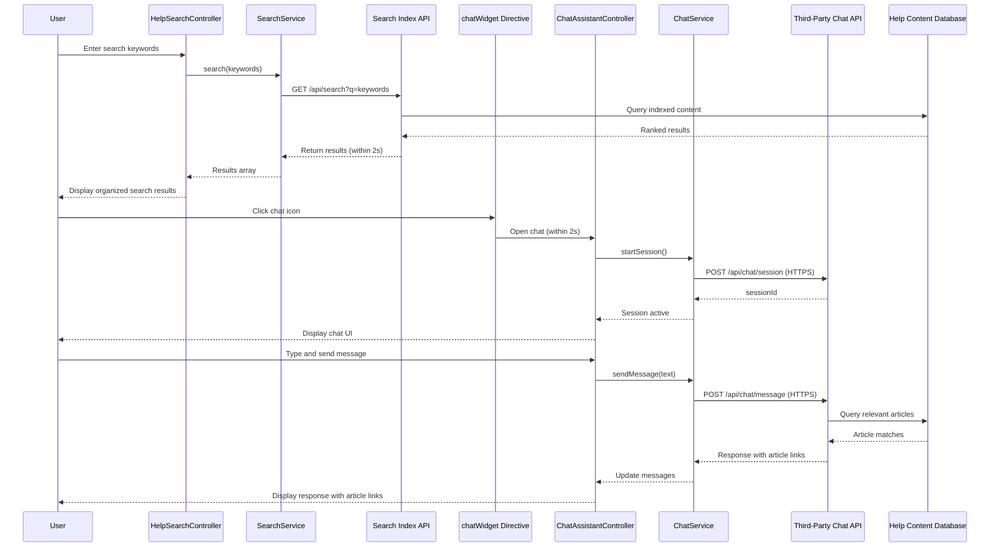

# Low-Level Design: Help Center Search and Chat Assistant

**Epic ID:** QE-5155

## a. Architecture Mapping

- **Search Module** → AngularJS Module (`helpSearchModule`)
- **Search Controller** → AngularJS Controller (`HelpSearchController`)
- **Search Service** → AngularJS Service (`SearchService`)
- **Chat Module** → AngularJS Module (`chatAssistantModule`)
- **Chat Controller** → AngularJS Controller (`ChatAssistantController`)
- **Chat Service** → AngularJS Service (`ChatService`)
- **Chat Widget Directive** → AngularJS Directive (`chatWidget`)

**Recommended Folder Structure:**
```
/app
  /modules
    /help-search
      /controllers
        - help-search.controller.js
      /services
        - search.service.js
      /views
        - search-results.html
      - help-search.module.js
    /chat-assistant
      /controllers
        - chat-assistant.controller.js
      /services
        - chat.service.js
      /directives
        - chat-widget.directive.js
      /views
        - chat-widget.html
      - chat-assistant.module.js
```

## b. Component Specifications

| Name | Artifact Type | Responsibility | Key Dependencies |
|------|---------------|----------------|------------------|
| helpSearchModule | Module | Root module for search functionality | ngRoute |
| HelpSearchController | Controller | Manages search input, displays ranked results, handles search state | SearchService, $scope, $timeout |
| SearchService | Service | Queries search index REST API, returns ranked results within 2 seconds | $http, $q |
| chatAssistantModule | Module | Root module for chat assistant functionality | ngWebSocket (or $http for polling) |
| ChatAssistantController | Controller | Manages chat UI state, message exchange, displays article links | ChatService, $scope |
| ChatService | Service | Integrates with third-party chat API via REST/WebSocket, retrieves article recommendations | $http, $websocket, $q |
| chatWidget | Directive | Renders chat UI overlay, handles open/close, real-time message display | ChatService |

## c. Data Model

**SearchQuery (JS Object):**
```javascript
{
  keywords: String,
  filters: Object, // {contentType: Array, category: String}
  timestamp: Date
}
```

**SearchResult (JS Object):**
```javascript
{
  id: String,
  title: String,
  snippet: String,
  contentType: String, // 'article', 'video', 'faq', 'download'
  relevanceScore: Number,
  url: String,
  category: String
}
```

**ChatMessage (JS Object):**
```javascript
{
  id: String,
  sender: String, // 'user' or 'assistant'
  text: String,
  timestamp: Date,
  articleLinks: Array // [{title: String, url: String}]
}
```

**ChatSession (JS Object):**
```javascript
{
  sessionId: String,
  messages: Array, // Array of ChatMessage
  isActive: Boolean,
  startTime: Date
}
```

## d. Data Flow

**Search Flow:** User enters keywords in search input → HelpSearchController captures input with debounce ($timeout) → Controller calls SearchService.search(keywords) → Service makes REST API call to Search Index endpoint → Search Index queries Help Content Database and returns ranked results → Service returns results to Controller within 2 seconds → Controller binds results to $scope → View displays organized results with snippets and content type indicators. **Chat Flow:** User clicks chat icon → chatWidget directive opens overlay within 2 seconds → ChatAssistantController initializes ChatService.startSession() → Service establishes connection to Third-Party Chat API via WebSocket/REST → User types message → Controller calls ChatService.sendMessage(text) → Service sends to Chat API → API processes query, retrieves relevant articles from Help Content Database → API returns response with article links → Service pushes message to Controller → Controller updates $scope.messages → View displays message with clickable article links in real-time over HTTPS.

## e. Primary Sequence Diagram



## f. Implementation Notes

- Use AngularJS $http for REST API calls with $q promises; implement debounce in SearchController using $timeout (300ms delay) to optimize search API calls
- SearchService caches recent queries using $cacheFactory to improve repeat search performance within 2-second target
- ChatService uses angular-websocket library for real-time messaging or falls back to $http polling if WebSocket unavailable
- chatWidget directive uses ng-show/ng-hide for overlay toggle, positioned fixed with z-index for accessibility, includes aria-live for screen reader updates
- Both modules use dependency injection for services and implement HTTPS-only endpoints via $httpProvider interceptor

## g. Error Handling

HTTP interceptor catches search/chat API failures, displays user-friendly error toast using Bootstrap alert, SearchService retries once on timeout, ChatService reconnects on WebSocket disconnect.

## h. Security Notes

All API calls (search, chat) use HTTPS with token-based auth; no sensitive user data exposed in chat messages; input sanitization applied to prevent XSS.