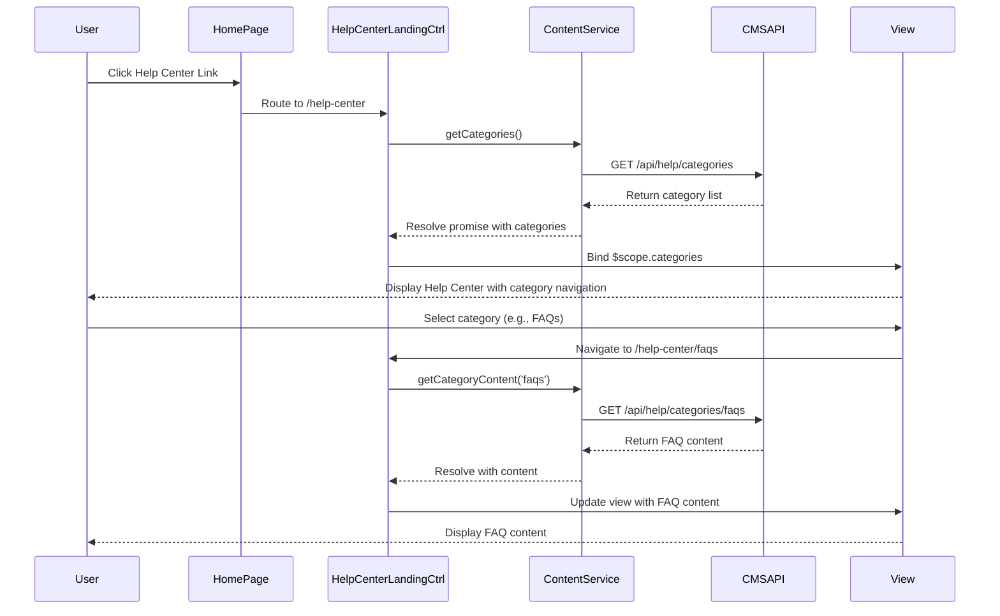

# Low-Level Design: Help Center Integration - Home Page

**Epic ID:** QE-5162

---

## a. Architecture Mapping

- **Help Center Entry Point** → AngularJS Directive (`helpCenterLink`) embedded in Home Page template
- **Help Center Landing Page** → AngularJS View (`help-center-landing.html`) with Controller (`HelpCenterLandingCtrl`)
- **Category Navigation Component** → AngularJS Component (`categoryNav`) with dedicated Controller (`CategoryNavCtrl`)
- **Content Management System Integration** → AngularJS Service (`ContentService`) for API calls
- **Responsive Framework** → Bootstrap grid system with CSS3 media queries

**Recommended Folder Structure:**
```
app/
├── modules/
│   └── help-center/
│       ├── controllers/
│       ├── services/
│       ├── directives/
│       ├── components/
│       └── views/
├── assets/
│   └── css/
└── shared/
    └── services/
```

---

## b. Component Specifications

| Name | Artifact Type | Responsibility | Key Dependencies |
|------|---------------|----------------|------------------|
| `helpCenterModule` | Module | Root module for Help Center functionality | `ngRoute`, `ui.bootstrap` |
| `HelpCenterLandingCtrl` | Controller | Manages landing page state and category data loading | `ContentService`, `$scope` |
| `CategoryNavCtrl` | Controller | Handles category selection and navigation logic | `ContentService`, `$location` |
| `categoryNav` | Component | Renders category navigation UI with responsive behavior | `CategoryNavCtrl`, Bootstrap CSS |
| `helpCenterLink` | Directive | Injects Help Center entry point link into Home Page | `$location` |
| `ContentService` | Service | Fetches categorized help content from CMS via REST API | `$http`, `$q` |
| `ResponsiveService` | Service | Detects device type and applies responsive adjustments | `$window` |

---

## c. Data Model

**HelpCategory (JS Object):**
```javascript
{
  id: String,
  name: String,
  icon: String,
  description: String,
  contentCount: Number,
  url: String
}
```

**HelpCenterConfig (JS Object):**
```javascript
{
  categories: Array<HelpCategory>,
  brandingAssets: Object,
  fallbackMessage: String
}
```

---

## d. Data Flow

User clicks Help Center link on Home Page → `helpCenterLink` directive triggers route change to `/help-center` → `HelpCenterLandingCtrl` initializes and calls `ContentService.getCategories()` → Service makes REST API call to CMS endpoint → API returns categorized content metadata → Controller binds data to `$scope.categories` → View renders category navigation using `categoryNav` component with Bootstrap responsive grid → User selects category → `CategoryNavCtrl` updates route to `/help-center/:categoryId` → Content loads with fallback messaging if unavailable.

---

## e. Primary Sequence Diagram



---

## f. Implementation Notes

- Use AngularJS dependency injection for all controllers and services; register via module config
- Implement `ContentService` with `$http` and promise-based API calls; cache category metadata using `$cacheFactory` for 2-second load performance
- Apply Bootstrap responsive grid (`col-xs-*`, `col-md-*`) in category navigation template for cross-device compatibility
- Use AngularJS `$routeProvider` for SPA navigation between landing page and category views
- Implement error handling in `ContentService` with fallback messaging bound to `$scope.errorMessage` and displayed conditionally in view

---

## g. Error Handling

HTTP interceptor captures API errors; `ContentService` returns rejected promises with user-friendly messages displayed via `ng-show` in view templates.

---

## h. Security Notes

Standard input validation and secure API calls assumed; HTTPS enforced at infrastructure level for all CMS API endpoints.