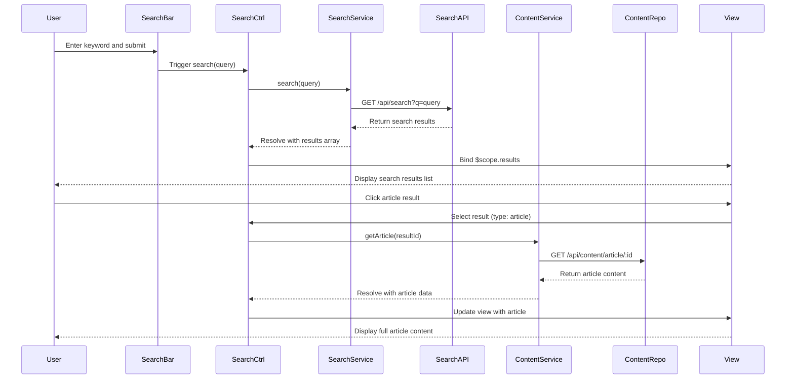

# Low-Level Design: Help Center Search and Content Browsing

**Epic ID:** QE-5163

---

## a. Architecture Mapping

- **Search Interface** → AngularJS Component (`searchBar`) with Controller (`SearchCtrl`)
- **Search Indexing Service Integration** → AngularJS Service (`SearchService`) for keyword-based API calls
- **Content Repository Access** → AngularJS Service (`ContentService`) for articles, FAQs, and metadata retrieval
- **Video Hosting Integration** → AngularJS Directive (`videoPlayer`) for embedded playback
- **Document Download** → AngularJS Service (`DownloadService`) for secure file retrieval

**Recommended Folder Structure:**
```
app/
├── modules/
│   └── help-center/
│       ├── controllers/
│       ├── services/
│       ├── directives/
│       ├── components/
│       └── views/
├── assets/
│   └── css/
└── shared/
    └── services/
```

---

## b. Component Specifications

| Name | Artifact Type | Responsibility | Key Dependencies |
|------|---------------|----------------|------------------|
| `SearchCtrl` | Controller | Manages search input, triggers queries, and displays results | `SearchService`, `$scope` |
| `searchBar` | Component | Renders search input UI with autocomplete and submit button | `SearchCtrl`, Bootstrap CSS |
| `SearchService` | Service | Executes keyword search via REST API to indexing service | `$http`, `$q` |
| `ContentService` | Service | Retrieves full content (articles, FAQs) by ID from repository | `$http`, `$q` |
| `videoPlayer` | Directive | Embeds HTML5 video player with standard controls for tutorials | None |
| `DownloadService` | Service | Handles secure HTTPS download of PDF/guide materials | `$http`, `$window` |
| `ContentDisplayCtrl` | Controller | Manages display of selected content (article/video/download) | `ContentService`, `DownloadService` |

---

## c. Data Model

**SearchResult (JS Object):**
```javascript
{
  id: String,
  title: String,
  type: String, // 'article', 'faq', 'video', 'download'
  snippet: String,
  url: String,
  thumbnailUrl: String
}
```

**ContentItem (JS Object):**
```javascript
{
  id: String,
  title: String,
  type: String,
  body: String,
  videoUrl: String,
  downloadUrl: String,
  metadata: Object
}
```

---

## d. Data Flow

User enters search keywords in `searchBar` component → `SearchCtrl` calls `SearchService.search(query)` → Service sends GET request to search indexing API endpoint → API returns array of `SearchResult` objects → Controller binds results to `$scope.results` → View renders results list with type indicators (article/video/download) → User clicks result → `ContentDisplayCtrl` calls appropriate service method (`ContentService.getArticle()`, `DownloadService.initiateDownload()`) based on type → Content displayed in view (article text, embedded video via `videoPlayer` directive, or download initiated) → Error messages shown if resources unavailable with alternative suggestions.

---

## e. Primary Sequence Diagram



---

## f. Implementation Notes

- Use AngularJS `$http` service with promise chaining in `SearchService` and `ContentService`; implement debouncing on search input using `$timeout`
- Cache search results using `$cacheFactory` with 5-minute TTL to optimize sub-2-second performance for repeated queries
- Implement `videoPlayer` directive using HTML5 `<video>` tag with `controls` attribute; support MP4 and WebM formats via `<source>` elements
- Use `DownloadService` with `$window.open()` for secure HTTPS downloads; set appropriate `Content-Disposition` headers server-side
- Apply Bootstrap styling for search results grid; use `ng-repeat` with `track by` for efficient rendering of result lists

---

## g. Error Handling

HTTP interceptor-based error handling with try/catch in service methods; user-friendly error messages displayed via `$scope.errorMessage` with alternative content suggestions.

---

## h. Security Notes

All downloads served over HTTPS; standard input validation on search queries to prevent injection attacks; secure API calls with authentication tokens.