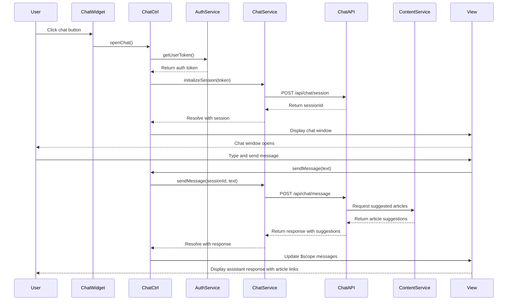

# Low-Level Design: Interactive Chat Assistant Integration

**Epic ID:** QE-5164

---

## a. Architecture Mapping

- **Chat Interface Component** → AngularJS Component (`chatWidget`) with Controller (`ChatCtrl`)
- **Chat Assistant API Gateway** → AngularJS Service (`ChatService`) for message exchange
- **Third-Party Chat Assistant API** → External REST API integrated via `ChatService`
- **Authentication Service** → AngularJS Service (`AuthService`) for user identification
- **Help Center Content Service** → AngularJS Service (`ContentService`) for article suggestions
- **Usage Monitoring** → AngularJS Service (`AnalyticsService`) for logging interactions

**Recommended Folder Structure:**
```
app/
├── modules/
│   └── help-center/
│       ├── controllers/
│       ├── services/
│       ├── components/
│       └── views/
├── shared/
│   └── services/
└── assets/
    └── css/
```

---

## b. Component Specifications

| Name | Artifact Type | Responsibility | Key Dependencies |
|------|---------------|----------------|------------------|
| `chatWidget` | Component | Renders chat window UI with message display and input field | `ChatCtrl`, Bootstrap CSS |
| `ChatCtrl` | Controller | Manages chat state, message flow, and user interactions | `ChatService`, `AuthService`, `$scope` |
| `ChatService` | Service | Handles WebSocket/HTTP communication with third-party chat API | `$http`, `$q`, `AuthService` |
| `AuthService` | Service | Provides user authentication tokens for secure chat sessions | `$http`, `$window` |
| `ContentService` | Service | Retrieves suggested help articles based on chat context | `$http`, `$q` |
| `AnalyticsService` | Service | Logs chat interactions for support staff analytics | `$http` |
| `chatActivator` | Directive | Injects chat activation button into Help Center views | `ChatCtrl` |

---

## c. Data Model

**ChatMessage (JS Object):**
```javascript
{
  id: String,
  sender: String, // 'user' or 'assistant'
  text: String,
  timestamp: Number,
  suggestedArticles: Array<Object>
}
```

**ChatSession (JS Object):**
```javascript
{
  sessionId: String,
  userId: String,
  messages: Array<ChatMessage>,
  status: String, // 'active', 'closed'
  startTime: Number
}
```

---

## d. Data Flow

User clicks chat activation button in Help Center → `chatActivator` directive triggers `ChatCtrl.openChat()` → Controller calls `AuthService.getUserToken()` to authenticate → `ChatService.initializeSession(token)` sends POST request to Chat Assistant API Gateway → API returns session ID → Chat window opens and binds to `$scope.chatSession` → User types message → `ChatCtrl` calls `ChatService.sendMessage(message)` → Service forwards to third-party chat API via HTTPS → API processes query and optionally calls `ContentService.getSuggestedArticles(query)` → Response with message and article suggestions returned → Controller updates `$scope.messages` → View renders assistant response with clickable article links → `AnalyticsService.logInteraction()` records session data for monitoring.

---

## e. Primary Sequence Diagram



---

## f. Implementation Notes

- Use AngularJS dependency injection for all services; register `ChatService` as singleton to maintain session state across components
- Implement `ChatService` with `$http` for REST API calls; use polling or WebSocket (via `$websocket` if available) for real-time message updates
- Apply WCAG 2.1 AA compliance: keyboard navigation support via `tabindex`, ARIA labels for chat input/output, screen reader announcements for new messages
- Use Bootstrap modal or custom CSS for chat window overlay; ensure responsive design with `@media` queries for mobile devices
- Implement session token management in `AuthService` with secure storage (sessionStorage); refresh tokens as needed for long sessions

---

## g. Error Handling

HTTP interceptor captures API errors; `ChatService` returns rejected promises with user-friendly error notifications displayed in chat window.

---

## h. Security Notes

Requires token-based auth via existing SSO; all chat messages transmitted over HTTPS; no sensitive data logged or exposed in client-side storage.