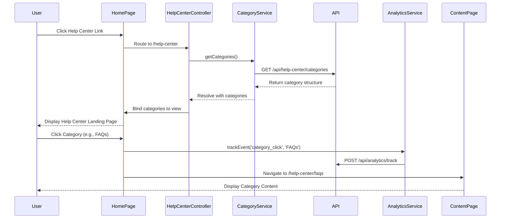

# Low-Level Design: Help Center Integration Home Page

## Epic ID: QE-5171

---

## a. Architecture Mapping

- **Home Page Navigation Module** → AngularJS Module (`app.helpCenter`) with routing configuration
- **Help Center Landing Controller** → AngularJS Controller (`HelpCenterLandingController`) managing category display and navigation
- **Category Navigation Service** → AngularJS Service (`CategoryService`) fetching category structure via REST API
- **Analytics Tracking Directive** → AngularJS Directive (`analyticsTracker`) for user interaction tracking
- **Responsive Layout Component** → HTML5/CSS3/Bootstrap grid system with AngularJS templates

**Recommended Folder Structure:**
```
/app
  /modules
    /help-center
      /controllers
        help-center-landing.controller.js
      /services
        category.service.js
      /directives
        analytics-tracker.directive.js
      /views
        help-center-landing.html
      help-center.module.js
      help-center.routes.js
  /assets
    /css
      help-center.css
```

---

## b. Component Specifications

| Name | Artifact Type | Responsibility | Key Dependencies |
|------|---------------|----------------|------------------|
| HelpCenterModule | Module | Defines help center feature module and routing | angular, angular-route |
| HelpCenterLandingController | Controller | Manages landing page state, category display, and user navigation | CategoryService, $scope, $location |
| CategoryService | Service | Fetches category structure from REST API and caches results | $http, $q |
| AnalyticsTrackerDirective | Directive | Tracks user interactions and sends events to analytics system | $window, AnalyticsService |
| HelpCenterLandingView | Template | Renders responsive landing page with category cards and search integration | Bootstrap grid, AngularJS directives |
| CategoryNavigationComponent | Component | Displays clickable category tiles with icons and descriptions | CategoryService |
| BrandingService | Service | Provides centralized access to branding assets (CSS, logos, fonts) | $http |

---

## c. Data Model

**Category Object:**
```javascript
{
  id: String,
  name: String,
  description: String,
  iconUrl: String,
  contentCount: Number,
  route: String
}
```

**HelpCenterConfig Object:**
```javascript
{
  categories: Array<Category>,
  brandingAssets: {
    logoUrl: String,
    primaryColor: String,
    fontFamily: String
  },
  analyticsEnabled: Boolean
}
```

---

## d. Data Flow

User clicks Help Center link on Home Page → HelpCenterLandingView loads → HelpCenterLandingController initializes and calls CategoryService.getCategories() → CategoryService makes GET request to /api/help-center/categories → API returns category structure → Controller binds categories to $scope → View renders category cards using Bootstrap grid with responsive breakpoints → User clicks category → AnalyticsTrackerDirective captures event and sends to analytics API → $location service navigates to selected category content page → UI updates within 2 seconds.

---

## e. Primary Sequence Diagram



---

## f. Implementation Notes

- Use AngularJS 1.x module pattern with dependency injection for CategoryService and AnalyticsService
- Implement $http interceptor for adding authentication tokens and handling API errors globally
- Leverage Bootstrap responsive grid (col-xs-*, col-sm-*, col-md-*, col-lg-*) for cross-device compatibility
- Use AngularJS $routeProvider for client-side routing between landing page and category content pages
- Cache category structure in CategoryService using $cacheFactory to minimize API calls and improve 2-second load time compliance

---

## g. Error Handling

HTTP interceptor captures API failures, displays user-friendly error messages via modal/toast, and logs errors to monitoring system.

---

## h. Security Notes

Requires token-based auth via existing SSO for analytics tracking; HTTPS enforced for all API calls and asset delivery.