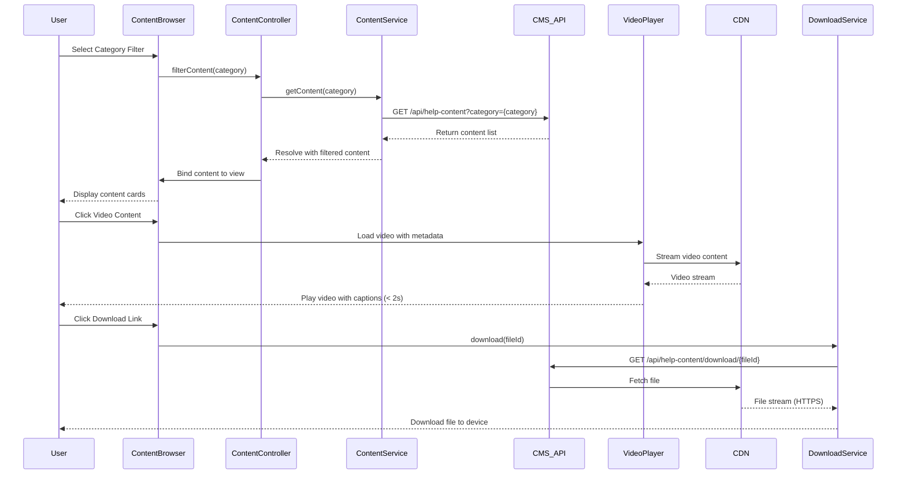

# Low-Level Design: Help Content Delivery

## Epic ID: QE-5172

---

## a. Architecture Mapping

- **Content Display Module** → AngularJS Module (`app.helpContent`) with content rendering components
- **Content Browser Controller** → AngularJS Controller (`ContentBrowserController`) managing content filtering and display
- **Content Service** → AngularJS Service (`ContentService`) fetching articles, FAQs, videos, and downloadables via REST API
- **Video Player Directive** → AngularJS Directive (`videoPlayer`) embedding video with playback controls and captions
- **Download Manager Service** → AngularJS Service (`DownloadService`) handling file downloads with error handling
- **Link Validator Service** → AngularJS Service (`LinkValidatorService`) checking resource availability before display

**Recommended Folder Structure:**
```
/app
  /modules
    /help-content
      /controllers
        content-browser.controller.js
      /services
        content.service.js
        download.service.js
        link-validator.service.js
      /directives
        video-player.directive.js
      /views
        content-browser.html
        content-detail.html
      help-content.module.js
      help-content.routes.js
```

---

## b. Component Specifications

| Name | Artifact Type | Responsibility | Key Dependencies |
|------|---------------|----------------|------------------|
| HelpContentModule | Module | Defines content delivery feature module with routing | angular, angular-route, angular-sanitize |
| ContentBrowserController | Controller | Manages content list display, filtering by category/popularity, and recently viewed tracking | ContentService, $scope, $filter |
| ContentService | Service | Fetches content from CMS via REST API, caches results, and manages content metadata | $http, $q, $cacheFactory |
| VideoPlayerDirective | Directive | Embeds video player with controls, captions, and 2-second playback initiation | $sce, ContentService |
| DownloadService | Service | Handles file downloads over HTTPS with progress tracking and error messaging | $http, $window |
| LinkValidatorService | Service | Validates resource links before rendering and displays error messages for broken links | $http, $q |
| ContentDetailController | Controller | Manages individual content item display (article, FAQ, video, downloadable) | ContentService, DownloadService |
| RecentlyViewedService | Service | Tracks and retrieves recently accessed content using local storage | $window.localStorage |

---

## c. Data Model

**Content Object:**
```javascript
{
  id: String,
  type: String, // 'article', 'faq', 'video', 'downloadable'
  title: String,
  description: String,
  category: String,
  popularity: Number,
  contentUrl: String,
  thumbnailUrl: String,
  fileSize: Number, // for downloadables
  duration: Number, // for videos
  captionsUrl: String, // for videos
  lastUpdated: Date
}
```

**VideoMetadata Object:**
```javascript
{
  videoUrl: String,
  captionsUrl: String,
  duration: Number,
  format: String
}
```

---

## d. Data Flow

User navigates to content browser → ContentBrowserController calls ContentService.getContent(category, filter) → ContentService makes GET request to /api/help-content → API returns content list from CMS → Controller filters by category/popularity and binds to $scope → View renders content cards. For video: User clicks video → VideoPlayerDirective loads video from CDN → Video playback initiates within 2 seconds with captions enabled. For download: User clicks download link → DownloadService.download(fileId) makes GET request to /api/help-content/download/{fileId} → File Storage System serves file over HTTPS via CDN → Browser downloads file. LinkValidatorService periodically checks resource availability and displays error message if link is broken.

---

## e. Primary Sequence Diagram



---

## f. Implementation Notes

- Use AngularJS $http service with CDN URLs for video streaming and file downloads to meet 2-second performance requirement
- Implement VideoPlayerDirective using HTML5 video element with $sce.trustAsResourceUrl() for secure video URL binding
- Use $cacheFactory in ContentService to cache frequently accessed content and reduce API calls
- Leverage AngularJS $filter for client-side content filtering by category and popularity
- Store recently viewed content in browser localStorage via RecentlyViewedService with 30-day expiration

---

## g. Error Handling

HTTP interceptor captures API/CDN failures; LinkValidatorService displays user-friendly error messages for broken links; DownloadService handles download failures with retry option.

---

## h. Security Notes

HTTPS enforced for all downloads and video streaming; standard input validation and secure API calls assumed.