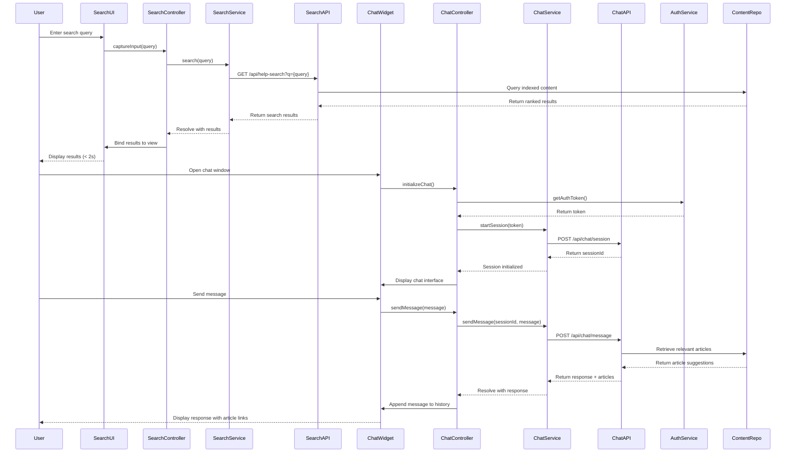

# Low-Level Design: Self-Service Support Features

## Epic ID: QE-5173

---

## a. Architecture Mapping

- **Search Module** → AngularJS Module (`app.helpSearch`) with search UI and result display
- **Search Controller** → AngularJS Controller (`SearchController`) managing search input and result rendering
- **Search Service** → AngularJS Service (`SearchService`) querying search index via REST API
- **Chat Module** → AngularJS Module (`app.helpChat`) with chat interface and messaging
- **Chat Controller** → AngularJS Controller (`ChatController`) managing chat session and message flow
- **Chat Service** → AngularJS Service (`ChatService`) integrating with third-party chat API
- **Authentication Interceptor** → AngularJS HTTP Interceptor for token-based authentication

**Recommended Folder Structure:**
```
/app
  /modules
    /help-search
      /controllers
        search.controller.js
      /services
        search.service.js
      /views
        search-results.html
      help-search.module.js
    /help-chat
      /controllers
        chat.controller.js
      /services
        chat.service.js
      /directives
        chat-widget.directive.js
      /views
        chat-window.html
      help-chat.module.js
  /shared
    /interceptors
      auth.interceptor.js
```

---

## b. Component Specifications

| Name | Artifact Type | Responsibility | Key Dependencies |
|------|---------------|----------------|------------------|
| HelpSearchModule | Module | Defines search feature module with routing and components | angular, angular-route |
| SearchController | Controller | Manages search input, query execution, and result display with ranking | SearchService, $scope, $timeout |
| SearchService | Service | Queries search index API and returns ranked results within 2 seconds | $http, $q |
| HelpChatModule | Module | Defines chat assistant feature module with real-time messaging | angular |
| ChatController | Controller | Manages chat session state, message history, and user input | ChatService, $scope, AuthService |
| ChatService | Service | Integrates with third-party chat API for conversational intelligence and article recommendations | $http, $q, $interval |
| ChatWidgetDirective | Directive | Renders collapsible chat window with message display and input field | ChatService |
| AuthInterceptor | HTTP Interceptor | Adds authentication tokens to all API requests and handles 401 responses | $q, AuthService |
| MonitoringService | Service | Logs search queries, chat interactions, and performance metrics to monitoring system | $http |

---

## c. Data Model

**SearchQuery Object:**
```javascript
{
  query: String,
  filters: {
    contentType: Array<String>, // ['article', 'video', 'faq', 'downloadable']
    category: String
  },
  timestamp: Date
}
```

**SearchResult Object:**
```javascript
{
  id: String,
  title: String,
  snippet: String,
  contentType: String,
  url: String,
  relevanceScore: Number
}
```

**ChatMessage Object:**
```javascript
{
  id: String,
  sender: String, // 'user' or 'assistant'
  message: String,
  timestamp: Date,
  suggestedArticles: Array<{title: String, url: String}>
}
```

**ChatSession Object:**
```javascript
{
  sessionId: String,
  userId: String,
  messages: Array<ChatMessage>,
  isActive: Boolean
}
```

---

## d. Data Flow

User enters search query in search box → SearchController captures input and calls SearchService.search(query) → SearchService makes GET request to /api/help-search?q={query} → Search Index returns ranked results → Controller binds results to $scope → View displays results within 2 seconds. For chat: User opens chat widget → ChatController initializes session via ChatService.startSession() → ChatService authenticates user and creates session with third-party chat API → User sends message → ChatService.sendMessage(message) posts to /api/chat/message → Third-party API processes query, retrieves context from Help Content Repository, and returns response with article recommendations → Controller appends message to chat history → View updates chat window. MonitoringService logs all interactions for analytics.

---

## e. Primary Sequence Diagram



---

## f. Implementation Notes

- Use AngularJS $http service with $timeout for 2-second search result rendering; implement debouncing on search input to reduce API calls
- Implement ChatWidgetDirective as isolated scope component with two-way binding for message history and session state
- Use $interval in ChatService for polling chat API if WebSocket is not supported by third-party API
- Leverage AuthInterceptor to inject authentication tokens into all $http requests for personalized chat sessions
- Cache search results in SearchService using $cacheFactory with 5-minute TTL to improve performance

---

## g. Error Handling

HTTP interceptor captures API failures for search and chat; fallback messaging displayed when chat API is unavailable; try/catch blocks in controllers with user notification via toast/modal.

---

## h. Security Notes

Requires token-based auth via existing SSO for personalized chat sessions; HTTPS-only for all API calls; no sensitive user data exposed in chat logs.