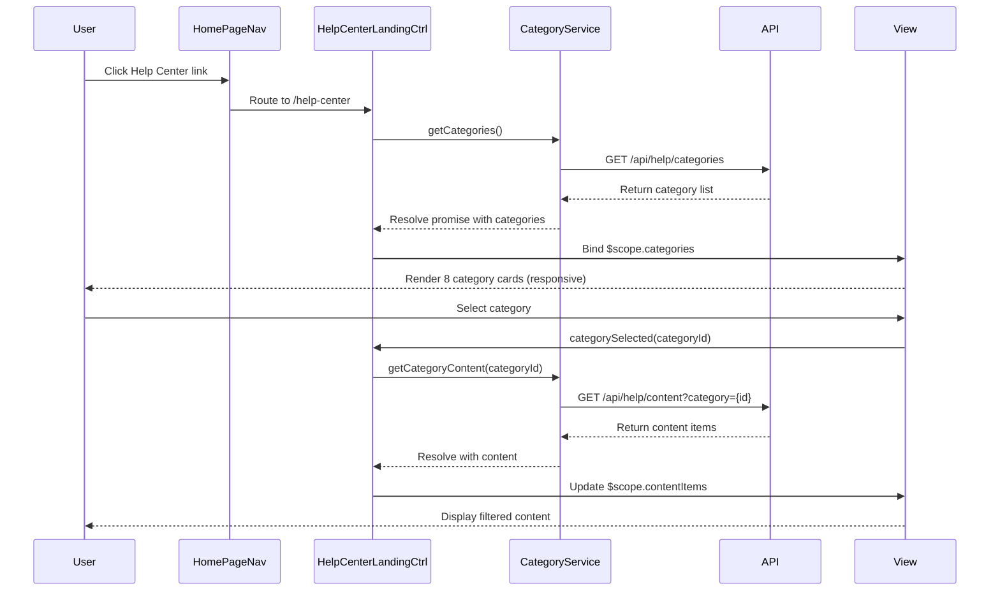

# Low-Level Design: Help Center Integration - Home Page

**Epic ID:** QE-5180

## a. Architecture Mapping

- **Home Page Navigation Component** → AngularJS Directive (`helpCenterNavLink`)
- **Help Center Landing Page** → AngularJS Module (`helpCenter`) with Controller (`HelpCenterLandingCtrl`)
- **Category Navigation** → AngularJS Controller (`CategoryNavigationCtrl`) + Service (`CategoryService`)
- **Content Rendering Engine** → AngularJS Service (`ContentRenderService`) + Filter (`categoryFilter`)
- **Responsive Framework** → Bootstrap grid system + CSS3 media queries
- **Accessibility Layer** → AngularJS Directive (`a11yEnhancer`) for ARIA attributes

**Recommended Folder Structure:**
```
/app
  /modules
    /help-center
      /controllers
      /services
      /directives
      /views
      /filters
  /assets
    /css
    /images
```

## b. Component Specifications

| Name | Artifact Type | Responsibility | Key Dependencies |
|------|---------------|----------------|------------------|
| helpCenterNavLink | Directive | Renders Help Center entry point in main navigation with click handler | $location |
| HelpCenterLandingCtrl | Controller | Manages landing page state, loads categories, handles user interactions | CategoryService, ContentRenderService |
| CategoryNavigationCtrl | Controller | Handles category selection, filtering, and browse controls | CategoryService, $scope |
| CategoryService | Factory | Fetches category metadata and content from REST API | $http, $q |
| ContentRenderService | Service | Transforms content data into device-appropriate HTML with responsive classes | $window |
| categoryFilter | Filter | Filters content items by selected category and search terms | - |
| a11yEnhancer | Directive | Injects ARIA labels, keyboard navigation handlers, and screen reader support | $document |

## c. Data Model

**Category Model:**
```javascript
{
  id: String,
  name: String,
  description: String,
  iconUrl: String,
  contentCount: Number,
  slug: String
}
```

**Content Item Model:**
```javascript
{
  id: String,
  title: String,
  categoryId: String,
  type: String, // 'article', 'video', 'guide'
  summary: String,
  url: String,
  lastUpdated: Date
}
```

## d. Data Flow

User clicks Help Center link in Home Page navigation → `helpCenterNavLink` directive triggers route change → `HelpCenterLandingCtrl` initializes and calls `CategoryService.getCategories()` → Service makes GET request to `/api/help/categories` → Response parsed and bound to `$scope.categories` → View renders eight category cards using Bootstrap grid with responsive breakpoints → User selects category → `CategoryNavigationCtrl` filters content via `categoryFilter` and calls `ContentRenderService.render()` → Service applies device-specific CSS classes based on viewport → Updated content displayed with ARIA attributes injected by `a11yEnhancer` directive.

## e. Primary Sequence Diagram



## f. Implementation Notes

- Use AngularJS 1.x module pattern with explicit DI annotation (`$inject` array) to avoid minification issues
- Implement lazy loading for category content using `$http` with promise chaining for 2-second load target
- Apply Bootstrap responsive utilities (col-xs/sm/md/lg) in templates for device breakpoints
- Use AngularJS `$routeProvider` for Help Center routing with template caching enabled
- Implement custom directive for keyboard navigation (Tab, Enter, Escape) and ARIA live regions for dynamic content updates

## g. Error Handling

HTTP interceptor captures API errors, displays user-friendly toast notifications via `$mdToast` or custom service, and logs errors to console for debugging.

## h. Security Notes

Standard input validation and secure API calls assumed; content served over HTTPS with CSP headers configured at server level.