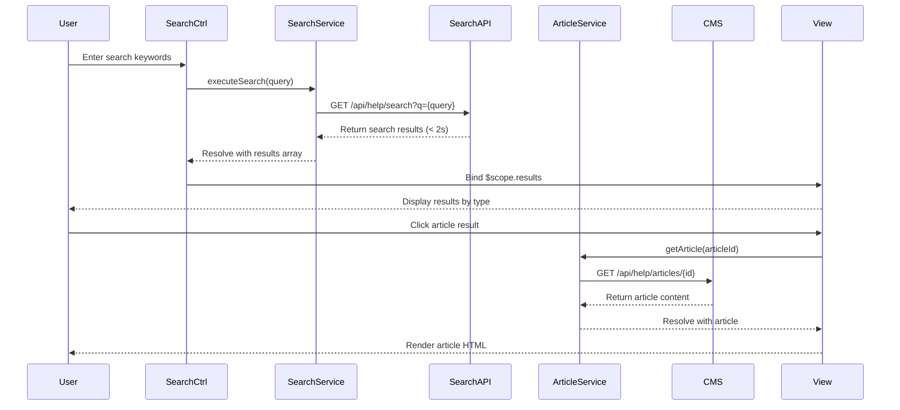

# Low-Level Design: Help Center Search & Content Consumption

**Epic ID:** QE-5181

## a. Architecture Mapping

- **Search Interface** → AngularJS Controller (`SearchCtrl`) + Directive (`searchBox`)
- **Search Service** → AngularJS Factory (`SearchService`)
- **Content Display (Articles/FAQs)** → AngularJS Controller (`ArticleViewCtrl`) + Service (`ArticleService`)
- **Video Player** → AngularJS Directive (`videoPlayer`) wrapping HTML5 video element
- **Download Manager** → AngularJS Service (`DownloadService`)
- **Error Handler** → AngularJS Factory (`ErrorHandlerService`) with interceptor

**Recommended Folder Structure:**
```
/app
  /modules
    /help-center
      /controllers
      /services
      /directives
      /views
      /filters
  /assets
    /videos
    /downloads
```

## b. Component Specifications

| Name | Artifact Type | Responsibility | Key Dependencies |
|------|---------------|----------------|------------------|
| SearchCtrl | Controller | Manages search input, triggers search, displays results | SearchService, $scope, $timeout |
| searchBox | Directive | Renders search input with autocomplete and debounce | $timeout |
| SearchService | Factory | Executes keyword search against indexed API endpoint | $http, $q |
| ArticleViewCtrl | Controller | Loads and displays article/FAQ content | ArticleService, $routeParams |
| ArticleService | Factory | Fetches article content from CMS via REST API | $http |
| videoPlayer | Directive | Embeds HTML5 video with playback controls and CDN source | $sce |
| DownloadService | Service | Handles secure file downloads over HTTPS with progress tracking | $http, $window |
| ErrorHandlerService | Factory | Provides centralized error messaging with alternative suggestions | $mdDialog or custom modal |

## c. Data Model

**Search Result Model:**
```javascript
{
  id: String,
  title: String,
  type: String, // 'article', 'video', 'material'
  snippet: String,
  url: String,
  relevanceScore: Number
}
```

**Article Model:**
```javascript
{
  id: String,
  title: String,
  content: String, // HTML content
  author: String,
  publishedDate: Date,
  tags: Array<String>
}
```

**Video Model:**
```javascript
{
  id: String,
  title: String,
  videoUrl: String,
  thumbnailUrl: String,
  duration: Number,
  format: String // 'mp4', 'webm'
}
```

**Download Material Model:**
```javascript
{
  id: String,
  title: String,
  fileUrl: String,
  fileSize: Number,
  fileType: String, // 'pdf', 'docx'
  description: String
}
```

## d. Data Flow

User enters search keywords in `searchBox` directive → Debounced input triggers `SearchCtrl.search()` → `SearchService.executeSearch(query)` sends GET request to `/api/help/search?q={query}` → Search index returns results within 2 seconds → Results bound to `$scope.results` and displayed by type → User selects result: (a) Article: `ArticleViewCtrl` calls `ArticleService.getArticle(id)` → CMS returns HTML content rendered in view, (b) Video: `videoPlayer` directive loads CDN URL via `$sce.trustAsResourceUrl()` → HTML5 video renders with controls, (c) Material: `DownloadService.download(fileUrl)` initiates HTTPS download via `$window.open()` → If resource unavailable, `ErrorHandlerService` displays modal with alternative content links.

## e. Primary Sequence Diagram



## f. Implementation Notes

- Use `ng-model` with `ng-model-options="{debounce: 300}"` for search input to reduce API calls
- Implement `$http` caching for frequently accessed articles using `cache: true` option
- Use `$sce.trustAsResourceUrl()` for video CDN URLs to prevent XSS while allowing iframe/video embedding
- Apply `ng-repeat` with `track by` for search results to optimize DOM rendering performance
- Implement download progress tracking using `$http` config with `eventHandlers` for large files

## g. Error Handling

HTTP interceptor catches 404/500 errors, `ErrorHandlerService` displays modal with error message and alternative content suggestions retrieved from `/api/help/alternatives` endpoint.

## h. Security Notes

HTTPS enforced for all downloads via server configuration; video URLs sanitized using `$sce`; search input sanitized server-side to prevent injection attacks.