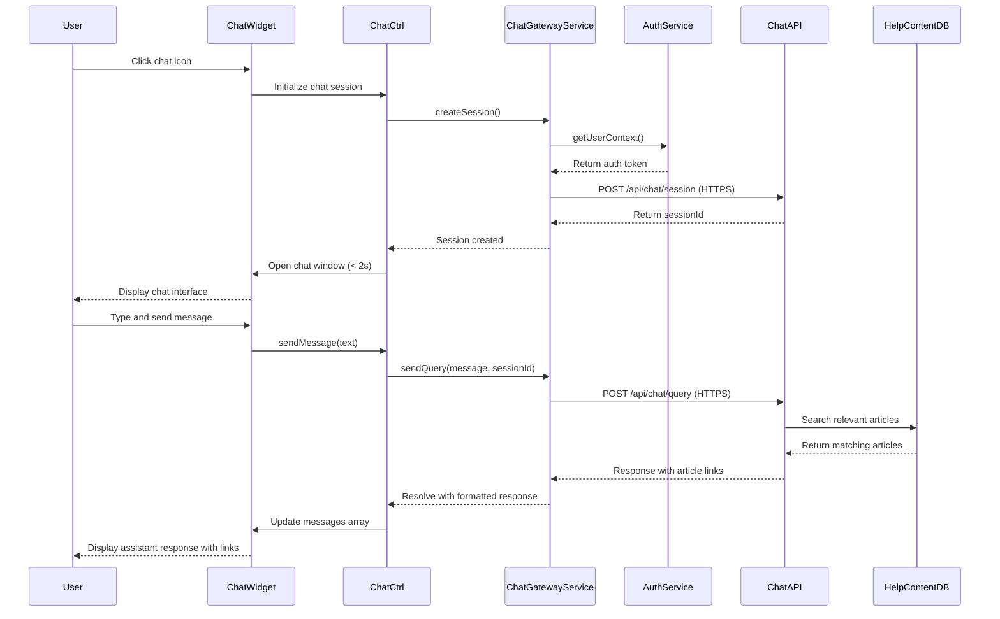

# Low-Level Design: Interactive Chat Assistant

**Epic ID:** QE-5182

## a. Architecture Mapping

- **Chat Widget UI** → AngularJS Directive (`chatWidget`)
- **Chat Controller** → AngularJS Controller (`ChatCtrl`)
- **Chat Service Gateway** → AngularJS Factory (`ChatGatewayService`)
- **Authentication Integration** → AngularJS Service (`AuthService`)
- **Message Handler** → AngularJS Service (`MessageService`)
- **Session Manager** → AngularJS Factory (`SessionManagerService`)

**Recommended Folder Structure:**
```
/app
  /modules
    /chat
      /controllers
      /services
      /directives
      /views
  /assets
    /css
    /images
```

## b. Component Specifications

| Name | Artifact Type | Responsibility | Key Dependencies |
|------|---------------|----------------|------------------|
| chatWidget | Directive | Renders chat UI overlay with open/close/minimize controls | ChatCtrl, $compile |
| ChatCtrl | Controller | Manages chat state, user input, message display, and widget lifecycle | ChatGatewayService, MessageService, $scope |
| ChatGatewayService | Factory | Proxies requests to third-party chat API over HTTPS with authentication headers | $http, AuthService, $q |
| AuthService | Service | Provides user authentication token and context for personalized chat | $window.localStorage |
| MessageService | Service | Formats messages, handles article link rendering, manages message history | $sce |
| SessionManagerService | Factory | Tracks active chat sessions, implements fallback logic for service unavailability | $timeout, $interval |

## c. Data Model

**Chat Message Model:**
```javascript
{
  id: String,
  sender: String, // 'user' or 'assistant'
  content: String,
  timestamp: Date,
  articleLinks: Array<{title: String, url: String}>
}
```

**Chat Session Model:**
```javascript
{
  sessionId: String,
  userId: String,
  startTime: Date,
  messages: Array<ChatMessage>,
  status: String // 'active', 'closed', 'error'
}
```

**User Context Model:**
```javascript
{
  userId: String,
  authToken: String,
  userName: String,
  userRole: String
}
```

## d. Data Flow

User clicks chat widget icon on Help Center page → `chatWidget` directive initializes and `ChatCtrl` calls `SessionManagerService.createSession()` → Session created and widget opens within 2 seconds → User types message → `ChatCtrl.sendMessage()` triggered → `ChatGatewayService.sendQuery(message, userContext)` retrieves auth token from `AuthService` → HTTPS POST to `/api/chat/query` with encrypted payload → Third-party API processes query, searches Help Content Database, returns response with article recommendations → `MessageService.formatResponse()` parses response and renders article links → `ChatCtrl` updates `$scope.messages` → View displays assistant response with clickable article links → If API unavailable, `SessionManagerService` displays fallback message "Chat service temporarily unavailable. Browse our Help Center categories."

## e. Primary Sequence Diagram



## f. Implementation Notes

- Use AngularJS directive with isolated scope for chat widget to prevent scope pollution
- Implement WebSocket or long-polling via `$http` for real-time messaging if third-party API supports it
- Apply `$sce.trustAsHtml()` for rendering article links in chat messages after sanitization
- Use `$interval` in `SessionManagerService` to monitor concurrent session count and implement throttling at 10K limit
- Store session state in `$rootScope` or service singleton to persist across route changes

## g. Error Handling

HTTP interceptor detects API failures (timeout, 503), `SessionManagerService` displays fallback message in chat window and logs error; retry logic with exponential backoff implemented for transient failures.

## h. Security Notes

Requires token-based auth via existing SSO; user context passed in encrypted HTTPS headers; no sensitive data (PII, credentials) transmitted in chat messages; all API communication over TLS 1.2+.