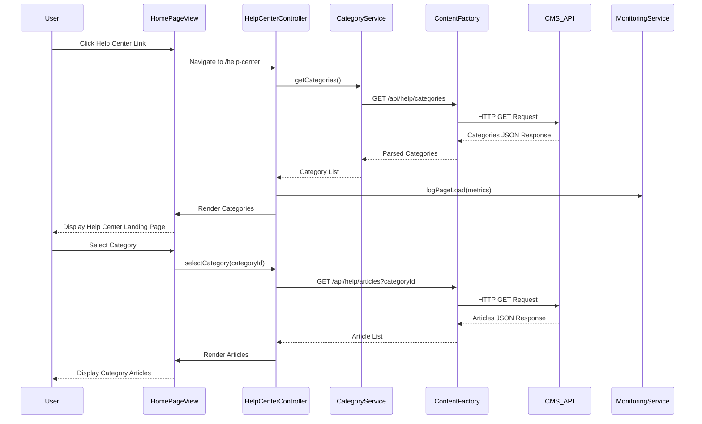

# Low-Level Design: Help Center Integration - Home Page

**Epic ID:** QE-5189

**Technology Stack:** AngularJS 1.x, JavaScript ES6, HTML5, CSS3, Bootstrap, REST APIs, MVC Architecture

---

## a. Architecture Mapping

- **Home Page Component** → AngularJS Controller (`homePageController`) + View Template (`home-page.html`)
- **Help Center Landing Page** → AngularJS Module (`helpCenterModule`) + Controller (`helpCenterController`) + View (`help-center-landing.html`)
- **Category Navigation** → AngularJS Directive (`categoryNavigation`) + Service (`categoryService`)
- **Content Management Integration** → AngularJS Factory (`contentFactory`) for REST API calls
- **Responsive UI Framework** → Bootstrap Grid System + Custom CSS3
- **Monitoring Service** → AngularJS Service (`monitoringService`) for uptime/performance tracking

**Recommended Folder Structure:**
```
/app
  /modules
    /help-center
      /controllers (helpCenterController.js)
      /services (categoryService.js, contentFactory.js, monitoringService.js)
      /directives (categoryNavigation.js)
      /views (help-center-landing.html, category-list.html)
  /assets
    /css (help-center.css)
  /shared
    /services (httpInterceptor.js)
```

---

## b. Component Specifications

| Component Name | Artifact Type | Responsibility | Key Dependencies |
|----------------|---------------|----------------|------------------|
| homePageController | Controller | Manages Home Page state and Help Center link navigation | $scope, $location, helpCenterModule |
| helpCenterModule | Module | Root module for Help Center functionality | ngRoute, ui.bootstrap |
| helpCenterController | Controller | Manages Help Center landing page state, category display, and user interactions | $scope, categoryService, contentFactory, monitoringService |
| categoryNavigation | Directive | Renders category navigation UI with organized content sections (Getting Started, How-to, Troubleshooting) | categoryService, $compile |
| categoryService | Service | Provides category data and navigation logic | $http, $q, contentFactory |
| contentFactory | Factory | Handles REST API calls to Content Management System for articles and FAQs | $http, $q, API_ENDPOINTS |
| monitoringService | Service | Tracks page load times, uptime metrics, and logs performance data | $http, $window.performance |
| httpInterceptor | Service | Handles HTTPS enforcement, error responses, and meaningful error messages | $q, $injector |

---

## c. Data Model

**HelpCategory Model:**
```javascript
{
  id: String,
  name: String, // "Getting Started", "How-to Guides", "Troubleshooting"
  description: String,
  iconClass: String,
  articleCount: Number,
  order: Number
}
```

**HelpArticle Model:**
```javascript
{
  id: String,
  title: String,
  categoryId: String,
  content: String,
  tags: Array<String>,
  lastUpdated: Date,
  isFAQ: Boolean
}
```

**PageMetrics Model:**
```javascript
{
  pageUrl: String,
  loadTime: Number,
  timestamp: Date,
  userAgent: String,
  success: Boolean
}
```

---

## d. Data Flow

User clicks Help Center link on Home Page → homePageController triggers route change to `/help-center` → helpCenterController initializes and calls categoryService.getCategories() → categoryService invokes contentFactory REST API (`GET /api/help/categories`) → Response returns category list → categoryNavigation directive renders organized categories with visual hierarchy → User selects a category → Controller fetches articles via contentFactory (`GET /api/help/articles?categoryId={id}`) → Articles rendered in responsive Bootstrap grid → monitoringService logs page load metrics and uptime data → UI updates with WCAG-compliant accessible content.

---

## e. Primary Sequence Diagram



---

## f. Implementation Notes

- Use AngularJS Dependency Injection for all services, factories, and controllers to ensure testability and modularity
- Implement ES6 classes for service definitions with `$inject` annotation for minification safety
- Use `$http` service with promise-based API calls; cache category data with `$cacheFactory` to reduce redundant requests
- Bootstrap responsive grid (col-xs, col-sm, col-md, col-lg) for multi-device compatibility with CSS3 media queries for custom breakpoints
- Implement lazy loading for article content using `$ocLazyLoad` to meet 2-second page load requirement

---

## g. Error Handling

HTTP interceptor-based error handling with try/catch blocks in services; display user-friendly error messages via Bootstrap modal/alert components with alternative navigation suggestions.

---

## h. Security Notes

HTTPS enforced for all API calls via httpInterceptor; standard input validation and secure API calls with existing SSO token-based authentication.