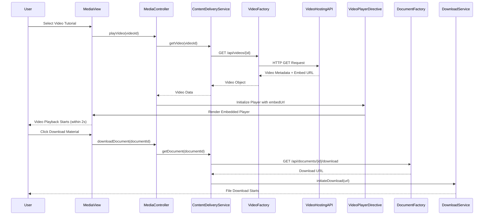

# Low-Level Design: Multimedia Learning Resources

**Epic ID:** QE-5190

**Technology Stack:** AngularJS 1.x, JavaScript ES6, HTML5, CSS3, Bootstrap, REST APIs, MVC Architecture

---

## a. Architecture Mapping

- **User Interface** → AngularJS Controller (`mediaController`) + View Template (`media-viewer.html`)
- **Content Delivery Service** → AngularJS Service (`contentDeliveryService`) for orchestrating media requests
- **Video Hosting Integration** → AngularJS Factory (`videoFactory`) for REST API calls to video hosting service
- **Document Storage Integration** → AngularJS Factory (`documentFactory`) for REST API calls to document storage
- **Video Player Component** → AngularJS Directive (`videoPlayer`) for embedded video playback with controls
- **Download Manager** → AngularJS Service (`downloadService`) for handling file downloads
- **Error Handling Module** → AngularJS Service (`errorHandlerService`) for graceful error management

**Recommended Folder Structure:**
```
/app
  /modules
    /media
      /controllers (mediaController.js)
      /services (contentDeliveryService.js, downloadService.js, errorHandlerService.js)
      /factories (videoFactory.js, documentFactory.js)
      /directives (videoPlayer.js)
      /views (media-viewer.html, video-embed.html)
  /assets
    /css (media-player.css)
```

---

## b. Component Specifications

| Component Name | Artifact Type | Responsibility | Key Dependencies |
|----------------|---------------|----------------|------------------|
| mediaController | Controller | Manages media viewer state, video playback, and download requests | $scope, contentDeliveryService, downloadService, errorHandlerService |
| contentDeliveryService | Service | Orchestrates content retrieval from video and document sources | videoFactory, documentFactory, $q |
| videoFactory | Factory | Handles REST API calls to third-party video hosting service for video URLs and metadata | $http, $q, VIDEO_API_ENDPOINTS |
| documentFactory | Factory | Handles REST API calls to document storage system for downloadable materials | $http, $q, DOCUMENT_API_ENDPOINTS |
| videoPlayer | Directive | Renders embedded video player with playback controls (play, pause, seek, volume, fullscreen) | videoFactory, $sce |
| downloadService | Service | Manages file downloads with progress tracking and concurrent download support | $http, $window, $timeout |
| errorHandlerService | Service | Provides meaningful error messages and alternative content suggestions when resources unavailable | $log, $uibModal |

---

## c. Data Model

**VideoContent Model:**
```javascript
{
  id: String,
  title: String,
  embedUrl: String,
  thumbnailUrl: String,
  duration: Number, // seconds
  categoryId: String,
  uploadDate: Date,
  isAvailable: Boolean
}
```

**DownloadableMaterial Model:**
```javascript
{
  id: String,
  title: String,
  fileType: String, // "PDF", "DOCX", "ZIP"
  fileSize: Number, // bytes
  downloadUrl: String,
  categoryId: String,
  lastUpdated: Date,
  isAvailable: Boolean
}
```

**DownloadProgress Model:**
```javascript
{
  fileId: String,
  fileName: String,
  progress: Number, // 0-100
  status: String, // "pending", "downloading", "completed", "failed"
  errorMessage: String
}
```

---

## d. Data Flow

User selects video tutorial → mediaController calls contentDeliveryService.getVideo(videoId) → videoFactory invokes REST API (`GET /api/videos/{id}`) → Video hosting service returns embed URL → videoPlayer directive renders embedded player using $sce.trustAsResourceUrl() → Video initiates playback within 2 seconds. For downloads: User clicks download button → mediaController calls downloadService.downloadFile(documentId) → documentFactory fetches download URL via REST API (`GET /api/documents/{id}/download`) → downloadService streams file over HTTPS using $http with progress tracking → File saved to user device. If resource unavailable, errorHandlerService intercepts failure and displays Bootstrap modal with meaningful message and alternative suggestions.

---

## e. Primary Sequence Diagram



---

## f. Implementation Notes

- Use `$sce.trustAsResourceUrl()` to sanitize video embed URLs for secure iframe rendering in videoPlayer directive
- Implement `$http` with `responseType: 'blob'` for document downloads; use `$window.URL.createObjectURL()` for client-side file handling
- Cache video metadata using `$cacheFactory` to reduce API calls for frequently accessed videos
- Bootstrap modal component for error messages with alternative content links; use `$uibModal` service for modal management
- Implement adaptive streaming detection in videoPlayer directive to optimize playback based on network conditions

---

## g. Error Handling

HTTP interceptor captures failed requests; errorHandlerService displays Bootstrap modal with meaningful messages and alternative content suggestions using try/catch in all async operations.

---

## h. Security Notes

HTTPS enforced for all video streaming and document downloads; standard input validation and secure API calls with existing token-based authentication.