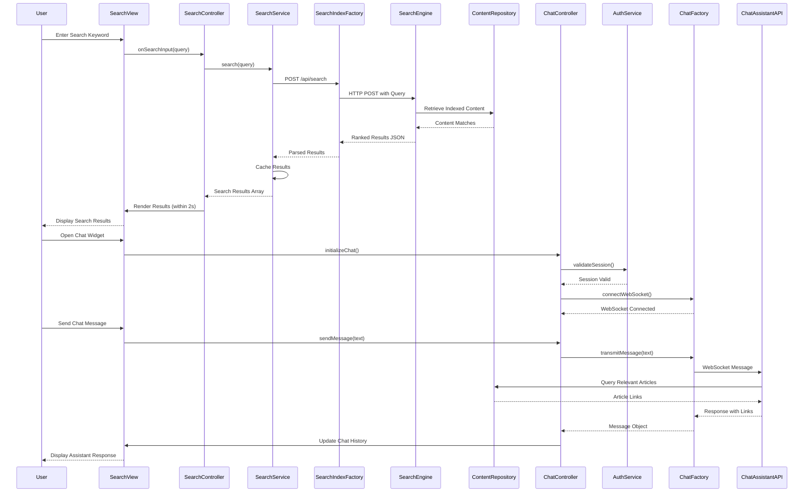

# Low-Level Design: Self-Service Search and Chat Assistant

**Epic ID:** QE-5191

**Technology Stack:** AngularJS 1.x, JavaScript ES6, HTML5, CSS3, Bootstrap, REST APIs, MVC Architecture

---

## a. Architecture Mapping

- **User Interface** → AngularJS Controller (`searchController`, `chatController`) + View Templates (`search-bar.html`, `chat-widget.html`)
- **Search Service** → AngularJS Service (`searchService`) for search query processing and result ranking
- **Search Index Engine Integration** → AngularJS Factory (`searchIndexFactory`) for REST API calls to search engine
- **Chat Assistant Integration** → AngularJS Factory (`chatFactory`) for REST/WebSocket API calls to chat assistant
- **Content Repository Integration** → AngularJS Factory (`contentRepositoryFactory`) for content retrieval
- **Authentication Service** → AngularJS Service (`authService`) for secure chat session validation
- **Search Results Component** → AngularJS Directive (`searchResults`) for rendering ranked results
- **Chat Widget Component** → AngularJS Directive (`chatWidget`) for real-time messaging interface

**Recommended Folder Structure:**
```
/app
  /modules
    /search
      /controllers (searchController.js, chatController.js)
      /services (searchService.js, authService.js)
      /factories (searchIndexFactory.js, chatFactory.js, contentRepositoryFactory.js)
      /directives (searchResults.js, chatWidget.js)
      /views (search-bar.html, search-results.html, chat-widget.html)
  /assets
    /css (search.css, chat.css)
```

---

## b. Component Specifications

| Component Name | Artifact Type | Responsibility | Key Dependencies |
|----------------|---------------|----------------|------------------|
| searchController | Controller | Manages search input, query submission, and result display state | $scope, searchService, $timeout |
| chatController | Controller | Manages chat widget state, message sending/receiving, and session management | $scope, chatFactory, authService, $interval |
| searchService | Service | Processes search queries, ranks results, and caches recent searches | searchIndexFactory, $q, $cacheFactory |
| searchIndexFactory | Factory | Handles REST API calls to search index engine for content retrieval | $http, $q, SEARCH_API_ENDPOINTS |
| chatFactory | Factory | Handles REST/WebSocket API calls to third-party chat assistant for real-time messaging | $http, $websocket, CHAT_API_ENDPOINTS |
| contentRepositoryFactory | Factory | Retrieves full content details for search results and chat article links | $http, $q, CONTENT_API_ENDPOINTS |
| authService | Service | Validates user sessions and manages authentication tokens for secure chat access | $http, $window.localStorage, AUTH_ENDPOINTS |
| searchResults | Directive | Renders ranked search results with highlighting and relevance indicators | searchService, contentRepositoryFactory |
| chatWidget | Directive | Renders real-time chat interface with message history, input field, and article link display | chatFactory, $sce |

---

## c. Data Model

**SearchQuery Model:**
```javascript
{
  query: String,
  timestamp: Date,
  filters: Object, // {contentType: Array, category: String}
  userId: String
}
```

**SearchResult Model:**
```javascript
{
  id: String,
  title: String,
  snippet: String,
  contentType: String, // "article", "video", "document"
  categoryId: String,
  relevanceScore: Number,
  url: String,
  lastUpdated: Date
}
```

**ChatMessage Model:**
```javascript
{
  id: String,
  sender: String, // "user" or "assistant"
  message: String,
  timestamp: Date,
  articleLinks: Array<Object>, // [{title: String, url: String}]
  sessionId: String
}
```

**ChatSession Model:**
```javascript
{
  sessionId: String,
  userId: String,
  startTime: Date,
  isActive: Boolean,
  messageHistory: Array<ChatMessage>
}
```

---

## d. Data Flow

User enters search keyword → searchController captures input with debounce ($timeout) → searchService.search(query) invoked → searchIndexFactory calls REST API (`POST /api/search`) with query payload → Search Index Engine returns ranked results from Content Repository → searchService caches results and returns to controller → searchResults directive renders results within 2 seconds with Bootstrap grid layout. For chat: User opens chat widget → chatController calls authService.validateSession() → authService verifies token → chatFactory establishes WebSocket connection (`wss://chat-api/connect`) → User sends message → chatFactory transmits message to Chat Assistant API → API processes query and retrieves relevant articles from Content Repository → Response with article links returned via WebSocket → chatController updates message history → chatWidget directive renders messages with clickable article links.

---

## e. Primary Sequence Diagram



---

## f. Implementation Notes

- Use `$timeout` with 300ms debounce on search input to prevent excessive API calls during typing
- Implement WebSocket connection using `angular-websocket` library for real-time chat; fallback to long-polling if WebSocket unavailable
- Cache search results with `$cacheFactory` (LRU cache, 50 entries max) to improve repeat query performance
- Use `$sce.trustAsHtml()` for rendering chat message content with article links; sanitize all user input to prevent XSS
- Bootstrap typeahead component for search suggestions; Bootstrap chat bubble UI for message display

---

## g. Error Handling

HTTP interceptor for API failures; WebSocket reconnection logic with exponential backoff; user-friendly error notifications via Bootstrap toast/alert components.

---

## h. Security Notes

HTTPS/WSS enforced for all search and chat communications; token-based authentication via existing SSO for chat sessions; no sensitive user data exposed in chat logs or search queries.