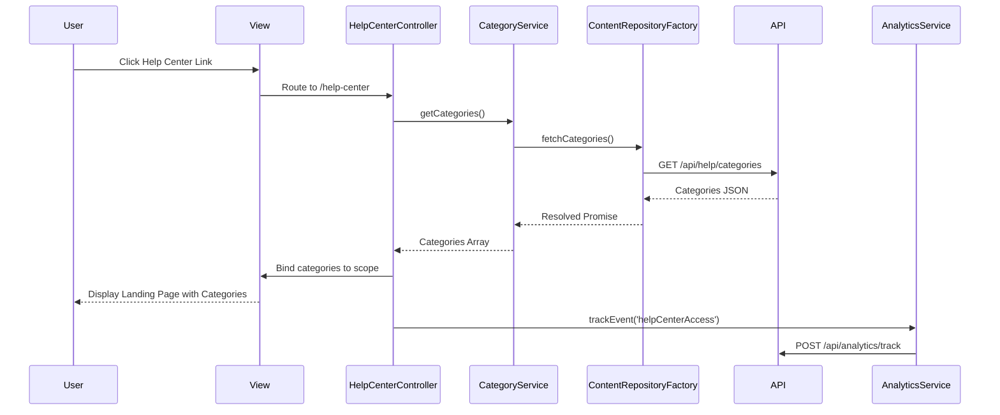

# Low-Level Design: Help Center Integration - Home Page

**Epic ID:** QE-5198

## a. Architecture Mapping

- **Help Center Entry Point** → AngularJS Directive (`helpCenterLink`) integrated into main navigation controller
- **Help Center Landing Page** → AngularJS Module (`helpCenterModule`) with Controller (`HelpCenterController`) and Template (`help-center-landing.html`)
- **Category Navigation** → AngularJS Controller (`CategoryController`) with Service (`CategoryService`) for content retrieval
- **Search Functionality** → AngularJS Service (`SearchService`) with Controller (`SearchController`) and Directive (`searchBox`)
- **Content Repository Integration** → AngularJS Factory (`ContentRepositoryFactory`) for REST API calls
- **Analytics Tracking** → AngularJS Service (`AnalyticsService`) for event tracking

**Recommended Folder Structure:**
```
app/
├── modules/
│   └── help-center/
│       ├── help-center.module.js
│       ├── controllers/
│       │   ├── help-center.controller.js
│       │   ├── category.controller.js
│       │   └── search.controller.js
│       ├── services/
│       │   ├── category.service.js
│       │   ├── search.service.js
│       │   └── analytics.service.js
│       ├── factories/
│       │   └── content-repository.factory.js
│       ├── directives/
│       │   ├── help-center-link.directive.js
│       │   └── search-box.directive.js
│       └── views/
│           ├── help-center-landing.html
│           ├── category-view.html
│           └── search-results.html
└── assets/
    └── css/
        └── help-center.css
```

## b. Component Specifications

| Component Name | Artifact Type | Responsibility | Key Dependencies |
|----------------|---------------|----------------|------------------|
| helpCenterModule | Module | Root module for Help Center functionality | angular, ngRoute, ui.bootstrap |
| HelpCenterController | Controller | Manages landing page state and category display | CategoryService, AnalyticsService |
| CategoryController | Controller | Handles category selection and content filtering | CategoryService, ContentRepositoryFactory |
| SearchController | Controller | Manages search input and results display | SearchService, ContentRepositoryFactory |
| CategoryService | Service | Retrieves and caches category metadata | ContentRepositoryFactory, $q |
| SearchService | Service | Executes keyword search against content repository | ContentRepositoryFactory, $q |
| AnalyticsService | Service | Tracks user interactions and page views | $window (Google Analytics/Adobe Analytics) |
| ContentRepositoryFactory | Factory | REST API wrapper for content retrieval | $http, $q |
| helpCenterLink | Directive | Renders Help Center link in main navigation | none |
| searchBox | Directive | Renders search input with autocomplete | SearchService |

## c. Data Model

**HelpCategory (JS Object):**
```javascript
{
  id: String,
  name: String,
  displayOrder: Number,
  iconClass: String,
  contentCount: Number
}
```

**HelpContent (JS Object):**
```javascript
{
  id: String,
  title: String,
  categoryId: String,
  description: String,
  tags: Array<String>,
  contentType: String, // 'article', 'faq', 'video', 'guide'
  url: String,
  lastUpdated: Date
}
```

**SearchResult (JS Object):**
```javascript
{
  query: String,
  results: Array<HelpContent>,
  totalCount: Number
}
```

## d. Data Flow

User clicks Help Center link in main navigation → `helpCenterLink` directive triggers route change to `/help-center` → `HelpCenterController` initializes and calls `CategoryService.getCategories()` → Service invokes `ContentRepositoryFactory` to fetch category metadata via REST API (`GET /api/help/categories`) → Controller receives categories and binds to view → User either clicks a category (triggering `CategoryController` to fetch content via `GET /api/help/content?categoryId={id}`) or enters search keywords (triggering `SearchController` to call `SearchService.search()` which invokes `GET /api/help/search?q={keywords}`) → Results rendered in view → `AnalyticsService` tracks interaction events (`helpCenterAccess`, `categoryClick`, `searchPerformed`) → UI updates complete within 2 seconds.

## e. Primary Sequence Diagram



## f. Implementation Notes

- Use AngularJS 1.x with ES6 module syntax; configure module dependencies via `angular.module('helpCenterModule', ['ngRoute', 'ui.bootstrap'])`
- Implement dependency injection for all controllers/services/factories using explicit array annotation to ensure minification safety
- Use `$http` service with promise-based API calls; implement response caching in `CategoryService` using `$cacheFactory` to reduce redundant API calls
- Apply Bootstrap 4 grid system for responsive layout; use `ng-class` and media query-driven CSS for mobile/tablet/desktop breakpoints
- Integrate WCAG 2.1 AA compliance: `aria-label` on navigation elements, `tabindex` for keyboard navigation, `role="search"` on search box, skip-to-content link

## g. Error Handling

Use `$http` interceptor to catch API errors globally; display user-friendly error messages via Bootstrap modal or inline alert directive; log errors to console and analytics service.

## h. Security Notes

Requires token-based auth via existing SSO; all API calls include Authorization header with JWT token; standard input validation and secure API calls assumed.